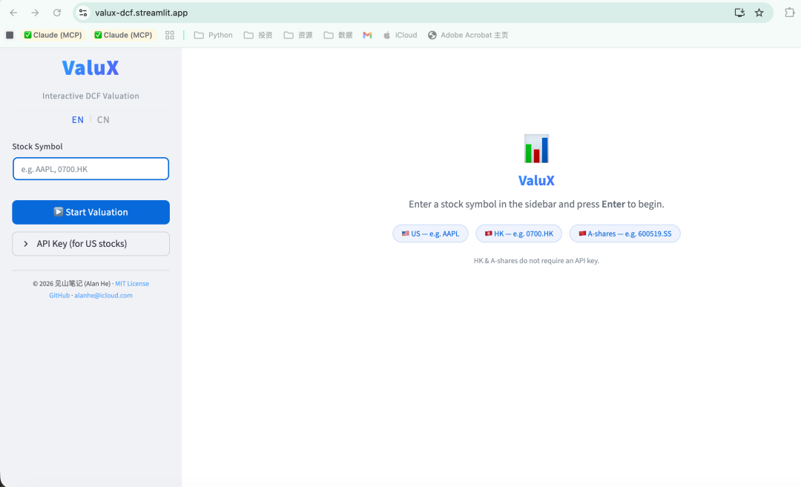

<h2>The DCF Valuation Engine Your AI Can Call</h2>

Standardized DCF · MCP server for Claude / ChatGPT / any AI · Web console for manual analysis

Covers US, HK, A-shares & Japan — A-shares & HK completely free, no signup required

<a href="https://valuescope.app/mcp" class="vs-cta" target="_blank">🔌 Connect via MCP in 2 Minutes →</a>
<a href="https://valuescope.app/" class="vs-cta-secondary" target="_blank">Open Web Console →</a>

---

### Use It Inside Your AI

<h4>🔌 The MCP Valuation Engine</h4>

AI is great at reasoning but bad at staying consistent — run a DCF today and again next month, and the data sources and methodology may differ completely. ValueScope MCP splits the work: <strong>your AI handles the forward-looking judgment</strong> (searching guidance, reasoning about assumptions) while <strong>the engine owns the data and the math</strong> (standardized financials, the DCF model, sensitivity analysis, reverse DCF). Same inputs, same result, every time.

<pre>claude mcp add valuescope --transport http https://mcp.valuescope.app/mcp</pre>

Once connected, just ask your AI: <em>"Value Tencent with a DCF."</em> Setup for Claude web, Cherry Studio, ChatGPT and other clients: <a href="https://valuescope.app/mcp" target="_blank">full setup guide →</a>

---

### Web Console: Four Analysis Dimensions

📊
<h4>DCF Intrinsic Valuation</h4>

A standardized 10-year FCFF model based on the Damodaran framework — fixed methodology, reproducible results.

<ul>
<li>Parameter sliders with instant recalculation, defaults from 5-year historical averages</li>
<li>Growth Rate × EBIT Margin dual-dimension sensitivity matrix</li>
<li>Full forecast table + valuation bridge + reverse DCF</li>
<li>Buffett Quick Valuation: automated Owner Earnings estimate</li>
</ul>

📈
<h4>Relative Valuation</h4>

Is the current price expensive? Compare it against the stock's own history to find out.

<ul>
<li>Current PE / PB / PS / EV/EBITDA multiples</li>
<li>3 / 5 / 10-year historical percentile visualization</li>
<li>Percentile bars: current value, mean, min/max at a glance</li>
<li>Historical PE & PB trend charts</li>
</ul>

🎯
<h4>4-Dimension Scoring</h4>

Valuation, Quality, Growth, and Momentum — four dimensions condensed into one radar chart.

<ul>
<li>Valuation: PE/PB percentile + mean-reversion signals</li>
<li>Quality: ROIC, ROE, asset efficiency</li>
<li>Growth: Revenue growth, earnings growth trajectory</li>
<li>Momentum: Price trends & technical indicators</li>
<li>Transparent sub-factors with adjustable weights</li>
</ul>

🔎
<h4>Financial Overview</h4>

The first screen you see — build a complete picture in seconds.

<ul>
<li>5-year PE / PB percentile cards</li>
<li>Revenue & growth, EBIT margin, ROIC & ROE, FCF — four-chart grid</li>
<li>Balance sheet highlights: cash, debt, leverage ratio</li>
<li>Full historical financials table</li>
</ul>

---

### Three Steps to Start

1

<h4>Enter a Ticker</h4>

US (AAPL), HK (0700.HK), A-shares (600519), Japan (7203.T)

2

<h4>Browse Four Dimensions</h4>

Overview, DCF, Relative Valuation, Scoring — switch with one click

3

<h4>Connect Your AI (Optional)</h4>

Two-minute MCP setup — let your AI research guidance, reason about assumptions, and run the valuation in chat

✅ Global market coverage
✅ MCP for any AI client
✅ A-shares & HK completely free
✅ No signup required
✅ Open source

---

### Popular Stocks

<a href="https://valuescope.app/stock/AAPL">🍎 Apple</a>
<a href="https://valuescope.app/stock/NVDA">🖥️ NVIDIA</a>
<a href="https://valuescope.app/stock/MSFT">💻 Microsoft</a>
<a href="https://valuescope.app/stock/GOOGL">🔍 Google</a>
<a href="https://valuescope.app/stock/0700.HK">💬 Tencent</a>
<a href="https://valuescope.app/stock/600519.SS">🥃 Moutai</a>
<a href="https://valuescope.app/stock/PDD">🛒 PDD</a>
<a href="https://valuescope.app/stock/7203.T">🚗 Toyota</a>

---

### Screenshot

---

### About ValueScope

ValueScope is a standardized DCF valuation engine built on the Damodaran FCFF framework (10-year discounted cash flow + WACC + terminal value), combined with relative-valuation historical percentiles and a 4-dimension scoring system. Use it two ways: <strong>connect it to your own AI via MCP</strong> — the AI researches and reasons, the engine owns the data and the math — or <strong>work the parameters by hand in the web console</strong> to test ideas and explore sensitivities. Both run the same engine. The AI brings the intelligence, ValueScope brings the framework and discipline — and the final judgment is always yours.

<a href="https://valuescope.app/mcp" class="vs-cta" target="_blank">🔌 Connect via MCP →</a>
<a href="https://valuescope.app/" class="vs-cta-secondary" target="_blank">Open Web Console →</a>

