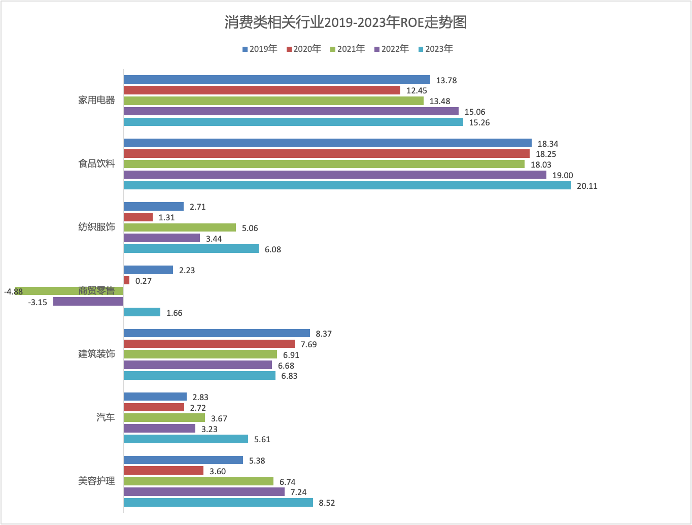

## Buy What You Know

In the 1980s and early 1990s, "buy what you know" was one of the most popular investment mantras. Peter Lynch was the most charismatic advocate of this philosophy.

Lynch believed that our best stock research tools are our eyes, ears, and common sense. Amateur investors possess an edge that professional institutions have forgotten how to leverage: "the power of common sense."

Many listed companies operate consumer-facing (to-C) businesses. If something catches your attention as a consumer, it should also pique your interest as an investor. If you discover a great restaurant, beverage, or hotel, you have a personal insight into that business that institutional investors may not yet have captured. As Lynch put it: "Over a lifetime of buying cars or cameras, you develop a sense of what's good and what's bad, what sells and what doesn't... and the most important thing is, you know it before Wall Street does."

But Lynch's rule comes with an important corollary: "Finding a promising company is only the first step. The next step is doing the research." No matter how excellent a company's products are, you should never invest without studying its financial statements and estimating its investment value.

## **Consumer Sectors Typically Have Higher Return on Equity**

Consumer businesses are generally brand-driven enterprises that benefit from strong brand effects. Brands foster high consumer loyalty, command product premiums, and to some extent deter potential competitors from entering the industry. These brand advantages enable companies to sustain returns on invested capital above their average cost of capital over the long term.

Let's look at A-share listed companies. Below is a chart showing the distribution of Return on Equity (ROE) over the past five years across industries classified by the Shenwan Level-1 industry classification:

As we can see, the household appliances and food & beverage industries generally have higher ROE with relatively low volatility — household appliances averaging around 15% and food & beverage averaging around 20%.

Other industries with relatively stable ROE include construction & decoration, banking, and environmental protection. However, the average ROE for these industries is lower than that of household appliances and food & beverage.

Let's take a closer look at several consumer-related industries, specifically household appliances, food & beverage, textiles & apparel, retail, building materials, automobiles, and beauty & personal care. Below is a chart showing the ROE trends for these industries over the past five years.

It is worth noting that A-share listed companies do not fully represent the characteristics of all consumer sub-sectors. In the apparel and beauty & personal care segments, most of the world's renowned consumer brands are listed in Hong Kong or the US. By comparison, China's household appliance industry has gone global, while food & beverage has a stronger domestic orientation. Listed companies in these two sub-sectors are predominantly on A-shares, making them more representative of their respective industries.

We can see that not only do household appliances and food & beverage have high ROE, but they also showed an overall upward trend over the past five years. These two industries offer a relatively large pool of investable targets on A-shares, making them the best consumer sector investment choices.

Among the other consumer-related industries, none had ROE exceeding 10%. Construction & decoration has seen its ROE gradually decline in recent years due to the impact of the real estate downturn; the automobile and retail industries face intense competition, resulting in generally poor ROE.

## Consumer Staples Are the Best Investment Track for Ordinary Investors

Why does the A-share market always experience dramatic booms and busts? One important reason is the cyclical nature of industries.

As a country with a large government and strong centralized management, China's government guides the development of various industries through industrial policies and subsidies. This model often leads to a rush into emerging industries, followed by overcapacity, and ultimately leaves behind a mess. In many ways, the A-share market is a mirror of industrial policy and industrial cycles.

For ordinary investors who are not deeply embedded within specific industries, it is very difficult to accurately gauge industrial cycles using only their eyes, ears, and common sense, let alone capture cyclical upswings or reversals. This information asymmetry and lack of specialized knowledge puts ordinary investors at a disadvantage when facing market volatility.

By contrast, the consumer sector is something we can see and touch. Especially in consumer industries related to daily life, demand is essential and can weather economic cycles. The pursuit of a better life is an eternal theme. As shown in the chart above, even in a weak economic environment, the return on equity in household appliances and food & beverage continued to rise. Even if these industries stop growing, their high ROE still enables solid investment returns. This is precisely why investment masters like Buffett are so fond of consumer sector investments.
