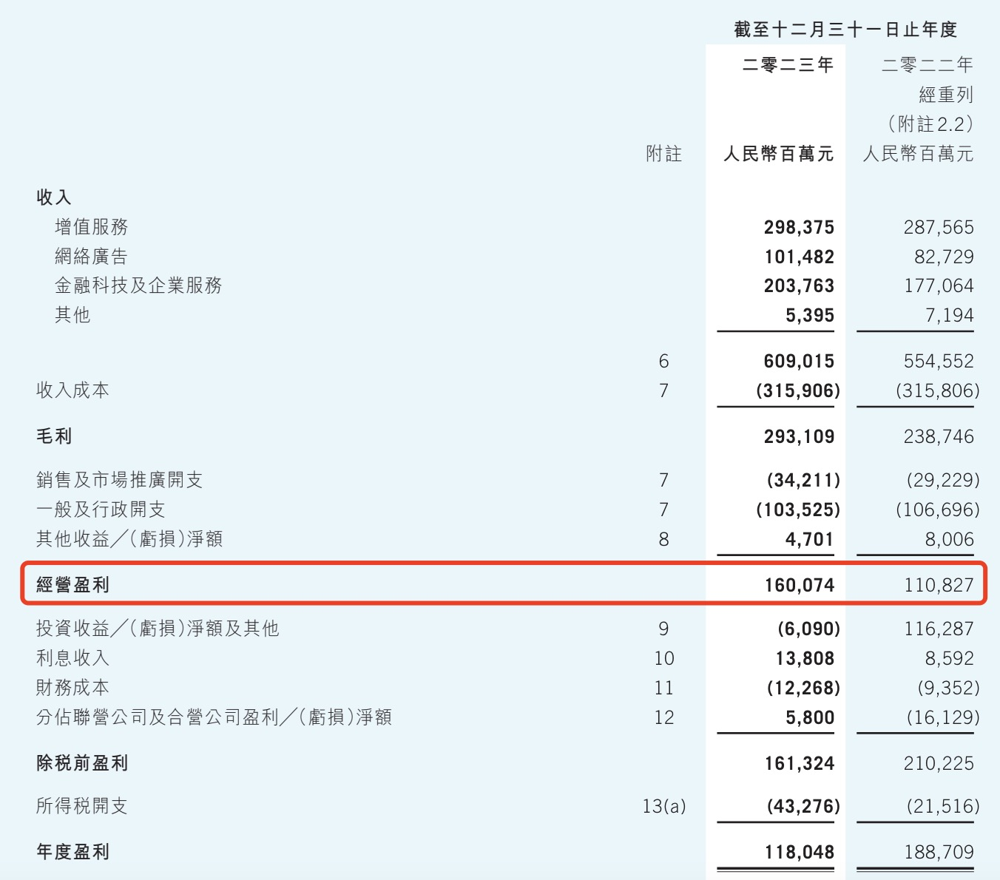

On April 9, 2024, the International Accounting Standards Board (IASB) issued IFRS 18 — Presentation and Disclosure in Financial Statements. This standard will replace IAS 1 — Presentation of Financial Statements and will become effective on January 1, 2027, with early adoption permitted.

The most notable change introduced by IFRS 18 is the incorporation of operating, investing, and financing perspectives into the income statement. Companies are required to classify income and expenses into these three categories, with two new subtotals: operating profit and profit before financing and income tax.

## IFRS 18 Makes DCF Valuation Calculations Simpler

Establishing explicit presentation requirements for the income statement enhances comparability and the usefulness of disclosed information. When it comes to company valuation specifically, this new presentation format is a tremendous benefit.

Why is that? Let's revisit how to calculate Free Cash Flow to the Firm (FCFF).

In DCF valuation, a common approach starts with Free Cash Flow to the Firm (FCFF), then deducts interest-bearing debt to arrive at the cash flow and discounted value attributable to equity. Starting from FCFF has the advantage of not requiring forecasts of changes in financing activities.

FCFF is the residual portion of Net Operating Profit After Tax (NOPAT) after deducting reinvestment. NOPAT does not have a corresponding line item on financial statements; in practice, it can be calculated as EBIT multiplied by (1 - tax rate).

FCFF belongs to both shareholders and creditors, so interest expenses are not deducted — in other words, it is "before interest." The scope of EBIT is consistent with this treatment.

However, the definition of EBIT does not exclude the impact of investing activities. For general companies whose primary business is not investing, investment income lacks continuity and predictability. Since FCFF is based on long-term, stable forecasts of a company's core operations, non-core investing activities should be considered separately.

For example, in the earlier analysis of Hong Kong Exchanges and Clearing (HKEX), its investment income is significantly influenced by interest rates and cannot be forecasted in tandem with trading fees and clearing fees.

Now let's revisit the IFRS 18 income statement structure shown above. After distinguishing operating, investing, and financing activities, the new operating profit subtotal differs from NOPAT (used in FCFF calculations) by just one item — tax. That is, NOPAT = Operating Profit x (1 - tax rate). This is practically tailor-made for FCFF calculations. Extracting data from the new income statement format for DCF valuation has become significantly more convenient.

## Current Landscape

### Income Statements of A-Share Listed Companies

Currently, domestic listed companies follow a uniform presentation and disclosure format for financial statements, stemming from the Ministry of Finance's requirements for general enterprise financial statement formats and the CSRC's guidelines on information disclosure for publicly listed companies. Below is a sample income statement:

This income statement structure is relatively flat: 1) All costs and expenses are mixed together. From revenue to operating profit, there are no subtotals — not even a gross profit line; 2) There is no distinction between operating and financing activities, with finance costs lumped in with operating costs. This means the income statement lacks an operating profit perspective that encompasses both shareholders and creditors.

To calculate EBIT (an approximation of operating profit) or even basic gross profit for an A-share listed company, you have to perform your own arithmetic.

### Income Statements of Hong Kong-Listed Companies

Now let's look at the income statements of Hong Kong-listed companies prepared under International Accounting Standards, using Tencent Holdings as an example:

It is immediately apparent that this format is much clearer than that of A-share companies. In particular, finance costs and investment income are presented below operating profit. This operating profit is essentially equivalent to EBIT and further excludes investment income, making it directly usable as the basis for calculating NOPAT and FCFF.

Hong Kong-listed and US-listed companies generally follow a similar presentation format, so no further examples are needed.

### Summary

Overall, the current income statement presentation of A-share listed companies does not distinguish between operating and financing activities and has too few subtotals, making it less user-friendly for those who rely on financial statements for company analysis and valuation. The income statement formats of Hong Kong-listed and US-listed companies clearly separate operating from investing and financing activities, as well as core from non-core items, and are already very close to the IFRS 18 presentation requirements — far more convenient for valuation calculations.

IFRS 18 will not take effect until 2027. It is hoped that the Ministry of Finance and the CSRC will adopt it early, reforming the income statement presentation of A-share listed companies sooner to enhance the usefulness of disclosed financial information.
