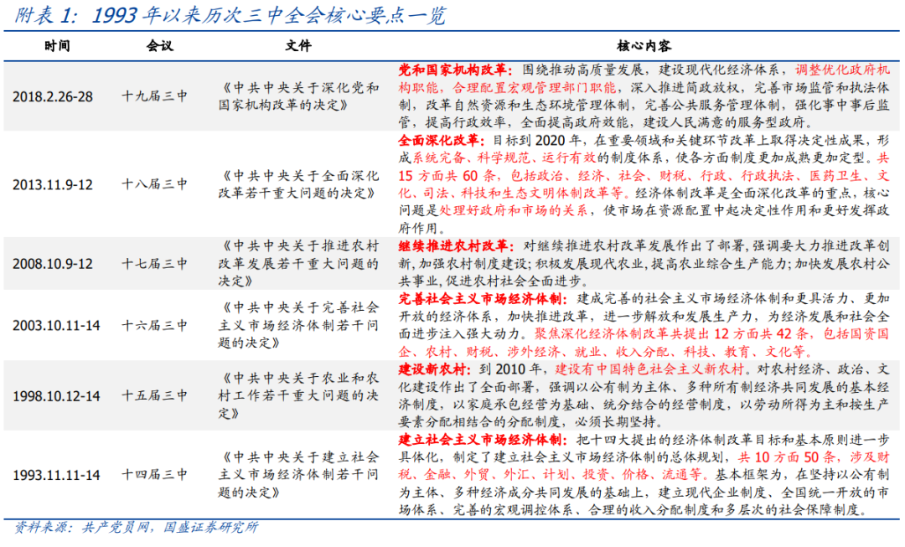
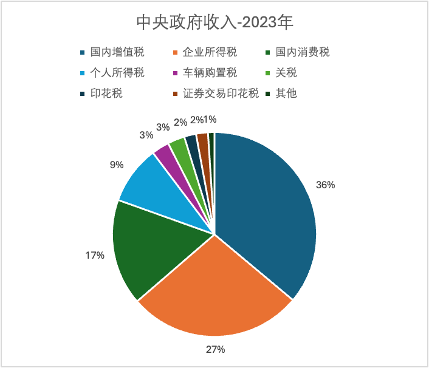
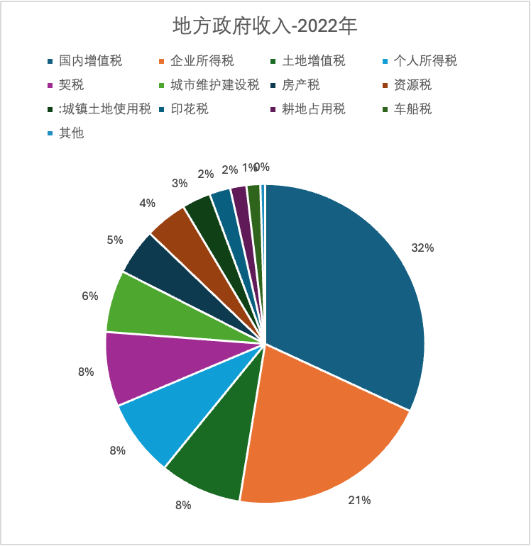
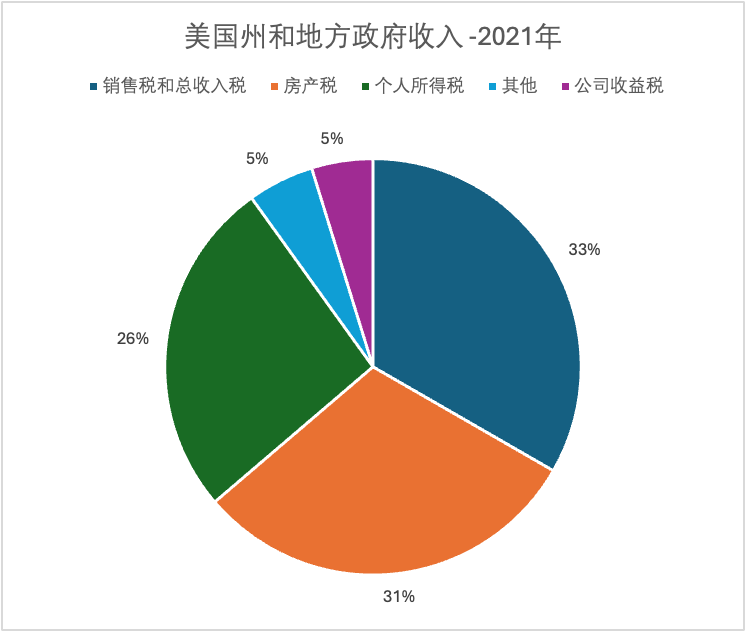

The Politburo meeting in late April announced that the Third Plenum of the 20th Central Committee would be convened in July of this year. Historically, every Third Plenum has been tied to major national economic and institutional reforms. The famous Third Plenum of the 11th Central Committee, for instance, ushered in the era of Reform and Opening Up. More recently, the Third Plenum of the 19th Central Committee focused on reforming Party and state institutions. The press release from this latest Politburo meeting emphasized the need to "place reform in a more prominent position and deepen comprehensive reform centered on advancing Chinese-style modernization" -- a clear signal setting the tone for the upcoming Third Plenum.

Combined with the Central Economic Work Conference at the end of last year, which stressed the need to "plan a new round of fiscal and tax system reform," fiscal and tax reform is expected to be a key agenda item at the Third Plenum.

This article first provides a comparative analysis of tax differences between the US and China, then briefly discusses the issues that the new round of fiscal and tax reform may need to address given the current economic environment.

## Indirect Taxes vs. Direct Taxes

Based on whether the taxpayer is the actual bearer of the tax burden, taxes can be classified as indirect or direct. Indirect taxes are those where the taxpayer is not the actual bearer of the tax burden and can shift it to others through higher prices. Specifically, Value-Added Tax (VAT), consumption tax, and customs duties are all indirect taxes. Direct taxes, on the other hand, cannot be shifted -- the taxpayer is the actual bearer of the tax burden. Examples include corporate income tax, personal income tax, and property taxes.

China's tax system is dominated by indirect taxes, while most developed countries rely primarily on direct taxes. Using the United States as a benchmark, let's examine the specific tax differences between the two countries. Since both Chinese and American local governments derive a significant portion of their fiscal revenue from non-tax sources, for ease of comparison, the composition of local government revenue in both countries excludes non-tax revenue. Additionally, it's worth noting that social insurance contributions in the US are part of the tax system, whereas in China they are collected separately and fall outside the scope of fiscal revenue.

## US-China Tax Differences

### China

China's tax revenue is primarily composed of two major indirect taxes -- VAT and consumption tax -- along with two major direct taxes -- corporate income tax and personal income tax. VAT is shared between the central and local governments on a 50/50 basis, while corporate and personal income taxes are shared on a 60/40 basis (central/local). Consumption tax belongs entirely to the central government.

Beyond these major tax categories, there are several smaller taxes: customs duties go to the central government, resource taxes are divided by resource type, with offshore oil resource taxes going to the central government and the rest to local governments.

Tax categories exclusively belonging to local governments include land appreciation tax, urban construction and maintenance tax, urban land use tax, property tax, vehicle and vessel tax, and deed tax.

In 2023, the central government's total fiscal revenue was approximately RMB 9.6 trillion, of which VAT accounted for about 36% and consumption tax for about 17%. Together, these two indirect taxes made up roughly 53% of total fiscal revenue. Among direct taxes, corporate income tax represented about 27% of total fiscal revenue, while personal income tax accounted for only 9%.

The most recent data for Chinese local government revenue is from 2022, with total revenue of approximately RMB 7.7 trillion. VAT and corporate income tax are the largest components, accounting for approximately 32% and 21%, respectively. Other significant tax categories -- including land appreciation tax, personal income tax, deed tax, urban construction tax, and property tax -- each account for 5% to 8%.

Furthermore, local government non-tax revenue is substantial, amounting to approximately RMB 3.2 trillion in 2022 (not included in the table below), primarily consisting of land transfer fees and income from the paid use of state-owned assets.

Looking at central and local levels combined, total fiscal revenue is approximately RMB 20 trillion, or about RMB 17 trillion excluding local government non-tax revenue. Aside from direct taxes such as personal and corporate income tax and property taxes (vehicle purchase tax and vehicle and vessel tax), indirect taxes account for approximately 53% of fiscal revenue. Excluding local government non-tax revenue, the indirect tax share rises to approximately 63%.

### United States

US taxation operates at three levels -- federal, state, and local -- with each level having relatively independent primary tax categories. The federal government relies mainly on personal income tax and social insurance tax, state governments primarily on income tax and sales tax, and local governments primarily on property taxes (including real estate). Besides regular tax revenue, state and local governments have several other fiscal income sources: user fees and special assessments (primarily public hospital and school fees, highway tolls, etc.), public utility and liquor store revenue, and insurance trust revenue. Insurance trust revenue is analogous to China's social insurance contributions and is excluded from the following analysis.

In 2023, federal government revenue was approximately USD 4.4 trillion, of which personal income tax accounted for about 49%, followed by social insurance tax at 36%. Both are direct taxes and together comprise approximately 85% of federal government revenue. The remainder is primarily corporate income tax, another direct tax, at about 9%. Notably, the US social insurance tax corresponds to China's social insurance contributions, but is collected as a tax.

The most recent data for state and local government tax revenue is from 2021, with total revenue of approximately USD 2.1 trillion. The main components are sales tax at 31%, property tax at 31%, and personal income tax at 26%. Sales tax is similar to China's consumption tax and is classified as an indirect tax.

Additionally, the other revenue sources mentioned above -- user fees and special assessments, as well as public utility and liquor store revenue -- totaled approximately USD 1 trillion.

Looking at federal, state, and local revenue combined, excluding social insurance and insurance trust revenue (which are social security in nature), total fiscal revenue is approximately USD 5.9 trillion (the comparable figure for China on the same basis is RMB 20 trillion). Among this, the primary indirect tax is sales tax, accounting for approximately 12%.

## Issues to Be Addressed in the Current Fiscal and Tax Reform

### The Mismatch Between Local Government Fiscal Authority and Expenditure Responsibilities

Following the 1994 Tax-Sharing Reform, the central government's share of tax revenue increased significantly, but local governments' expenditure responsibilities were not correspondingly reduced, resulting in a mismatch between fiscal authority and spending obligations at the local level. After the VAT reform in 2016 (replacing the Business Tax with VAT), the former Business Tax -- which had belonged entirely to local governments -- became a shared tax between central and local governments. To alleviate local fiscal pressure, the local share of VAT was raised to 50/50 after the reform, compared to the previous approximate 70/30 split in favor of the central government.

Addressing this mismatch currently relies primarily on central government transfer payments, which also serve to reduce regional development disparities. On the other hand, local governments have become heavily dependent on non-tax revenue to expand their fiscal resources -- including land transfer fees and fines -- and have used implicit local government debt to drive development. With the real estate sector undergoing deep adjustment, local government land revenue has declined sharply and is unlikely to serve as a major revenue source going forward. At the same time, inefficient investment has made local debt levels unsustainable.

Therefore, how to restructure the fiscal relationship between central and local governments -- establishing a long-term, sustainable framework to alleviate local fiscal pressures and mobilize local government initiative -- is likely to be a central issue in this round of fiscal and tax reform.

### The "Regressive" Nature of Indirect Taxes

Both VAT and consumption tax are indirect taxes collected during the circulation stage and ultimately embedded in end-consumer prices. In essence, they are taxes on demand and consumption. This means that the higher one's income, the lower the effective tax burden. For example, with daily necessities, demand is similar across income groups, but the tax burden clearly weighs more heavily on lower-income groups compared to high-income earners.

As a result, indirect taxes are inherently "regressive" rather than "progressive." A regressive tax structure runs counter to the goal of income redistribution and effectively exacerbates wealth inequality.

Clearly, direct taxes play a positive role in adjusting income distribution, enhancing consumer purchasing power, and stimulating consumption. Given the differences between the US and Chinese contexts, a shift to a direct-tax-dominated system is unrealistic in the short term, but increasing the proportion of direct taxes has long been a stated reform goal. The Third Plenum of the 18th Central Committee explicitly identified "gradually increasing the proportion of direct taxes" as the main thread of modernizing the tax system, and the 14th Five-Year Plan reiterated the goal of "optimizing the tax structure, improving the direct tax system, and appropriately increasing the proportion of direct taxes."

Among direct taxes, the current main categories are income taxes and property taxes piloted in select cities. Given the difficulties facing the real estate sector, property tax reform will likely continue to be delayed. For now, increasing the direct tax share can only rely on income taxes -- both personal and corporate.

There are two paths to increasing personal income tax revenue: broadening the tax base and requiring higher-income groups to pay more. In the current economic environment, China faces the problem of insufficient effective demand, and broadening the tax base would not help stimulate consumption -- making it a poor short-term choice. As for high-income groups, the current top marginal rate of 45% is not low (the US top marginal personal income tax rate is 37%). The current problem is that salaried workers have become the primary personal income taxpayers, while the wealthy and high-income groups employ numerous tax avoidance strategies. In fact, some local government tax incentive policies effectively help high-income earners avoid taxes. For example, many local governments offer companies personal income tax rebate quotas to attract investment, and companies naturally allocate these quotas to senior executives -- effectively worsening tax inequity and income inequality. Additionally, while celebrity tax evasion has improved in recent years, how to ensure that such high-income individuals pay their fair share -- as US President Biden put it, "pay your fair share" -- remains a challenge with many unresolved issues.

Regarding corporate income tax, China's current rate is 25%, with a reduced rate of 15% for high-tech enterprises. For comparison, the current US corporate income tax rate is 21%. Given America's large fiscal deficit, the corporate tax rate is likely to increase next year, potentially rising to 28%. Buffett addressed this very issue at the 2024 Berkshire Hathaway annual shareholders' meeting. If the US corporate tax rate does rise to 28%, China could also consider modestly raising its corporate income tax rate while simultaneously reducing VAT and consumption tax burdens on businesses -- keeping the overall tax burden unchanged -- to promote end-consumer spending.
