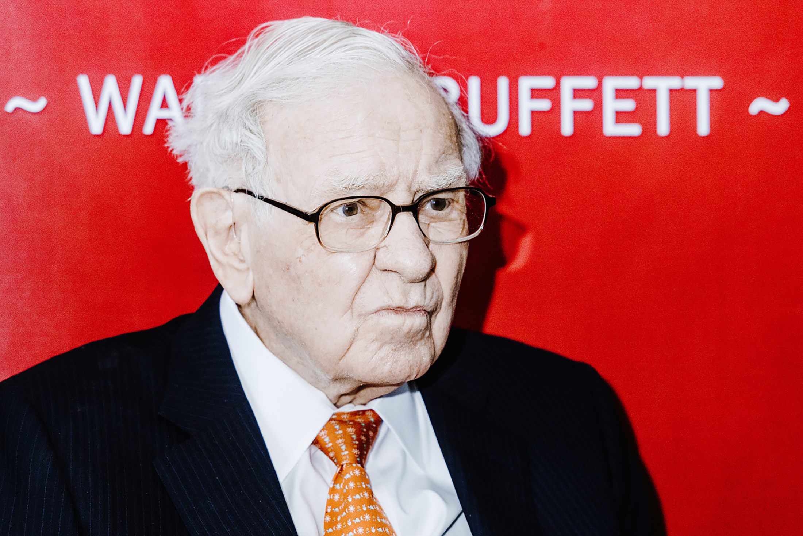

The 2024 Berkshire Hathaway Annual Shareholders Meeting has just concluded. Known as the "Woodstock of Capitalism," it attracts the attention of global investors every year. As a Chinese audience, we are naturally keen to hear Buffett's views on investing in China.

During this year's Q&A session, the very first question was about China. A shareholder from Hong Kong asked: "Mr. Buffett, Berkshire previously invested in BYD. Would you continue to invest in other Chinese companies in the future?"

Buffett responded: "**Our primary investment targets will be located in the United States -- that is something we firmly believe.** Look at our investments in Coca-Cola or American Express -- these are companies expanding their businesses globally. Companies like American Express or Coca-Cola that operate worldwide are hard to find anywhere else -- that is a global consensus. As for the BYD investment, I think it is comparable to what we did in Japan five years ago: we quickly invested in five Japanese trading houses. You will rarely see us make investments outside the U.S., even though we are participating in the global economy through these companies. **I understand the rules, weaknesses, and strengths of the United States... I don't have that same feeling about the rest of the world.**"

Buffett seemed to deflect the question with finesse. Compared to his later comments on the Indian market, he avoided directly discussing his views on China and politely sidestepped the shareholder's question. The reasoning he offered was fair enough -- after all, he knows the American market best.

Indeed, Buffett has made relatively few investments outside the United States. His investment in BYD was made eight years ago and was primarily driven by the recommendation of his late partner Charlie Munger. The Alibaba investment was made by Daily Journal Corporation, managed by Charlie Munger -- not by Buffett's Berkshire Hathaway. The investment in Japan's five major trading houses began in 2020 with excellent timing; in hindsight, the entry prices were extremely cheap. The deal even carried a flavor of carry trade: issuing near-zero interest rate Japanese bonds to purchase steadily dividend-paying Japanese companies. The margin of safety on this investment is now very high -- essentially a rock-solid arbitrage.

Beyond his deeper understanding of the American market, Buffett also touched on the essence of investing in U.S. stocks in his response: buying American stocks is effectively investing on a global scale, capturing returns from other countries as well. Take Coca-Cola and American Express -- they are "companies expanding their businesses globally. We are participating in the global economy through these companies."

This brings us to a broader topic: the reasons behind the long-running bull market in U.S. equities.

## Why the U.S. Stock Market Has Enjoyed a Prolonged Bull Run

After the 2008 subprime mortgage crisis, U.S. stocks fell sharply and bottomed out in February 2009, before embarking on a bull market that lasted over a decade. Despite two significant pullbacks -- one caused by the COVID-19 pandemic in 2020 and another triggered by the Fed's rate-hiking cycle starting in 2022 -- U.S. equities ultimately reclaimed their all-time highs.

Below is the S&P 500 chart from 2009 to the present (2024):

At its core, the prolonged bull market in U.S. stocks is inseparable from America's innovation capability. Economics tells us that three factors drive productivity: physical capital, human capital, natural resources, and technological knowledge. Setting aside America's abundant natural resources and exceptional human capital, the U.S. holds an absolute leadership position in technological innovation -- and this is the fundamental driver of the long-term bull market. The recent artificial intelligence wave, for instance, has allowed the U.S. economy to maintain its vitality even in a high interest rate environment, with a soft landing on inflation increasingly within reach.

Other important factors include the long-term low interest rate environment for the U.S. dollar, which is self-evident given that liquidity is a major driver of equity markets.

Here, I want to focus on the global nature of American listed companies.

The U.S. is home to many multinational corporations -- Apple, NVIDIA, the aforementioned Coca-Cola, and numerous well-known pharmaceutical companies. Their production and sales span the globe, even though their headquarters are in the United States.

Over 60% of Apple's revenue comes from international markets, with 19% from Greater China. Coca-Cola's figures are similar, while NVIDIA derives 56% of its revenue from markets outside the United States.

Therefore, investing in these global multinationals effectively means sharing in the growth dividends of the entire world, including emerging markets like China. This is another important reason behind the long-running bull market in U.S. equities.

For ordinary retail investors who find it difficult to manage individual stock risk, investing in passive global index funds that include major U.S. companies may be the best option. This approach captures the growth dividends of emerging markets while diversifying single-market risk.
