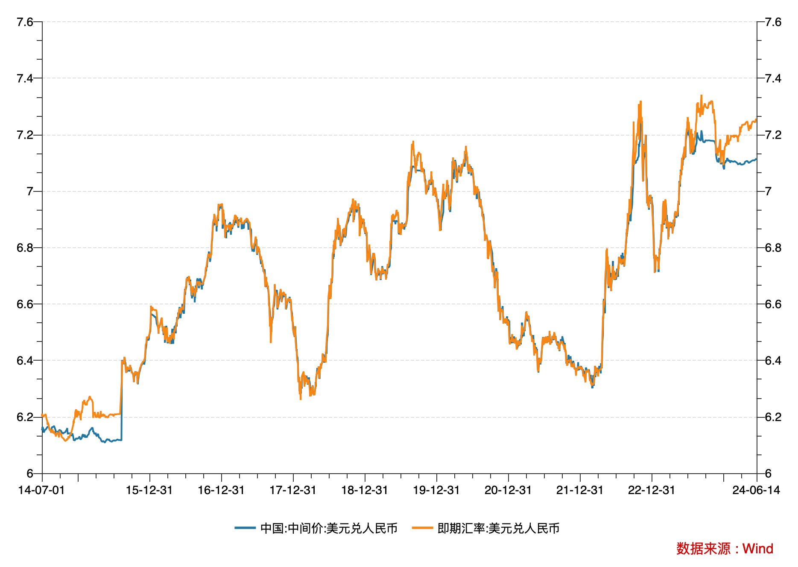

## Factors That Determine Exchange Rates

Among the various theories on exchange rate determination, the interest rate parity theory proposed by Keynes in his 1923 work *A Tract on Monetary Reform* stands as the most fundamental. Its core argument is that interest rate differentials between two countries drive international capital flows, which play a decisive role in determining exchange rates -- especially in the short term.

While interest rate parity is the most basic factor in exchange rate determination, it is often insufficient to predict exchange rate movements using interest rate differentials alone. This is because exchange rates reflect the relative strength between two countries, and many other factors underlie that relative strength -- including economic fundamentals, inflation, and foreign exchange controls.

### The Case of Japan

The depreciation of other currencies against the U.S. dollar driven by Fed rate hikes serves as an excellent validation of interest rate parity theory. Take Japan as an example: the current interest rate differential between Japan and the U.S. exceeds 5%, which is the core factor behind the yen's sustained depreciation against the dollar.

The yen remains suppressed at low levels, yet the Bank of Japan's monetary policy remains ambiguous and hesitant to intervene on a large scale. This is primarily because Japan's government debt has reached 250% of GDP, making it difficult to bear the burden of rate hikes. Furthermore, Japan has only recently shown signs of emerging from prolonged deflation, and hasty rate increases would pour cold water on the moderately growing economy. In fact, Japanese corporations welcome a weaker currency, as Japan's economy is export-oriented -- currency depreciation boosts exports and promotes inbound tourism. Consequently, most international investors believe the yen is unlikely to appreciate sustainably and may even depreciate further. However, as the yen weakens, wages have failed to keep pace with real price increases, putting household consumption under pressure.

In recent years, the renminbi has also depreciated significantly against the U.S. dollar. The China-U.S. interest rate differential is a core reason; the other major factor is the divergence in economic cycles between China and the United States, particularly China's sluggish domestic economy.

However, unlike Japan, China maintains capital controls. The renminbi is not freely convertible, and the exchange rate is not fully market-determined. Instead, China operates a managed floating exchange rate regime.

## The RMB Central Parity Rate

The People's Bank of China (PBOC) manages the renminbi exchange rate primarily through the daily central parity rate announced each morning. The spot exchange rate is only allowed to fluctuate within a 2% band around this central parity rate. If we compare the spot exchange rate to a kite, the central parity rate is the string. The kite rises and falls with the wind -- domestic economic conditions, interest rates, inflation, and the international market environment all significantly influence the wind -- but the string firmly controls its direction and range of movement.

How is this central parity rate determined? Its pricing formula is "previous closing rate + basket currency exchange rate changes." Specifically, when setting the day's central parity rate, the PBOC first references the previous day's "closing rate" -- the RMB/USD closing rate in the interbank foreign exchange market -- and then factors in "basket currency exchange rate changes," which represent the adjustment to the RMB/USD bilateral rate needed to keep the renminbi broadly stable against a basket of currencies. Here is an illustrative example:

Since the renminbi is not freely convertible, Hong Kong hosts a relatively independent offshore renminbi market. The offshore renminbi exchange rate is more market-driven. While the daily central parity rate is an important indicator for offshore renminbi investors, the offshore rate moves independently and has no fluctuation band limits. Because the offshore renminbi better reflects the market's "wind forces," the onshore spot rate is heavily influenced by offshore renminbi movements -- essentially being led by the nose.

## Current Depreciation Pressure on the Renminbi

Using the USD/CNY exchange rate as an example, below is the 10-year chart of the RMB central parity rate and spot exchange rate:

As the chart shows, although the spot exchange rate is permitted to fluctuate within 2% of the central parity rate, the two have largely moved in lockstep for most of the time. There are only two periods of notable divergence: the first from January to July 2015, which ultimately led to the "August 11 FX Reform," and the second occurring this year. During both periods, the spot rate reached the 2% upper limit of the central parity band, indicating significant renminbi depreciation expectations in the market. The kite string of the central parity rate is finding it increasingly difficult to hold back the kite that wants to soar higher.

If you have recently exchanged renminbi for U.S. dollars and noticed a large discrepancy between the settlement rate and the central parity rate, this is the reason.

### Signs From the Stock Connect Market

Since the beginning of this year, mainland investors have been continuously purchasing Hong Kong-listed stocks through the Stock Connect program. Profit opportunities are one factor, but considering that the RMB exchange rate is at elevated levels, the fact that mainland investors are accelerating their purchases of Hong Kong stocks despite exchange rate risk may reflect expectations of further renminbi depreciation.

### Key Drivers Behind Current Renminbi Depreciation Pressure

Overall, the China-U.S. interest rate differential is the primary factor determining the USD/CNY exchange rate trend. At the start of 2024, the differential was still widening, though it has narrowed somewhat in recent months. From the spot rate perspective, the renminbi has continued to show signs of depreciation in recent months. This suggests that beyond the interest rate differential, China's sluggish domestic economic environment is likely another significant factor.

Where will the current market-implied renminbi depreciation expectations ultimately lead? Looking back at history, could we see another one-off devaluation similar to 2015? Let us first examine the impact of the 2015 FX reform.

### The "August 11 FX Reform" of 2015

The pronounced divergence between the RMB central parity rate and the spot rate in 2015 ultimately led to a one-off devaluation of the renminbi. On August 11, 2015, the PBOC lowered the central parity rate by 1,000 basis points, resulting in an immediate 2% devaluation. The goal of the August 11 reform was to make the central parity rate pricing mechanism for the RMB/USD exchange rate more market-oriented, establishing the aforementioned "previous closing rate + basket currency exchange rate changes" formula.

The August 11 reform partially relieved renminbi depreciation pressure and corrected the overvaluation of the RMB effective exchange rate. However, it also triggered strong expectations of further depreciation. In the five months following the reform, the renminbi continued to weaken. The PBOC was forced to tighten capital controls and deploy foreign exchange reserves to intervene in the Hong Kong offshore market to stabilize the renminbi exchange rate. From a stock market perspective, in just two weeks after the August 11 reform, the Shanghai Composite Index plunged from over 3,900 points to 2,850 points.

## The PBOC's Dilemma

At the beginning of the year, PBOC Governor Pan Gongsheng, when discussing the key factors supporting the renminbi exchange rate in 2024, stated: "The market broadly expects a pivot in Fed monetary policy and weakening dollar appreciation momentum. The misalignment of China-U.S. monetary policy cycles is expected to improve, which will drive China-U.S. interest rate differentials toward convergence, contributing to greater stability and balance in the renminbi exchange rate and cross-border capital flows."

Based on the June Fed meeting, the U.S. may only cut rates once this year. Compared with the beginning-of-year consensus of three rate cuts, the timeline for U.S. rate cuts has been repeatedly pushed back, and the rate cut path remains highly uncertain.

China's economy currently faces insufficient domestic demand and deflationary pressures. Rate cuts would be beneficial in lowering financing costs for households and businesses, expanding domestic demand, and stimulating economic growth. However, given the current misalignment of China-U.S. monetary policy cycles, rate cuts would exert pressure on renminbi exchange rate stability.

Cut interest rates or defend the exchange rate -- this is the dilemma facing the PBOC. Our past and current policy has been to pursue both objectives: cautious rate cuts while moderately intervening in the exchange rate to maintain basic renminbi stability.

Given the uncertainty surrounding U.S. rate cuts, can our monetary policy afford to keep waiting? Considering the mounting renminbi depreciation expectations, should exchange rate management be appropriately relaxed?

### The Case for Relaxing Exchange Rate Controls

If we moderately relax exchange rate management, it would create more room for rate cuts. As mentioned above, rate cuts are beneficial for lowering financing costs for households and businesses, expanding domestic demand, and stimulating economic growth. Moreover, currency depreciation would import inflation, helping the economy escape its current deflationary environment.

On the external demand side, exports have been a more prominent growth driver in the first half of the year. Currently, international criticism of China exporting excess capacity is intensifying. Punitive tariffs and other trade protectionist measures adopted by the U.S. and Europe are constraining the overseas expansion of Chinese companies. In this environment, renminbi depreciation would help enhance the export competitiveness of Chinese firms.

### The Case for Maintaining Exchange Rate Stability

Stock and currency markets reflect not only current conditions but, more importantly, expectations about the future. Relaxing the exchange rate could worsen investor expectations, leading to further depreciation and exerting downward pressure on the still-fragile stock market.

Another consideration is the internationalization of the renminbi. A depreciating renminbi would undermine confidence in it as a foreign reserve currency.

As of 2023, the renminbi's share of global foreign exchange reserves stood at approximately 2.3%, down from its peak of 2.8% in Q1 2022, partly reflecting the impact of renminbi depreciation. Given the relatively modest scale of renminbi foreign reserves, and weighing domestic monetary policy needs, renminbi internationalization may not necessarily need to be a key consideration in policy formulation.

[7PQN4LWXJVHWZLMJI52TWX4SKU.avif](%E4%BA%BA%E6%B0%91%E5%B8%81%E7%9A%84%E5%89%8D%E6%99%AF%EF%BC%9A%E9%99%8D%E5%88%A9%E7%8E%87%EF%BC%8C%E8%BF%98%E6%98%AF%E4%BF%9D%E6%B1%87%E7%8E%87%EF%BC%9F/7PQN4LWXJVHWZLMJI52TWX4SKU.avif)

In summary, given the current economic environment, interest rate policy should prioritize domestic considerations, and rate cuts should be the preferred option.

Rate cuts do not necessarily lead to currency depreciation. Exchange rates are influenced by multiple factors. If rate cuts can effectively stimulate a domestic economic recovery, that would provide meaningful support for the renminbi, offsetting the depreciation pressure caused by interest rate differentials.

From the experience of the August 11 reform, a one-off renminbi devaluation carries significant negative consequences. Guiding gradual depreciation through rate cuts may be a gentler approach than directly adjusting the central parity rate downward.
