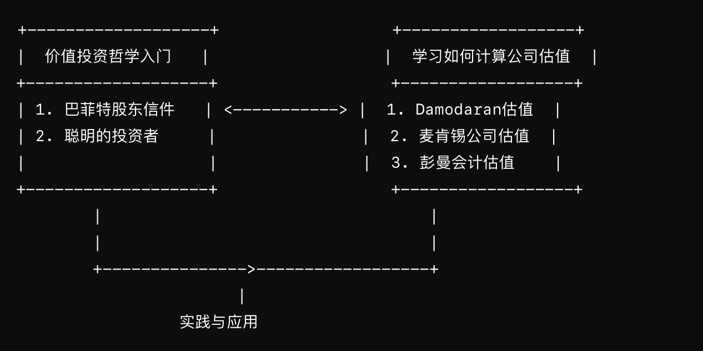
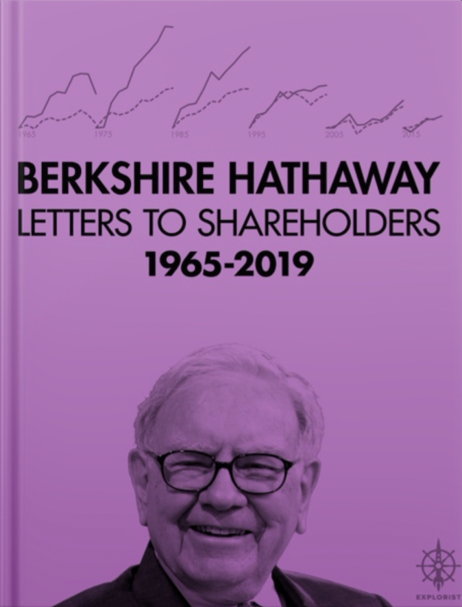
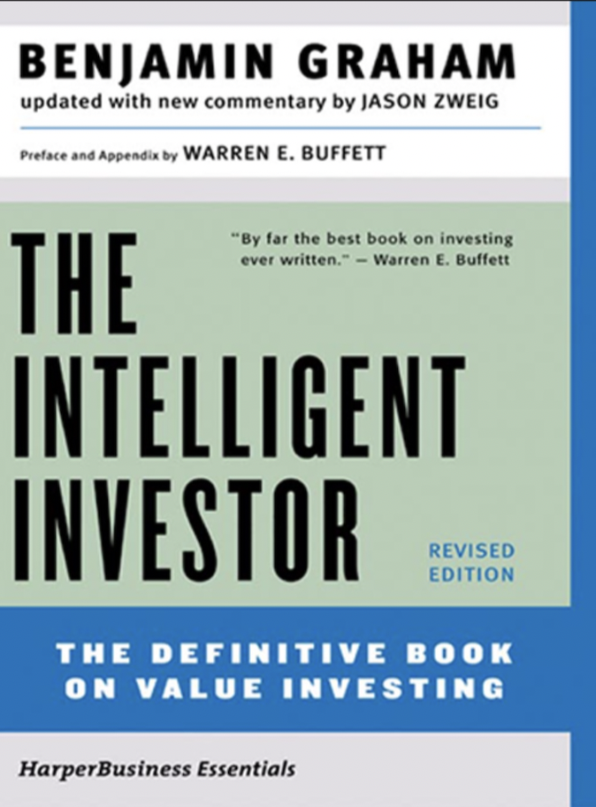

Today I've put together an advanced reading list for understanding value investing philosophy and systematically learning company valuation. Whether you work in finance or investing, these books can provide valuable guidance for your work and practice.

Here is a simple roadmap:

Books like these on professional investing tend to become harder to understand once translated into Chinese, so I recommend reading them in the original English whenever possible. If English feels too challenging, you can always look for the corresponding Chinese editions.

Below is a brief introduction to each book:

## On Value Investing Philosophy

### **"Berkshire Hathaway Letters to Shareholders, 1965-2019"** *by Warren E. Buffett*

Buffett's annual letters to shareholders can actually be downloaded from the Berkshire Hathaway website. This book is a compilation that makes them easier to read, though it only covers through 2009. While the letters contain an enormous amount of content, only by reading the originals can you gain a comprehensive and in-depth understanding of Buffett's investment philosophy and views on the business world.

### **"The Intelligent Investor, Rev. Ed"** *by Benjamin Graham*

Graham is known as the father of value investing, and his *The Intelligent Investor* is the classic work on value investing that Buffett has long championed. The book lays out the fundamental principles of value investing in detail, emphasizing the importance of long-term investing, margin of safety, and market psychology.

## How to Calculate Company Valuation

### **"The Dark Side of Valuation: Valuing Young, Distressed, and Complex Businesses"** *by Aswath Damodaran*

Damodaran is a leading authority in the field of valuation. This book takes a deep dive into the technical methods of both absolute and relative valuation, as well as the thorny issues that arise in practice. By studying this book, you can learn how to extract key data from financial statements and translate it into meaningful valuations.

### **"Valuation: Measuring and Managing the Value of Companies, 7th Edition"** *by McKinsey & Company Inc.*

Written by McKinsey & Company, this book integrates valuation with corporate strategy, taking a value-creation-oriented approach that offers a higher-level perspective on valuation theory and practice. It is suitable not only for investors but also for corporate managers and financial analysts, helping them apply valuation techniques in both management and investment decisions. If Damodaran's book covers the "techniques" of valuation, McKinsey's book is more about the "philosophy" behind it.

### **"Accounting for Value"** *by Stephen Penman*

Stephen Penman's book can be somewhat dense to read, but at its core, it still advocates the principles of value investing. Unlike traditional DCF valuation, which is based on the cash flow statement, Penman's valuation framework starts from book value of equity and residual earnings from the income statement, offering an alternative lens for assessing business value. The book's thoughtful examination of the relationship between financial statements, company value, and valuation helps deepen our understanding of both financial reporting and valuation.

### Closing Thoughts

I hope you can draw rich investment wisdom from these books, deepen your understanding of financial statements and business value, and continuously sharpen your analytical skills through practice — uniting knowledge with action.
