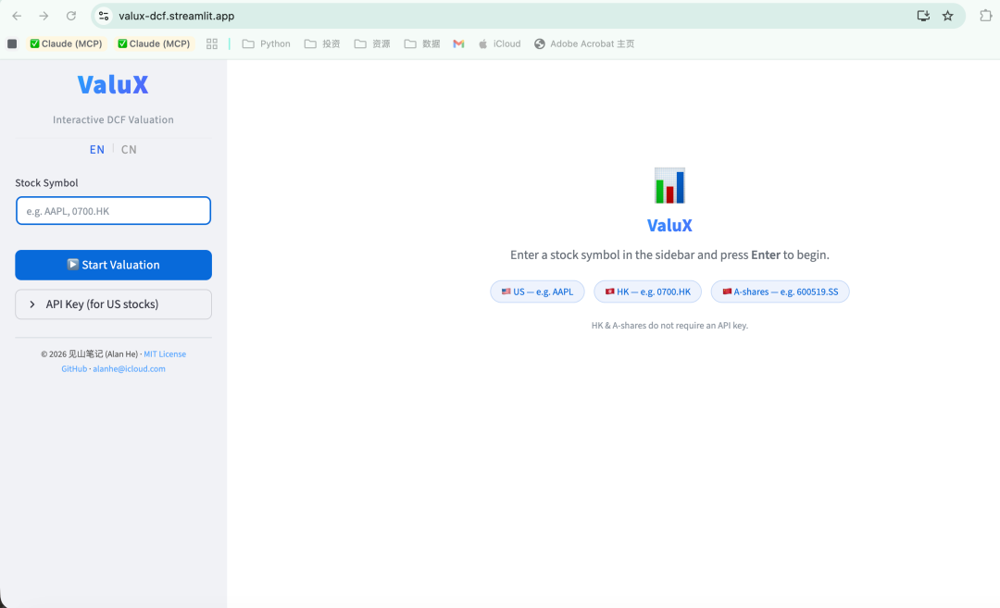
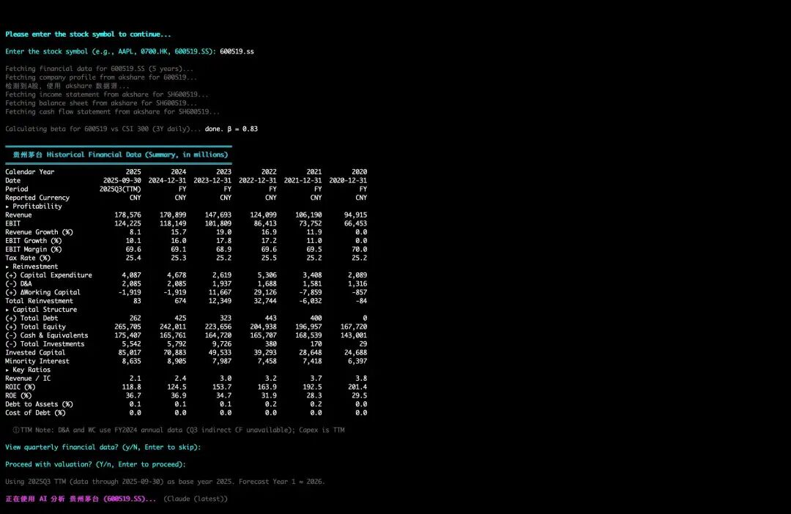
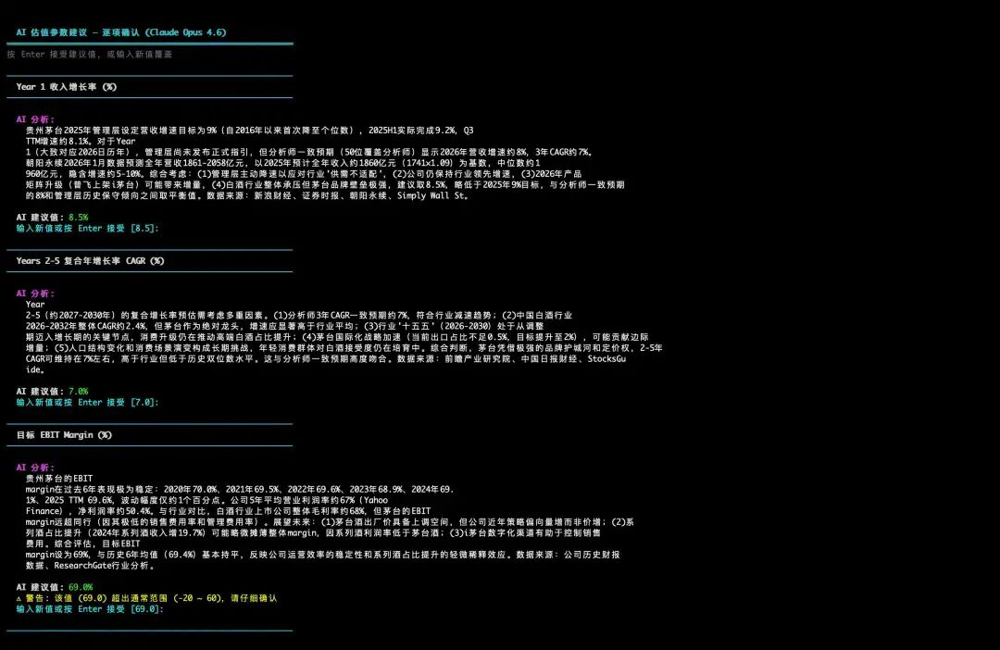
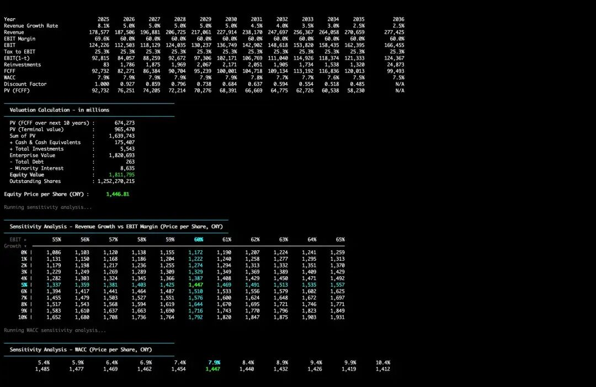
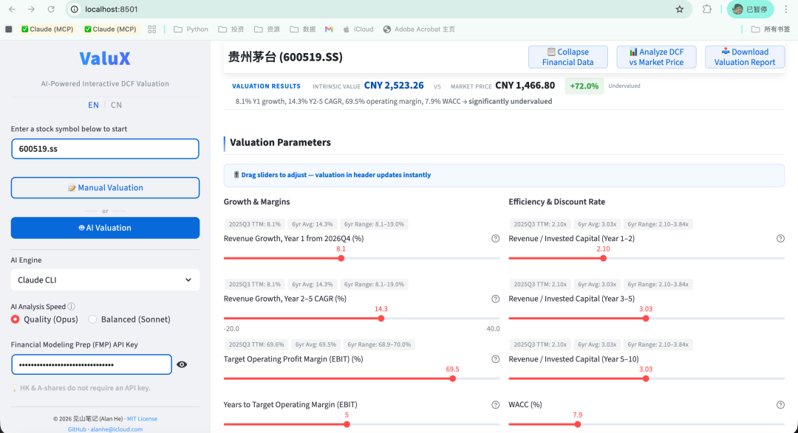

> **Updated on March 11, 2026**: The project has been officially renamed to **ValueScope**. The web version now features Cloud AI (DeepSeek R1 deep reasoning + Serper web search), enabling AI-driven valuation directly in the browser without any local setup. Content below has been updated accordingly.

During the Spring Festival holiday, I've been using Claude extensively. One clear takeaway: large language models have evolved beyond chatbots into genuine productivity tools. Strong comprehension, high-quality output, and many tasks completed in a single pass — far more efficient than the back-and-forth iterations typical in real-world work.

I previously shared how Claude's latest Opus 4.6 model can produce end-to-end DCF valuations — from searching financial data to generating assumptions, calculating intrinsic value, and outputting Excel spreadsheets, all through conversation.

But after extended use, I noticed a practical issue:

Every valuation requires AI to search financial reports from scratch and recalculate all metrics. This consumes significant tokens, and the output format isn't always consistent — making cross-company comparisons difficult.

Running one or two valuations occasionally is fine. But for regular tracking across multiple companies with iterative parameter adjustments, the cost adds up.

So I rethought the division of labor:

**Mechanical work** — data retrieval, cleaning, and computation — is better handled by standardized financial databases and automated programs. **Judgment calls** — what growth rate to assume, what margin range is reasonable — are where AI adds value.

This is the design philosophy behind **ValueScope**: an AI-powered interactive DCF valuation tool. The foundation is a standardized DCF model (10-year forecast period, WACC, terminal value, sensitivity analysis) — fixed framework, reproducible results. The AI layer helps with parameter judgment.

## The Simplest Way to Start: Web Version (Free, No Installation)

If you just want to quickly estimate what a stock is worth, **the web version is the best starting point** — open it and go, no downloads needed, completely free.

The web version offers two valuation modes:

- **🤖 AI Quick Valuation**: One click and Cloud AI (DeepSeek R1) automatically searches the web for company earnings guidance, analyst forecasts, and industry data, then suggests all DCF parameters and completes the valuation.
- **📝 Custom Valuation**: Drag sliders to manually set valuation parameters (revenue growth, margins, etc.) — each parameter shows historical data for reference, with results updating in real time.

Both modes generate sensitivity analysis and a valuation verdict (BUY / HOLD / SELL).

**China A-shares and Hong Kong stocks are completely free.** U.S. stocks are also supported with a free financial data account.

Web version: https://valuescope.streamlit.app

## What Can AI Do for You?

DCF's real challenge is — **how do you set the parameters?** What revenue growth rate? What operating margin assumption is reasonable? These judgments typically require extensive research. ValueScope's AI features are designed to solve exactly this.

Whether using Cloud AI on the web or AI Copilot locally, the AI will:

- **Search the latest data and suggest parameters.** For each valuation parameter, AI searches company guidance, analyst consensus, and industry data, providing suggested values with analytical reasoning.
- **You review — final decision is always yours.** Every AI-suggested parameter can be individually reviewed and adjusted. Accept it if reasonable; drag the slider or type your own number to override.
- **AI analyzes the gap between valuation and market price.** After calculation, AI compares the valuation result with the current stock price, searches analyst target prices, and analyzes discrepancies — is the market pricing in sentiment premium, or are your assumptions too conservative?
- **One-click Excel export.** Valuation results, historical financials, and AI analysis — all exported to a single Excel file for archiving and review.

## Advanced: Local Version

For a more complete terminal experience, you can download ValueScope to run locally (installation instructions at the GitHub link below). Two usage modes:

- **Terminal version**: Command-line interaction with custom, AI-assisted, and fully automated valuation modes.

- **Local web version**: Same visual interface as the online version with drag sliders and real-time updates, plus AI auto-valuation capability.

Both versions are functionally identical, support Chinese and English, and allow both AI Quick Valuation and Custom parameter input.

## About AI Engines

**Web version (online):** Built-in Cloud AI, no installation required:

- **DeepSeek R1**: Deep reasoning model for analyzing company fundamentals and generating parameter suggestions.
- **Serper**: Web search + page scraping to automatically gather the latest earnings guidance, analyst forecasts, and industry data.

**Local version (download):** Supports three AI CLI engines:

- **Claude**: Best analysis quality, requires Claude paid subscription.
- **Gemini**: By Google, **free** with a Google account login.
- **Tongyi Qianwen**: By Alibaba, **free** with account registration.

Even without spending a dime, you can use the web version's Cloud AI directly, or run Gemini or Tongyi Qianwen locally for AI-assisted valuation. Without any AI engine installed, the tool automatically switches to custom valuation mode — valuation calculation is unaffected.

## Why I Built This Tool

This tool evolved from a crude script to a relatively complete valuation tool over several years of iteration. For most of that time, it was just something I used myself — reaching its current state was largely thanks to the vibe coding trend, which lets non-professional programmers like me turn ideas into products.

The biggest barrier to value investing has never been just philosophy — Buffett's quotes are widely known. The real barrier is practice: how to calculate intrinsic value, where to get data, how to build models, how to set parameters.

**ValueScope aims to reduce that barrier to zero.** Enabling everyone to calculate the approximate intrinsic value of companies they follow, and find their margin of safety.

The project is fully open source. GitHub link below — feedback and contributions welcome:

GitHub: https://github.com/alanhewenyu/ValueScope
