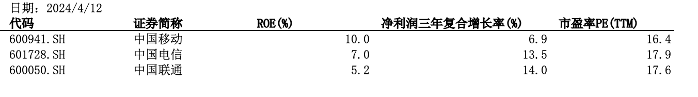

Relative valuation is straightforward and widely used in practice. On the numerator side, the most common metrics are share price (P) or enterprise value (EV). On the denominator side, one can choose from revenue, earnings, cash flow, book value, EBITDA, and other measures. Below is an overview of several commonly used multiples along with key considerations.

## Price-to-Earnings Ratio (P/E)

As analyzed in previous articles, the relationship between P/E ratios and a company's expected growth rate is often oversimplified as linear. For instance, the widely used PEG ratio measures the P/E relative to the expected growth rate. However, as demonstrated in earlier case studies, P/E and growth do not share such a straightforward linear relationship. A company's return on invested capital (ROIC) is also a critical factor in determining its P/E level. Since P/E reflects the value of the equity portion of a company, one could also say that return on equity (ROE) influences the P/E ratio as well.

### Return on Capital

Consider the three major Chinese telecom operators as an example. China Mobile's compound annual growth rate in net income over the past three years has been notably lower than that of China Telecom and China Unicom, yet the P/E ratios of all three companies are remarkably similar. A reasonable explanation is that China Mobile's ROE is higher, making its reinvestment more efficient.

High growth combined with high return on capital is, of course, the most attractive type of investment. However, when factoring in investment risk, mature companies can also be excellent choices -- especially those with a verifiable track record. Even if these companies lack strong growth, the fact that they require minimal reinvestment to maintain their competitive advantages -- that is, they have high returns on capital -- still makes them compelling investments. This is precisely the type of investment Warren Buffett favors: companies with economic moats that require little annual capital expenditure, such as See's Candies.

### The Growth Trap

Another important consideration is that not all revenue growth creates value, nor does it necessarily justify a high P/E multiple. While previous articles noted that revenue growth typically translates into earnings growth, situations can arise where revenue increases without corresponding profit growth -- often due to low reinvestment efficiency.

Growth creates value only when the reinvestment driving it generates long-term market value in excess of the capital deployed. Quantitatively, growth-oriented reinvestment creates value only when the return on invested capital (ROIC) exceeds the weighted average cost of capital (WACC). For businesses that require additional capital investment but earn returns below their cost of capital, growth actually destroys value for investors.

Many listed companies are reluctant to pay dividends, choosing instead to reinvest retained earnings into ventures that earn returns below the company's current ROIC or even below its cost of capital. This behavior is detrimental to shareholder interests.

The recently issued "New Nine Articles" policy aimed at promoting capital market development has set explicit requirements for listed company dividends. Companies that fail to meet dividend standards will face the risk of being designated as ST (Special Treatment). This can be seen as a significant positive for investor protection.

## Price-to-Book Ratio (P/B)

A low P/B ratio does not necessarily indicate genuine undervaluation. One must carefully examine the composition of the company's assets, paying particular attention to whether significant goodwill is present.

### Goodwill

Previous articles have discussed Buffett's views on goodwill arising from acquisitions. Looking at the A-share market, it is not uncommon for listed companies to experience declining performance and falling ROE following acquisitions, while goodwill impairment has become a frequent occurrence.

If a listed company has a very low P/B ratio alongside substantial goodwill, it may suggest that the market does not believe the goodwill holds real value.

### Debt-to-Asset Ratio

Another factor to scrutinize is the company's leverage. Financial leverage acts as a magnifying glass -- it amplifies returns when the company is profitable but equally amplifies losses during downturns. Given the rigid nature of debt obligations, when a company is highly leveraged, even a minor error involving a small portion of assets can devastate a large portion of equity. For example, banks typically carry leverage ratios as high as 90%; a 10% decline in asset values could wipe out the entire equity base.

If a company's assets have strong financial-asset characteristics and are highly cyclical, the impact of an economic downturn will be even more severe. Both the banking and real estate industries are highly leveraged, with asset values that are sensitive to economic cycles. This is one of the reasons why P/B ratios in these sectors are generally well below 1x or even cut in half.

## Price-to-Cash-Flow Ratio (P/CF)

The issue with P/CF lies in the mismatch between the numerator and the denominator. The numerator, P, represents the value of the company's equity, while the denominator, CF, represents the net operating cash flow at the company level -- that is, the cash flow generated by the total invested capital (IC), which includes both equity and debt, as discussed in previous articles.

Taking the telecom operators as an example again, net operating cash flow over the past three years has remained largely stable for each carrier. Comparing current market capitalization to the most recent annual net operating cash flow -- the P/CF ratio -- reveals that China Unicom's P/CF is significantly lower than that of the other two. Does this mean China Unicom's shares are undervalued?

As shown by the P/E ratios discussed earlier, the three operators trade at roughly similar multiples. In fact, China Unicom's notably low P/CF is primarily attributable to its high proportion of minority interests. The cash flow attributable to minority interests is included in the company-level cash flow, but the share price does not reflect the value of minority interests.

## EV/EBITDA

EV refers to enterprise value, which encompasses both equity and debt -- consistent with the basis used when calculating free cash flow to the firm (FCFF). As the name itself suggests, Earnings Before Interest, Taxes, Depreciation, and Amortization (EBITDA) strips out the effects of different capital structures and accounting depreciation policies across companies, enabling a fairer and more accurate comparison of profitability. This characteristic makes EV/EBITDA an important tool for comparing valuations across companies within an industry.

For example, capital-intensive industries such as data centers typically require substantial capital investment and tend to carry high financial leverage. If companies within the industry have significantly different debt levels or depreciation policies, using P/E ratios for valuation could distort cross-company comparisons. In contrast, EV/EBITDA more comprehensively accounts for the impact of interest and capital expenditures on corporate earnings, providing investors with a more accurate gauge of a company's profitability and investment value.

## Absolute Valuation vs. Relative Valuation

When using absolute valuation -- the discounted cash flow model (DCF) -- the underlying assumption is that the market makes mistakes and will correct them over time, with the company's market value eventually converging toward its intrinsic value as calculated by DCF. In relative valuation, the assumption is that even if the market misprices individual stocks, the average valuation across an industry is generally correct. Therefore, comparing an individual company's valuation to the industry average is a meaningful exercise.

For value investors, the concept of margin of safety means buying at a sufficiently low price. The sole benchmark for this margin of safety is that the company's intrinsic value, as calculated by DCF, must exceed its current market value. As Warren Buffett has said:

> "Whether the business grows or doesn't, displays volatility or smoothness in earnings, or carries a high or low price relative to current earnings and book value (i.e., relative valuation), the investment shown by the DCF calculation to be the cheapest is the one that the investor should purchase."
