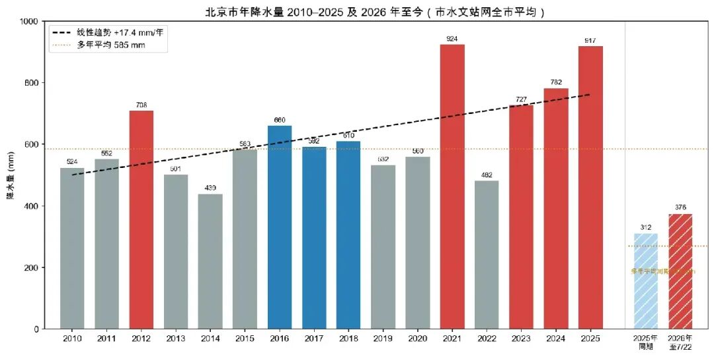
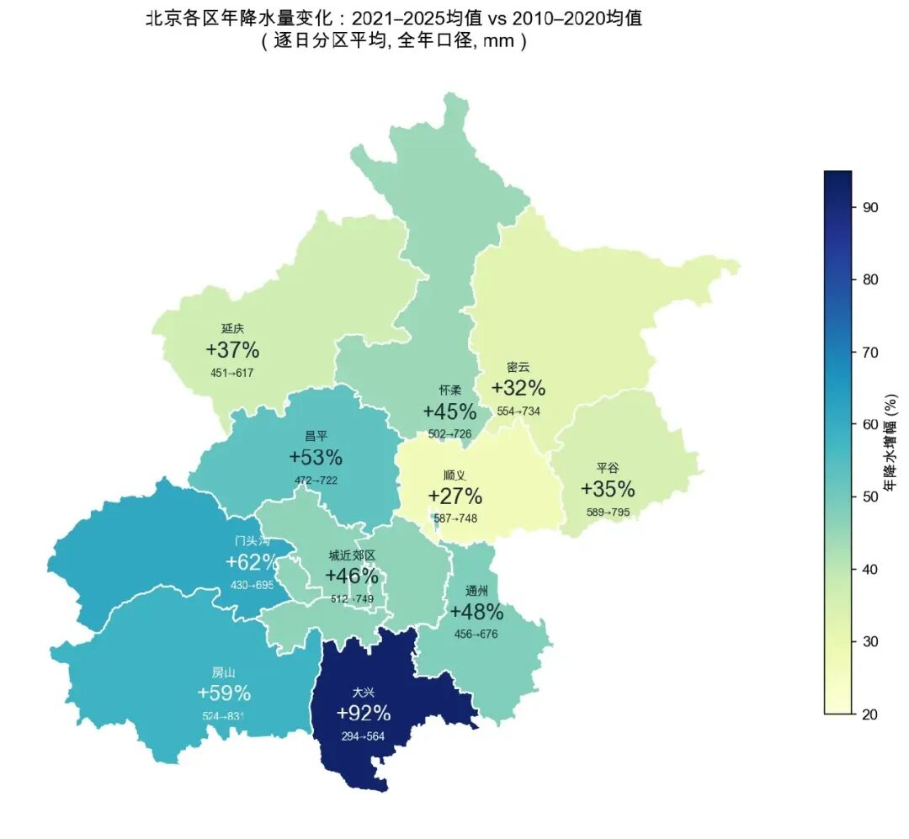

In recent years, Beijing has clearly felt rainier, and the sweltering heat seems to have eased a little. Some even say Beijing is becoming more like the south of China—**more humid, cooler, more livable**.

I remember when I first came to Beijing nearly twenty years ago, the news would still occasionally remind everyone that Beijing was a city severely short of water, and that its groundwater table had been falling for years on end. The South-to-North Water Diversion Project was built out to Beijing against exactly that backdrop. Yet in the past few years, the topic of water scarcity has rarely come up again. But can we trust how it feels? Let the data do the talking: **is Beijing really getting wetter?**

The website of the Beijing Water Authority has a daily-updated "Rainfall Table" that records the daily rainfall at all 121 hydrological rainfall monitoring stations across the city. This data can be traced back day by day to 2009. I scraped all of it—roughly **6,000 days and 460,000 station records** from 2010 to today—and organized it into a complete time series. The conclusion was even clearer than I had expected.

## Not an Illusion: The Past Five Years Have Been Three-Tenths Wetter Than the Long-Term Average

Middle-school geography textbooks feature a famous line—the **400mm isohyet**—running roughly along the Greater Khingan Mountains, Zhangjiakou, Lanzhou, and Lhasa. It marks the boundary between the semi-humid and semi-arid zones, and historically the boundary between farming and nomadic herding; the alignment of the Great Wall roughly coincides with it. This line passes right through the Zhangjiakou area, to the northwest of Beijing—in other words, **although Beijing sits on the "humid" side, it is only a little over a hundred kilometers from that arid boundary**. Beijing's long-term average rainfall of 585mm is precisely a reflection of this "semi-humid edge" location.

Against this backdrop, let's now look at Beijing's rainfall data over the past 16 years:

Across the eleven years from 2010 to 2020, only 2012—the year of the catastrophic "7·21" rainstorm—clearly exceeded the 585mm line. Most of the other years hovered around 500mm, and 2014 came in at just 439mm.

The turning point came in 2021. That year Beijing received **924mm**. After that: 727mm in 2023, 782mm in 2024, and 917mm in 2025—**four of the past five years topped 700mm, whereas only one of the previous eleven had done so**. The five-year average for 2021–2025 was 766mm, a full 31% above the long-term average.

This year has continued the trend: as of July 22, cumulative citywide rainfall reached 375.7mm, 20% higher than the same period last year and a full **39%** above the long-term average for the same period. This is now the sixth consecutive wet year.

## The Temporal Distribution of Rainfall: All the Extra Rain Fell in Midsummer

Plot the monthly data as a heatmap, and the pattern is unmistakable:

The darker the color, the more rain that month. Two things stand out:

First, **the dark cells are almost entirely concentrated in the two columns for July and August**—the increase in Beijing's rainfall isn't rain spread evenly across the whole year, but rather midsummer rain that has become far more intense. From 2010 to 2020, no single month in Beijing recorded more than 300mm of rain; after 2021, July of 405mm (2021), 446mm (2023), and 329mm (2025) appeared one after another.

Second, **the July and August cells after 2021 have clearly darkened**—this isn't a fluke of any single year, but a sustained state lasting five consecutive years.

Beijing's flood season runs from June to September, but break it down and June has only risen by 5% over these years, while September has barely changed—**the extra rain is precisely concentrated in July and August** (up 68% and 61%, respectively, from before the turning point).

Midsummer rain hasn't just become more plentiful, but also more violent. From 2010 to 2020, the city averaged 159 rainstorms recorded per year (a single observation point recording 50mm in one day counts as one); from 2021 to 2025 the average was 312—**nearly double**. Single-station records have also been dramatically rewritten: on the day of the "7·21" storm in 2012, Manshuihe in Fangshan recorded 408mm, an already terrifying figure at the time; during the "23·7" rainstorm of 2023, the Qingshui station in Mentougou recorded **575mm** in a single day—the equivalent of dumping a whole year's worth of Beijing's rain in a single day.

So what about outside the flood season (June–September)? **Not much has changed**: adding up the other eight months, the average rainfall was 122mm for 2010–2020 and 119mm for 2021–2025. Nearly all of Beijing's extra rain has fallen in summer—spring remains dry, and winter still sees little snow. It isn't the whole year that has grown wetter, it's summer.

## The Regional Distribution of Rainfall: Increases Everywhere, Most Fiercely in the Mountains

Put the annual rainfall of each district before and after the turning point (2010–2020 vs. 2021–2025) side by side on a map:

First, the urban and near-suburban areas where most people live: average annual rainfall rose from 512mm to 749mm, an increase of **46%**. That's no small gain, but it's only middling for the city as a whole. Larger increases came in the western mountains and the southern plains—Mentougou +62%, Fangshan +59%, Changping +53% (Daxing led at +92%, but that district has few stations and a low base, so the percentage is inflated). Smaller increases came in the northeast—Shunyi +27%, Miyun +32%, Pinggu +35%. Yet even Shunyi, at the bottom, gained a full quarter.

This spatial pattern is worth noting—Mentougou, Fangshan, and Changping, which top the list of increases, overlap closely with the locations of recent mountain floods: Mentougou and Fangshan in 2023, Miyun and Huairou in 2025. More and more rain is falling on the windward slopes at the foot of the mountains—precisely the places most prone to concentrate into flash floods in a short span of time.

## The Shift We Are Living Through

Back to the question we started with: Beijing getting wetter is no illusion. **Over the past sixteen years, rainfall has increased at a rate of about 17mm per year, with a clear acceleration after 2021**—at the level of the past five years, Beijing has in fact become a city with annual rainfall above 700mm, surpassing the long-term levels of North China neighbors like Shijiazhuang (around 570mm in a normal year), Jinan, and Zhengzhou. That said, one caveat: this round of getting wetter is a phenomenon across all of North China, and these cities' rainfall has also been rising in recent years—Beijing is not an isolated case, but part of a larger regional shift.

The impressions from daily life mostly match the data: the Yongding River carries more water, and the cool air after a summer rain does indeed arrive more often—the way it feels isn't lying.

How long this shift will last is hard to say. North China's rainfall has always had cycles; the 1950s and 1960s were a widely recognized wet period: in 1954, 1956, and 1963, the Hai River basin saw catastrophic floods one after another—the official characterization of the "23·7" rainstorm of 2023 was, in fact, "the strongest rainfall in the Hai River basin since 1963." In 1959, Beijing recorded 1,406mm, still the highest on meteorological record to this day (a single-station figure from the Observatory, slightly different from the citywide average used in this article). After that, Beijing's rainfall entered a downward channel lasting several decades, falling by about 31mm per decade on average, bottoming out in 1999–2007: nine consecutive years of drought, with annual rainfall averaging just 462mm. From 1,406 to 462, and back up again in these recent years—viewed over a long horizon, the current wetting looks more like yet another swing of a grand cycle, except that this time it may also be compounded by the push of global warming: for every 1°C rise in atmospheric temperature, the amount of water vapor the air can hold rises by about 7%, and the more it holds, the more violently it can rain.

Another trend has drawn attention in recent years: **China's rainfall line is shifting northward**. From the public record, there are two independent lines of evidence for this. One comes from academic studies measuring the 400mm isohyet: over recent decades this line has indeed been advancing north and west, on average about 0.5 to 1.5 kilometers per year, and faster in some segments—around Guyuan in Ningxia it has already shifted about 22 kilometers north. The other comes from the operational monitoring of the National Climate Center: since 2010 China's main rain belt has clearly expanded northward, and the area receiving 400 to 800mm of annual rainfall has been growing. The two lines of evidence point in the same direction. Beijing's wetting sits squarely within this larger context.

---

*Data note: The data in this article comes from the publicly available Rainfall Table on the Beijing Water Authority website (municipal-level hydrological rainfall monitoring data), scraped day by day for the 6,161 days from 2009-06-01 to 2026-07-22, about 460,000 station records. Statistical measures such as citywide average rainfall follow the figures published by the Beijing Meteorological Bureau; the figures in this article are values monitored by the hydrological station network and differ slightly from the Meteorological Bureau's national-station series. Starting in 2024 the station network was adjusted to 121 stations year-round; before that there were fewer stations in the non-flood season. The district-by-district comparison uses a method of "computing daily district averages first, then summing by year" to eliminate the effect of changes in station count, on a full-year basis.*
