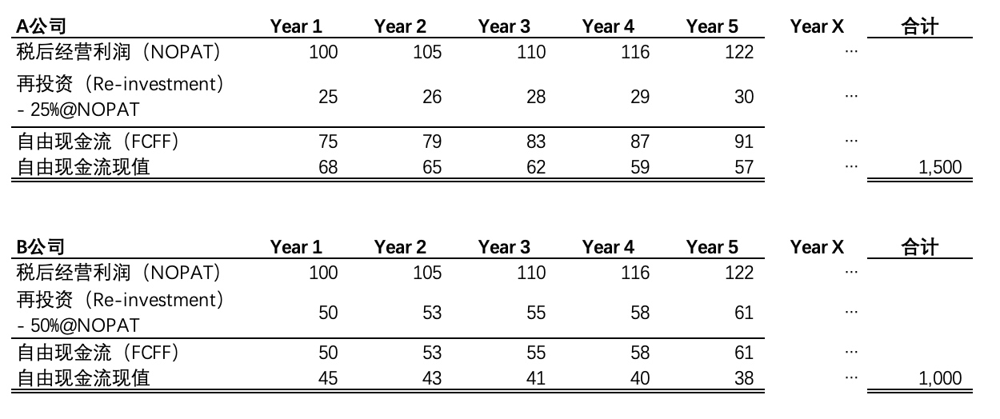

In previous articles, we discussed company growth, return on invested capital (ROIC), and how to calculate free cash flow to the firm (FCFF) as separate topics. In this article, we will systematically explore the relationships among these three concepts.

## Starting with the P/E Ratio

Compared to absolute valuation -- that is, discounted cash flow (DCF) analysis -- most people prefer relative valuation methods, among which the price-to-earnings ratio (P/E) is particularly well known.

The P/E ratio measures a company's relative value. For publicly listed companies, it reflects current market sentiment and is easy to observe without requiring any calculation.

Is a stock trading at 10x P/E necessarily cheaper than one trading at 20x? The answer is clearly not that simple. A core variable that determines the level of P/E is a company's growth profile. Generally speaking, companies in a high-growth phase command higher P/E multiples than those in a mature phase, because as the company grows rapidly, the denominator of the P/E ratio -- E (earnings per share) -- increases quickly and soon justifies the elevated multiple.

The relationship between P/E and expected growth rate is often oversimplified as a linear one. A prime example is the PEG ratio, which measures P/E relative to the expected growth rate. It is commonly assumed that a PEG of around 1 represents fair value -- implying that a 10% growth rate should correspond to a 10x P/E, and a 20% growth rate to a 20x P/E. In reality, the relationship between P/E and growth rate is far from this simple linear correspondence. There is another key variable that determines the level of P/E: the company's return on invested capital (ROIC).

## A Tale of Two Companies: Same Profits, Different Cash Flows

Suppose there are two companies, A and B, each earning 100 in after-tax operating profit (NOPAT) in Year 1, with both expected to grow revenue and profit at 5% annually.

Now let us value these two companies using the discounted cash flow (DCF) approach. We assume that their revenue growth and reinvestment rates (reinvestment as a percentage of NOPAT) are perpetual, and that the cost of capital (WACC) is 10%. Discounting each year's cash flow back to the present, we find that Company A has an intrinsic value of 1,500, while Company B's intrinsic value is 1,000.

This simple example demonstrates that despite having the same growth rate, Companies A and B have very different intrinsic values.

Converting these to P/E ratios by dividing each company's intrinsic value by its Year 1 profit of 100, Company A's P/E is 15x while Company B's is only 10x. Although revenue growth rates and profit levels are identical, the two companies carry different P/E multiples due to their vastly different cash flow profiles. This neatly illustrates the point raised at the beginning: the relationship between P/E and growth rate is not linear.

Why does Company A generate higher free cash flow and intrinsic value than Company B? The difference lies in the reinvestment rate. Nearly all companies need to invest in plant, equipment, or working capital to achieve growth -- in other words, they must reinvest. Free cash flow is the amount remaining after investors subtract reinvestment from after-tax operating profit. Company A achieves the same profit growth as Company B with only a 25% reinvestment rate, whereas Company B requires a 50% reinvestment rate to deliver the same profit growth. As a result, at the same profit level, Company A's annual free cash flow is 50% higher than Company B's.

The reason for the difference in reinvestment rates -- or more precisely, the core factor driving this divergence -- is the difference in return on invested capital (ROIC), which reflects the efficiency of reinvestment. In Year 1, Company A invests 25 to generate an additional 5 of profit in Year 2, yielding a return of 20% on its new invested capital (5 of incremental profit divided by 25 of investment). By contrast, Company B's return on new invested capital is only 10% (5 of incremental profit in Year 2 divided by 50 of investment).

## The Relationship Between Growth Rate, ROIC, and Free Cash Flow

The simple example above illustrates that the operating profit growth rate, ROIC, and free cash flow are interconnected. The following formulas further reveal the relationship among the three.

As discussed in a previous article, a company's operating profit growth rate depends on ROIC and the reinvestment rate, expressed as formula (1):

*NOPAT growth rate (g) = ROIC x Reinvestment Rate*

Combined with the free cash flow (FCFF) formula (2):

*Free Cash Flow (FCFF) = NOPAT x (1 - Reinvestment Rate)*

By eliminating the reinvestment rate from both formulas, we derive (1) x (2):

*Free Cash Flow (FCFF) = NOPAT x (1 - g / ROIC)*

This formula reveals that the core drivers of a company's free cash flow can be decomposed into the growth rate (g) and ROIC -- two metrics that are essential for understanding a company's operating performance and assessing its intrinsic value. ROIC is equally important in evaluating P/E levels. A slow-growing company does not necessarily deserve a low P/E, because a company with high ROIC reinvests more efficiently -- even with modest growth, it can still generate substantial free cash flow.

It is worth noting that previous articles have repeatedly emphasized that revenue growth and operating profit margin are the core drivers of company value. This perspective differs slightly from the one presented here, but there is no fundamental contradiction. Revenue growth typically leads to operating profit growth, so in many contexts -- as the title of this article suggests -- there is no need to specifically distinguish whether the growth rate refers to revenue or profit. Furthermore, operating profit margin is a core determinant of ROIC. Assuming a company's asset turnover efficiency (e.g., accounts receivable turnover, inventory turnover) remains unchanged, an improvement in operating profit margin will enhance the company's operational and reinvestment efficiency, thereby further boosting ROIC.
