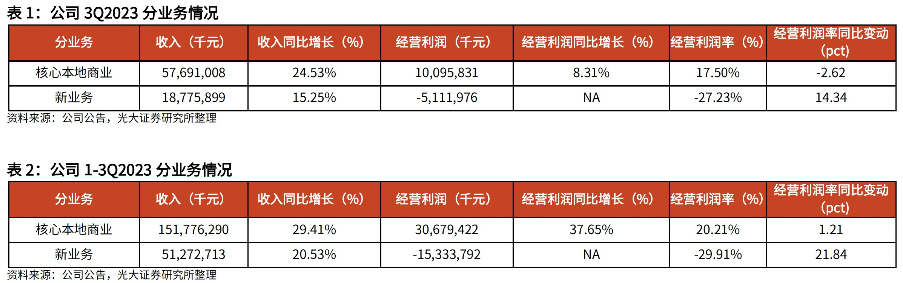

## Why Has Meituan's Stock Price Plunged

Recently, Meituan's stock price has been in a sustained decline, drawing widespread market attention. Discussions about Meituan's future prospects — particularly its competition with Douyin — have intensified, with no shortage of bearish voices. This is how the stock market works: when prices fall, pessimism and negativity emerge in droves, as if the company's fundamentals are about to collapse. In reality, the fundamentals remain the same; it is simply Mr. Market, as Buffett would say, crying and fretting.

Let us start with why Meituan's stock price has plunged. The decline began before the Q3 earnings release and continued to drop sharply after the report was published. In fact, Meituan's key Q3 metrics — including revenue and net profit — exceeded market expectations. So why did the market react negatively? The core reason is that Meituan's core business, specifically its local commerce segment, saw a decline in operating margin. In Q3, Meituan's local commerce operating margin was 17.5%, down 2.6 percentage points year-over-year.

Behind the margin decline is Meituan's competition with Douyin. Meituan has had to increase marketing spend and even lower merchant commission rates to fend off Douyin's competitive pressure. This is the primary reason for the market's pessimism regarding Meituan's outlook. In numerical terms, a decline in operating margin has a significant impact on DCF valuation — in other words, operating margin typically has high sensitivity to valuation changes. I will discuss this topic in more detail at a later opportunity.

## Meituan's Business

Let us first look at Meituan's business segments. According to its financial reports, Meituan divides its business into two major categories: core local commerce and new initiatives. Core local commerce is straightforward — from an O2O perspective, it essentially consists of two types of services: delivery (to-home) and in-store (to-store). Food delivery is the core to-home service, complemented by flash delivery (instant retail). New initiatives are more varied, primarily consisting of Meituan Select (community group buying) and Meituan Maicai (grocery), both of which are still in a loss-making phase.

Below is a simplified financial overview of these two segments. As we can see, although Q3 core local commerce experienced a decline in operating margin, operating profit for the quarter still reached RMB 10 billion, with RMB 30 billion for the first three quarters combined. At this pace, it is reasonable to expect the local commerce segment to achieve RMB 40 billion in operating profit for the full year. New initiatives remain in a loss-making state, burning through roughly RMB 5 billion per quarter.

Meituan's current market capitalization is approximately HKD 520 billion, or roughly RMB 480 billion. If we set aside the valuation of new initiatives and look solely at the local commerce business, the P/E ratio is only around 10-15x.

Meituan's competition with Douyin is primarily concentrated in the core local commerce segment. Let us now examine Douyin's business in more detail.

## Douyin's Business

Douyin is not yet publicly listed, so there is limited public data available. Many people may wonder: how exactly does Douyin make money?

Let us start with Douyin's business model. At its core, there are two sides. On the user side, Douyin currently has approximately 700 million daily active users, with content serving as the primary driver of user growth. On the user side, Douyin is currently facing slowing growth in active users and even declining average time spent per user — in other words, traffic is hitting a ceiling. This is a common challenge facing Chinese internet companies today.

On the other side is monetization. With user traffic comes a variety of monetization opportunities. Douyin's traffic monetization is still in a dividend phase with plenty of untapped potential — short dramas being one example. This is also why Douyin's business model has not yet fully solidified and why it continues to expand into new commercial domains.

Douyin's earliest monetization was through advertising. For short-form video, much like the text-based Toutiao (Today's Headlines) before it, advertising revenue is a natural business. However, advertising has a content load rate issue — users cannot be constantly shown ads, as this clearly harms user experience and retention. The load rate is already quite high, and with user-side growth slowing, advertising revenue has largely plateaued.

Starting from advertising, Douyin subsequently moved into e-commerce. It began with livestream e-commerce (also called the content channel), a product-finds-user model that focuses on a small number of viral products with compressed prices and high volume. However, livestream e-commerce traffic has a ceiling similar to advertising. Public data shows that Douyin's livestream e-commerce GMV reached RMB 1.3 trillion for January-October 2023, with full-year revenue expected to approach its ceiling.

Starting last year, Douyin began pushing Douyin Mall, which differs from livestream e-commerce — it is a traditional shelf-based model where users search for products, similar to Taobao and JD.com. Combining both e-commerce formats, Douyin calls this its "full-domain e-commerce" strategy, aiming to create a closed-loop business ecosystem. Indeed, strong content channel operations can effectively drive traffic to the shelf channel.

With both advertising and e-commerce approaching their ceilings, this may explain Douyin's urgency to expand into new business areas. The new business currently receiving the most focus is local commerce.

In local commerce, Douyin first entered the in-store business — specifically, group buying deals. During the pandemic in particular, local merchants increasingly used short videos for promotion while users spent more time watching videos at home. Douyin's in-store business seized this strategic window and achieved rapid expansion.

On the delivery side, Douyin began piloting food delivery services in select cities this year. So far, the delivery business has proven difficult, and Douyin has already abandoned its aggressive annual expansion targets. Starting in October, Douyin launched an hourly delivery service, which directly competes with Meituan's flash delivery business.

It is clear that Douyin and Meituan compete across virtually all fronts in local commerce. So, can Meituan win this battle? And if neither side can eliminate the other, can Douyin and Meituan find differentiated paths forward?

## Characteristics of the Local Commerce Business

### Delivery (To-Home) Business

Let us start with food delivery — Meituan's foundational business. To understand the characteristics of the delivery business, we need to first discuss economies of scale. Wang Huiwen, Meituan's co-founder, has addressed this topic in his Meituan product course at Tsinghua University.

We typically assume that bigger is always better in business — that as scale increases, fixed costs are spread further, naturally generating economic efficiencies. However, economies of scale depend on the geographic scope. Take offline retail: many cities have their own local retail brands and lifestyle services. For these businesses, economies of scale matter only at the regional or local level, not at the national or global scale.

Food delivery shares this characteristic — its economies of scale operate at the city level, and the battle is fought street by street. This is why both Meituan and Ele.me can coexist, and why Douyin can also enter the market. This type of business is difficult to defend but equally difficult to attack.

However, the delivery business is a tough nut to crack. The core of food delivery lies in fulfillment capability — specifically, delivery logistics. When it comes to meals, people cannot wait long; timeliness requirements are extremely high. Douyin does not have its own delivery fleet and must rely on third-party logistics partners. Compared with Meituan's exceptionally strong delivery capabilities, Douyin has no advantage in food delivery — neither in user experience nor in cost.

Douyin has clearly recognized this as well — heavy operational execution is not its strength. At present, Douyin's food delivery business has visibly contracted.

Regarding flash delivery (instant retail), Douyin has a better chance of making a breakthrough compared to food delivery, since flash delivery has somewhat lower timeliness requirements — customers can afford to wait. However, the constraint for Douyin remains its operational capabilities.

### In-Store Business

Douyin's in-store business primarily relies on livestream-driven traffic. In-store group deals also have a shelf channel, and no doubt some of Douyin's loyal users will proactively search the shelf. However, when it comes to user habits for active searching, Meituan likely offers a better experience due to its vast repository of review data that helps inform purchasing decisions.

Local lifestyle merchants have a distinctive characteristic: they represent a typical long tail, predominantly composed of small and medium-sized businesses. For these merchants, there is a service radius issue — their customers are essentially within a 3-kilometer range. Compared to the cost of livestreaming, small and medium-sized merchants are not well-suited for livestreaming, as the scale effects are limited. What works better for these merchants is typically partnering with content creators (KOLs) for video recommendations. However, since in-store conversion rates are not high, the cost of using KOL recommendations is quite significant.

Therefore, if Douyin relies on livestream-driven traffic for its in-store business, it is better suited for major brands — especially those with nationwide chain operations — where meaningful economies of scale can be achieved. When major brands livestream on Douyin, the primary purpose is usually brand advertising or new product promotion. If they use livestreaming for in-store group deals, the sudden surge of traffic can easily disrupt the merchant's supply chain management and may actually damage the offline customer experience.

## Conclusion

In the competition between Douyin and Meituan, Meituan holds an exceptionally strong moat in the food delivery business. The most threatening area remains the in-store business, which is where most concerns are focused. However, it is important to recognize that local merchants form a long tail, and the vast majority of small and medium-sized merchants are not well-suited for Douyin-based promotion. For top-tier merchants, Douyin is better suited for customer acquisition and brand awareness, while Meituan may be more appropriate for day-to-day operations.

Those who remain bullish on Meituan often point to the logic that Meituan can leverage its high-frequency delivery business to drive low-frequency in-store business — and this is indeed a sound analytical framework. But fundamentally, Meituan's core strength lies in having built an ecosystem platform. Its breadth of coverage in local commerce and the sheer scale of merchants it can serve are difficult for Douyin to match. Such a platform benefits from two-sided network effects, and Meituan continues to hold long-term core competitive advantages in this space.

Of course, competition will inevitably lead to some loss of market share and, as we are currently seeing, margin compression. However, the local commerce market is vast, online penetration still has room to grow, and it remains an incremental market. In a growing market, all players have opportunities for growth. Given that Meituan still holds significant advantages and core competitive strengths over Douyin, the market's current valuation of Meituan may be overly pessimistic.
