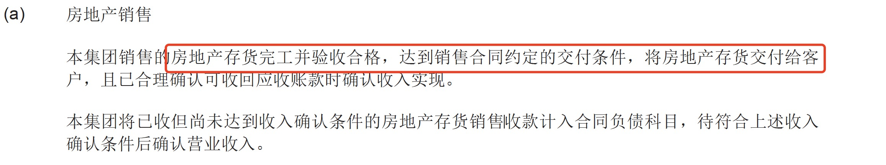
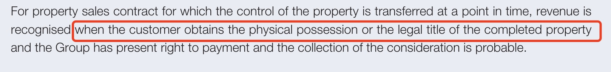
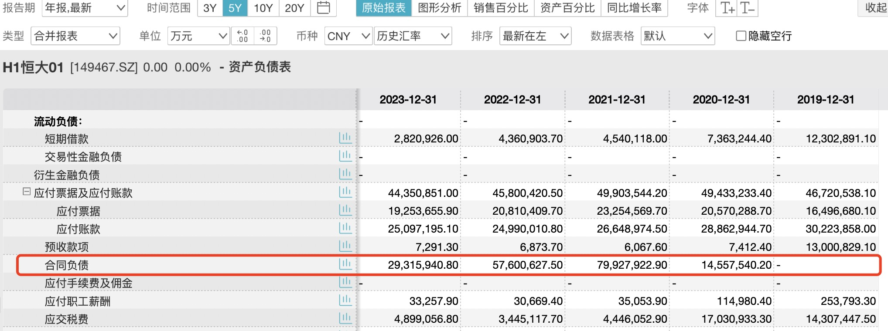

## How Evergrande Falsified Its Financials

Two days ago, the China Securities Regulatory Commission (CSRC) issued administrative penalties against Evergrande Real Estate for violations related to its corporate bonds. The investigation started with corporate bonds because Evergrande was not listed on mainland Chinese stock exchanges, but had issued a large volume of corporate bonds through the exchanges.

The most critical violation was financial fraud -- the annual reports for 2019 and 2020 contained false records. The original statement reads:

> Evergrande Real Estate committed financial fraud through **premature revenue recognition**. In 2019, it inflated revenue by RMB 213.989 billion, accounting for 50.14% of operating revenue for the period, with corresponding inflated costs of RMB 173.267 billion and inflated profit of RMB 40.722 billion, representing 63.31% of total profit for the period. In 2020, it inflated revenue by RMB 350.157 billion, accounting for 78.54% of operating revenue for the period, with corresponding inflated costs of RMB 298.868 billion and inflated profit of RMB 51.289 billion, representing 86.88% of total profit for the period.

Note that Evergrande's method of financial fraud was "premature revenue recognition," which differs from the more common approach of fabricating transactions and cash flows. Fabricated transactions typically involve a complete set of forged documents, including fake bank statements, making them more concealed and harder for auditors to detect. Evergrande's fraud, by contrast, appeared to be merely a matter of recognizing revenue earlier than appropriate, without tampering with cash flows.

Evergrande's 2019 and 2020 financial statements were audited by PricewaterhouseCoopers (PwC). As a leading accounting firm, it seems highly unlikely that PwC would have issues with revenue recognition, since the timing of revenue recognition follows established industry conventions, with companies in the sector routinely benchmarking against one another. PwC serves a considerable number of real estate clients and has extensive experience in the field. This puzzled me, so I reviewed Evergrande's corporate bond annual reports and PwC's audit reports.

## Were the Accounting Policies Problematic?

### Evergrande's Revenue Recognition Timing

Reviewing the 2021 audit report issued by PwC for Evergrande Real Estate (the corporate bond issuer), the accounting policy on revenue recognition states the following:

The core criterion for revenue recognition is "delivery." But what constitutes "delivery"? The corporate bond report did not elaborate. So I reviewed the 2020 annual report of China Evergrande Group (03333.HK), which is listed in Hong Kong.

China Evergrande Group is the overseas holding and listing vehicle for Evergrande Real Estate. Its consolidated financial statements cover a broader scope than Evergrande Real Estate's, but the revenue recognition methodology should be consistent.

China Evergrande Group's annual report provides a somewhat more specific description of the revenue recognition timing:

According to this annual report, revenue is recognized when the customer "obtains the physical possession" of the completed property or receives the property ownership certificate.

Does the accounting policy indicate premature revenue recognition? For comparison, let us examine the corporate bond 2020 annual report of Vanke, widely regarded as a model company in the real estate industry. Vanke's auditor is KPMG.

### Vanke's Revenue Recognition Timing

Reviewing Vanke's 2020 corporate bond annual report, the revenue recognition policy is as follows:

This policy has remained unchanged through to the present -- Vanke's 2023 corporate bond annual report uses the same wording. Similarly, reviewing the annual report of Vanke's Hong Kong-listed entity, the revenue recognition policy states:

In summary, Vanke's revenue recognition timing is based on "delivery" or "deemed acceptance by the customer." The phrase "when the customer obtains control of the relevant goods" used in Vanke's domestic bond issuer report can be understood as "deemed acceptance by the customer." As for the exact criteria for this determination, the reports leave room for interpretation without spelling it out.

Comparing the accounting policies of both companies, there is no fundamental difference. Evergrande's criterion of the customer "obtaining physical possession" of the completed property or receiving the property ownership certificate can also be interpreted as "deemed acceptance by the customer" -- and this standard is actually more specific than Vanke's description.

### PwC May Have Dug Its Own Grave

Looking solely at PwC's 2020 audit report for Evergrande's corporate bonds, the revenue recognition criterion mentions only "delivery," without referencing "deemed acceptance by the customer," which appears to be a narrower scope. However, when cross-referenced with Evergrande's Hong Kong annual report, the revenue recognition criteria include "deemed acceptance by the customer," i.e., "physical possession."

So did the regulators hold PwC accountable because it did not strictly audit revenue according to the "delivery" standard stated in the corporate bond report? The issue may not be that straightforward. Comparing Vanke's accounting policies reveals that the principle of "deemed acceptance by the customer" is sound and commonly adopted by other real estate companies in the industry. Overall, the revenue recognition policy that PwC accepted for Evergrande was not materially different from industry practice.

## How Did Evergrande Recognize Revenue Prematurely?

If the accounting policies were not the issue, how did Evergrande recognize revenue prematurely? Let us first examine how the problem was discovered.

### Evergrande Exposed Its Own Secrets

The last audit report PwC issued for Evergrande was for the year 2020. In the following years, Evergrande's annual reports were repeatedly delayed and could not be disclosed on time. PwC formally resigned in January 2023. Subsequently, in August 2023, Evergrande published its corporate bond 2021 annual report, with newly appointed auditor Lian'an (Mazars China) issuing the 2021 audit report.

In this corporate bond annual report, Evergrande Real Estate adjusted its revenue recognition timing under the guise of a change in accounting policy -- clearly the result of negotiations and compromise with the new auditor. The rationale for the adjustment was stated as follows:

> Prior to 2021, the Company recognized revenue when the customer accepted the property or when, under the terms of the sales contract, the property was deemed to have been accepted by the customer (whichever was earlier). However, since 2021, as the Company has gradually fallen into liquidity difficulties, the Company considers that using the **completion filing certificate or delivery to the homeowner as additional conditions for revenue recognition** better reflects the Company's circumstances and is more practically operable.

As mentioned at the beginning of this article, the revenue recognition timing in Evergrande's corporate bond 2020 annual report was "delivery," with the prerequisite that "real estate inventory has been completed and passed inspection." Now, the addition of a completion filing certificate or actual delivery as supplementary conditions for revenue recognition may seem redundant, but the implication is that revenue in prior years was not recognized based on "delivery" as stated in the accounting policy -- and that revenue may have been recognized under "deemed acceptance" even before projects were completed. Evergrande's own formulation was that revenue had previously been recognized based on whichever came earlier: "customer acceptance of the property" or "deemed acceptance of the property."

In this annual report, Evergrande Real Estate disclosed the impact of the adjusted revenue recognition criteria on prior years. The balance that should have been classified as contract liabilities rather than recognized as revenue at the beginning of 2021 was RMB 578.065 billion (excluding VAT). This amount is broadly consistent with the aggregate revenue fraud figures for 2019 and 2020 as determined by the CSRC.

The result of the revenue restatement was a dramatic surge in contract liabilities (i.e., advance receipts from pre-sales) on Evergrande's 2021 financial statements -- from approximately RMB 145 billion in 2020 to approximately RMB 800 billion in 2021 -- with the balance sheet correspondingly showing net liabilities and net current liabilities.

### The Boundaries of "Deemed Acceptance"

In our earlier comparison with Vanke's annual report, we noted that "deemed acceptance by the customer" is consistent with industry convention. However, the criteria for "deemed acceptance" are rarely made explicit. For example, Vanke's accounting policy does not list project completion filing as a condition for recognition.

Based on the information above, the most significant issue likely lies in Evergrande Real Estate's execution standards for "deemed acceptance." Although "physical possession of the completed project" was the standard that PwC accepted for "deemed acceptance," projects may have been "deemed accepted" before they were actually completed -- otherwise, Evergrande Real Estate would not have abruptly added the completion filing certificate as a supplementary condition for revenue recognition.

As for whether PwC relaxed its audit standards for "deemed acceptance" or simply failed to perform adequate audit procedures, we cannot say for certain. However, given PwC's stature as the industry leader, it is unlikely that the firm actively colluded in the fraud -- audit quality issues are the more probable explanation.

Recently, a PwC internal whistleblower published an open letter stating: "Because Evergrande's financial fraud was so egregious, the audit work on both 'properties' and 'cash/bank deposits' was inadequate. Legally, should PwC be considered a participant in the fraud?" The "properties" referred to here are likely real estate inventory, which relates directly to the revenue recognition timing issue. However, the "cash/bank deposits" issue mentioned in the open letter was not addressed in the CSRC's list of violations.

## Other Audit Issues at PwC: The Going Concern Assumption

As early as October 2021, PwC was placed under investigation by Hong Kong's Accounting and Financial Reporting Council (AFRC) over the Evergrande audit. The Hong Kong regulator's 2021 investigation did not involve the revenue recognition issue; instead, it focused on whether PwC's 2020 audit report adequately disclosed matters related to Evergrande's going concern assumption. This investigation has yet to produce a public conclusion.

### The Going Concern Assumption

The going concern assumption, in simple terms, involves assessing whether an enterprise will be able to continue operating normally over the next 12 months. A common trigger for going concern doubts is a company's liquidity position -- for example, when current liabilities exceed current assets.

Even if auditors have doubts about a client's ability to continue as a going concern, this generally does not prevent them from issuing an unqualified audit opinion unless the situation is extremely severe. When going concern doubts exist, auditors typically include detailed explanations in the notes to the financial statements about the rationale for preparing the statements on a going concern basis. If the uncertainty is so significant that it cannot be resolved, the auditor will issue an unqualified opinion with an emphasis-of-matter paragraph. Compared to a standard unqualified opinion, a report with an emphasis-of-matter paragraph is more likely to attract investor attention and signal potential risks.

### PwC's Audit Opinion

PwC's 2020 audit report for Evergrande's corporate bonds was a clean, standard unqualified opinion. Moreover, the notes to the financial statements made no mention of any going concern doubts or uncertainties.

Looking purely at the comparison of current assets and current liabilities, Evergrande did indeed have net current assets in 2020, seemingly without liquidity issues. However, this net current asset position was directly linked to Evergrande's revenue recognition timing. Premature revenue recognition resulted in reduced contract liabilities. When the revenue recognition criteria were adjusted for 2021, Evergrande's financial statements underwent a dramatic transformation, revealing net current liabilities exceeding RMB 600 billion.

In hindsight, it would obviously be inappropriate to use the 2021 financial position to judge potential going concern uncertainties in 2020. But standing at the 2020 vantage point, even though Evergrande's 2020 report showed net current assets, should PwC have been able to forego any supplementary disclosures about the going concern assumption?

### Evergrande's Liquidity Problems Were Already Visible in 2020

In fact, liquidity problems at Evergrande had already surfaced in the second half of 2020, and became further exposed in the first half of 2021.

In September 2020, regulators introduced the now-famous "Three Red Lines" policy for real estate company financing. The three criteria were: (1) the asset-to-liability ratio (excluding advance receipts) must not exceed 70%; (2) the net debt ratio must not exceed 100%; and (3) the cash-to-short-term-debt ratio must not be less than 1. These were designed to restrict real estate companies' financing activities. At the time, among 133 real estate companies listed on the Shanghai, Shenzhen, and Hong Kong exchanges, about 70% violated these requirements. Nineteen companies, including Evergrande, breached all three red lines simultaneously and faced the strictest financing restrictions -- they were prohibited from taking on any new interest-bearing debt.

In November 2020, Evergrande's commercial acceptance bills defaulted for the first time. By early 2021, rumors about Evergrande's commercial paper continued to circulate. According to Evergrande's suppliers, the company began delaying payments starting in April.

Under these circumstances, it is difficult to understand how PwC's audit report, issued on March 31, 2021, made absolutely no mention of going concern doubts regarding Evergrande.

In summary, PwC's issues with the Evergrande audit likely extend beyond revenue recognition to include the assessment and disclosure of the going concern assumption. The exposure of these problems has inevitably raised questions among the public about PwC's audit quality and independence. The definitive answers will have to await the conclusions of regulatory investigations.

In an era when capital market regulators are determined to show "teeth and claws," auditors face increasingly significant professional risks. The Evergrande affair serves as a powerful cautionary tale, reminding other audit firms to exercise even greater diligence in their work.
