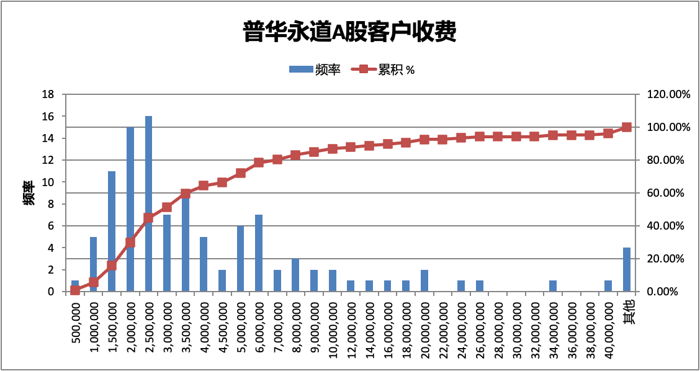

Bloomberg has reported that the Ministry of Finance may announce penalties against PwC this week for its role in auditing Evergrande Group. PwC reportedly faces a fine of at least RMB 1 billion, which would surpass the previous record penalty for an accounting firm -- the RMB 212 million fine imposed on Deloitte in 2023. The penalties may also include the suspension of operations at some of PwC's offices in mainland China.

PwC served as Evergrande's auditor for 15 years. According to available data, PwC collected approximately RMB 276 million in cumulative audit fees (excluding Evergrande Property and Evergrande Auto). The most recent year of service was 2020, with an audit fee of RMB 45 million.

According to the 2022 comprehensive ranking of the top 100 accounting firms published by the Chinese Institute of Certified Public Accountants (CICPA), PwC ranked first with total revenue of RMB 7.92 billion in 2022 and 23 branch offices. Based on a RMB 1 billion fine, the penalty would represent approximately 13% of PwC's annual revenue.

The suspension of office operations could lead to the loss of listed company clients and IPO engagements. As of May, several A-share listed companies that were previously PwC clients have already switched auditors.

## PwC and Other Big Four A-Share Audit Client Fee Overview

In 2023, the total audit fees for over 5,300 A-share listed companies that had disclosed financial reports amounted to approximately RMB 8.5 billion. The Big Four international accounting firms, while serving only 7% of audit clients by number, collected 32% of the total audit fees in the A-share market. Details are shown in the table below:

Among them, PwC's audit fees from A-share listed companies totaled approximately RMB 870 million, accounting for 10% of total A-share audit fees. PwC served 107 clients, representing about 2% of all A-share companies.

Compared to PwC's total revenue in 2022, its 2023 A-share audit fees accounted for only 11% of total revenue. Therefore, even if the penalties cause further client attrition among A-share companies, the impact on total revenue may be limited. However, the impact on IPO engagements is difficult to estimate, and IPO fees tend to be significantly higher.

## Fee Concentration Among PwC and Other Big Four A-Share Audit Clients

The chart above is based on 2023 data. Across all Big Four firms, the top five A-share clients by fee account for over 40% of total fees, the top ten account for approximately 60%, and the top twenty account for over 70%. Among them, PwC's client fee concentration is relatively lower compared to the other firms.

The high concentration is largely attributable to the fact that the highest-fee clients tend to be state-owned enterprise (SOE) giants -- often centrally-administered companies with individual audit fees exceeding RMB 10 million each.

Looking exclusively at A-share audit clients with fees above RMB 10 million, the Big Four collectively serve approximately 85% of these clients. In essence, nearly all mega-cap audit engagements and fees are controlled by the Big Four.

## PwC A-Share Audit Client Fee Distribution

The chart above is based on 2023 data. For clients with fees below RMB 5 million, the distribution follows a clear normal distribution, with an average fee of approximately RMB 2.5 million. For clients with fees above RMB 5 million, the distribution is more dispersed but features a very long tail. PwC's highest-fee A-share client is Bank of China, with an audit fee of RMB 193 million.

## Estimated A-Share and Hong Kong Audit Market Size and Big Four Revenue Share

Research has long established that audit fee concentration is a significant factor affecting auditor independence.

Although the Big Four operate as separate legal entities on the mainland and in Hong Kong, they are essentially the same teams under two different names. From an audit client perspective, companies dual-listed on both A-shares and H-shares (A+H) typically engage the same auditor for both markets.

It would be an interesting exercise to combine the audit clients and fees from both the mainland China and Hong Kong markets to analyze the Big Four's audit fee concentration. Unfortunately, detailed audit fee breakdowns by firm for the Hong Kong market are not publicly available.

However, aggregate audit fee data for Hong Kong-listed companies does exist. According to the Accounting and Financial Reporting Council (AFRC), total audit fees for Hong Kong-listed companies in 2021 were approximately HKD 13 billion, with Category A firms accounting for 64.6%, or approximately HKD 8.4 billion.

Adding the RMB 8.5 billion from 2023 A-share audit fees and adjusting for potential double-counting of A+H dual-listed companies, the combined annual audit fees for mainland China and Hong Kong listed companies total approximately RMB 20 billion.

The AFRC defines Category A firms as those with 100 or more audit clients. In practice, among the over 2,600 companies listed in Hong Kong, only five firms have more than 100 audit clients. All Big Four firms are included, with a combined total of approximately 1,100 clients, of which PwC serves around 360. The fifth firm is BDO Limited, with approximately 160 audit clients. Using the proportion of audit clients as a rough proxy for fee share, the Big Four's audit fees in the Hong Kong market are estimated at HKD 7-8 billion, with PwC's share estimated at approximately HKD 3-4 billion.

Combining the mainland and Hong Kong markets, within the approximately RMB 20 billion audit market described above, the Big Four collectively earn around RMB 10 billion, with PwC's revenue estimated at over RMB 3 billion.

It should be noted that the above analysis is a rough estimate based on publicly available data from different years and does not represent precise figures. As for how much a single client's fee share must constitute before it becomes significant -- or even poses a threat to auditor independence -- opinions vary, and no definitive comment can be made here. This analysis is intended solely to provide a general overview of the audit market size and Big Four revenue for reference purposes.