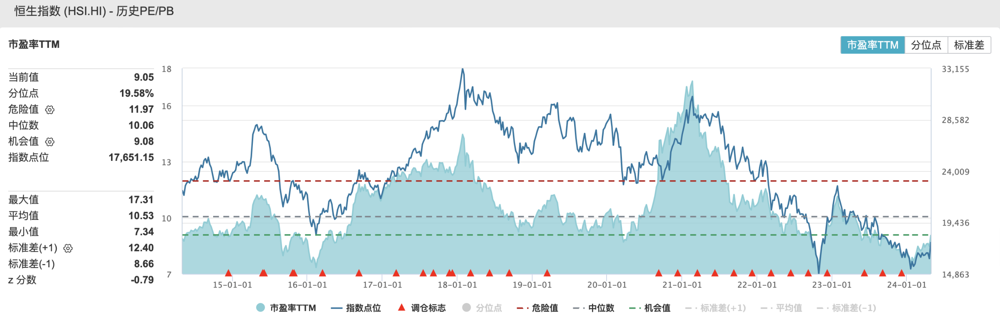
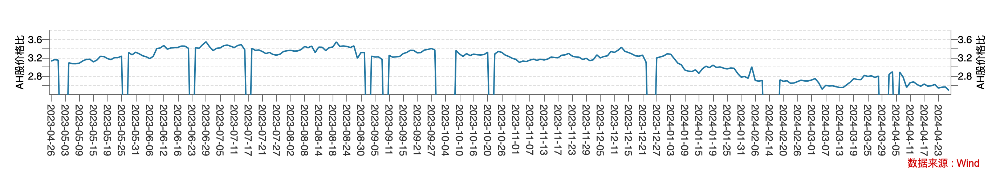
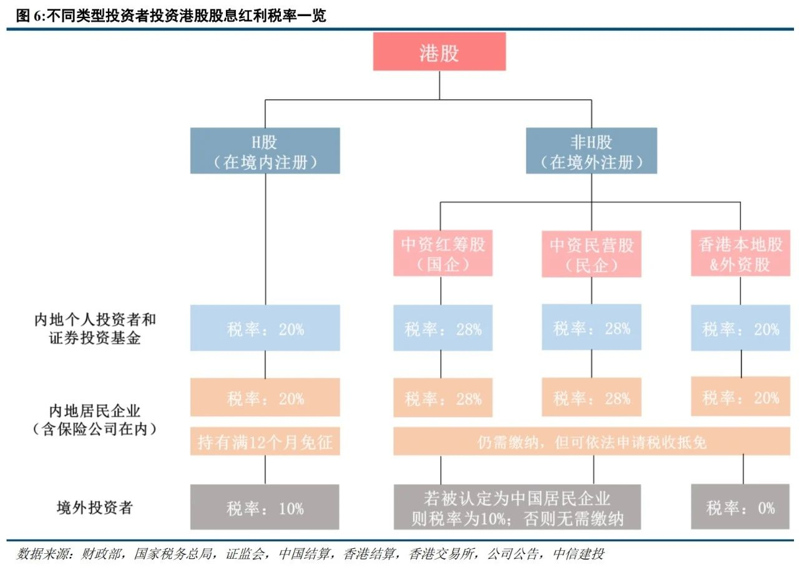

On April 19, the China Securities Regulatory Commission (CSRC) announced five measures to optimize the Shanghai-Shenzhen-Hong Kong Stock Connect mechanism, including relaxing the eligibility requirements for exchange-traded funds (ETFs) under Stock Connect, incorporating Real Estate Investment Trusts (REITs) into Stock Connect, supporting the inclusion of RMB trading counters in Stock Connect's southbound channel, optimizing the Mutual Recognition of Funds arrangement, and supporting leading mainland enterprises in listing in Hong Kong. Among these, the inclusion of RMB trading counters in the southbound Stock Connect is by far the most significant.

## **The HKD-RMB Dual Counter Model**

The HKD-RMB Dual Counter Model for Hong Kong stocks can be summarized as "one stock, two currencies." Under this model, the securities on both counters belong to the same class and are fully fungible. Investors on both counters enjoy identical rights, such as dividends and voting rights. Dual counter market makers provide two-way quotes for these RMB-denominated shares, thereby supplying liquidity to the RMB counter and narrowing price discrepancies between the two counters.

The Dual Counter Model was officially launched on June 19, 2023, and currently caters primarily to offshore RMB investors. There are 24 dual counter stocks available for trading, including some of the largest and most actively traded companies on the Hong Kong cash equities market, such as Tencent, Meituan, and CNOOC.

Hong Kong is the world's largest offshore RMB center. The abbreviation for offshore RMB is CNH, where the "H" stands for Hong Kong. The primary objective of introducing the RMB dual counter is to enrich the offshore RMB product ecosystem, extend RMB activity from the money market into the financial markets, optimize returns for offshore RMB asset holders, and advance RMB internationalization.

The policy announced by the CSRC last weekend extends the Hong Kong RMB dual counter model further to onshore RMB -- that is, to mainland investors. Given the timing of this policy announcement, the Stock Connect RMB trading counter will most likely be officially launched on the first anniversary of the Dual Counter Model, in June of this year.

## Advantages of the RMB Trading Counter

Some believe that the RMB trading counter can reduce or even eliminate exchange rate risk, but this is not entirely accurate, as exchange rate risk still exists under the RMB counter.

Currently, among stocks that already offer an RMB counter, trading remains predominantly in HKD, with RMB trading volume remaining modest. As a result, price movements are essentially anchored to HKD-denominated prices, which means that FX fluctuations between RMB and HKD are already implicitly reflected in intraday RMB price movements. However, since two counters exist, their prices are not perfectly aligned, and actual trading spreads may also be influenced by liquidity differences between the two counters.

That said, the RMB counter can reduce a portion of currency conversion costs. Currently, purchasing Hong Kong stocks through the southbound Stock Connect requires HKD-denominated settlement. In this process, investors must convert RMB to HKD at the time of purchase and then convert back to RMB upon selling -- involving two currency conversions. Due to the bid-ask spread in foreign exchange rates, and setting aside any RMB appreciation or depreciation during the holding period, this conversion process incurs FX friction costs. The RMB counter eliminates this issue entirely.

In the long run, if RMB trading volume under the southbound Stock Connect increases and even gains pricing power over Hong Kong stocks, the RMB counter could indeed reduce exchange rate risk -- particularly for Hong Kong-listed companies whose assets and operations are primarily based on the mainland.

Mainland companies listed in Hong Kong are, in essence, RMB-denominated assets priced in HKD. From a valuation perspective, their free cash flows and DCF valuations are denominated in RMB, so RMB-denominated trading would be free from exchange rate risk. In contrast, current HKD-denominated prices are the result of currency translation and are subject to RMB exchange rate fluctuations. For example, when the RMB depreciates against the HKD, the HKD-denominated value of RMB assets declines, and Hong Kong stocks tend to fall. Conversely, when the RMB appreciates against the HKD, Hong Kong stocks tend to rise. From this perspective, the RMB trading counter can indeed reduce or even eliminate exchange rate risk -- but the prerequisite is that RMB gains pricing power over Hong Kong stocks. This is likely the long-term strategic intent behind introducing the RMB counter to the southbound Stock Connect. In practice, mainland southbound capital already accounts for a dominant share of trading volume in certain Hong Kong stocks.

In summary, if the southbound Stock Connect shifts to RMB-denominated quotation and settlement, the FX friction costs inherent in currency conversion can be avoided. Over the long term, as RMB trading volume grows, there is the potential to mitigate FX risk in the Hong Kong market. For mainland investors, the investment appeal of Hong Kong stocks has been enhanced, particularly for companies dual-listed on both A-shares and H-shares.

## Investment Appeal of Hong Kong Stocks

Last week, the Hang Seng Index posted five consecutive days of gains, with a weekly increase of 8.8%. There are multiple factors behind the rally, but in my view, the upcoming inclusion of the RMB counter in the southbound Stock Connect is a key catalyst. There is no doubt that this measure will improve liquidity in the Hong Kong market to some extent.

From a P/E perspective, the Hang Seng Index currently trades at a forward P/E of only 9x. Looking at the Hang Seng Index over the past decade, this valuation sits at approximately the 20th percentile, remaining at historically depressed levels.

If we accept that A-share valuations are already at low levels, we find that among companies dual-listed on both A-shares and H-shares, the H/A discount remains substantial.

The chart below shows the A/H share price ratio over the past year. While the A/H price ratio has been narrowing in trend, it remains above 2x, implying an overall H/A discount of more than 50%. Of course, this is based on the full A+H sample, and individual company-level differences can be significant.

Hong Kong's market is dominated by mainland Chinese companies and is closely tied to China's economic trajectory. However, compared to A-shares, the long-standing discount is not merely a matter of domestic economic fundamentals -- two core factors are at play: a lack of liquidity and the impact of dividend taxes.

The underlying reason for the liquidity deficit is that Hong Kong stocks are denominated in HKD, which is pegged to the USD, and pricing power currently rests primarily with foreign institutional investors. Consequently, the Hong Kong market is affected by factors such as U.S. interest rate hikes and the ongoing Sino-U.S. geopolitical tensions. In recent years, many have taken a bearish view on Hong Kong, with foreign institutions visibly retreating -- some even describing Hong Kong's financial sector as being in ruins. I will not elaborate on this here. As discussed above, the RMB trading counter holds significant long-term strategic importance in improving Hong Kong market liquidity and reclaiming pricing power.

Once the southbound Stock Connect introduces the RMB dual counter, investors will inevitably compare the investment appeal of A-shares versus H-shares, which brings up the issue of dividend tax differences between the two markets. Dividend tax is also a core factor driving the current A/H price spread.

## Southbound Stock Connect Dividend Tax

Mainland individual investors who invest in Hong Kong stocks through the southbound Stock Connect are subject to dividend tax. For H-share companies (incorporated in mainland China and listed in Hong Kong), the tax rate is 20%. For mainland companies registered offshore, such as red-chip stocks, the dividend tax rate is as high as 28%. The chart below illustrates the dividend tax rates under various scenarios.

By comparison, for individual investors in A-shares, current policy stipulates that dividends are taxed at 20% for holding periods of one month or less, at a reduced rate (typically 10%) for holding periods between one month and one year, and are fully tax-exempt for holding periods exceeding one year.

For Hong Kong-listed companies that consistently pay high dividends (including both H-share and red-chip companies), investors primarily hold these stocks for stable dividend income. However, the high dividend tax rate clearly undermines the attractiveness of Hong Kong stocks and impacts their fair valuation. For example, the Big Four state-owned banks listed in Hong Kong are H-share companies with respectable dividend yields, yet they generally trade at a discount of approximately 30%. The same applies to red-chip stocks such as China Mobile and China Unicom, which trade at a notable discount relative to their A-share counterparts. Dividend tax is a significant factor contributing to these elevated discount rates.

The dividend tax issue under the southbound Stock Connect may adversely affect liquidity on the RMB trading counter -- a problem that will need to be addressed sooner or later. In fact, the Hong Kong Securities and Futures Commission (SFC) has been advocating and lobbying the mainland authorities on this issue.

If the dividend tax rate for Hong Kong stocks is reduced, the RMB dual counter could put pressure on the A-share premium for dual-listed companies. Given the current state of the A-share market, achieving this in the near term appears unlikely. Over the long term, however, I believe a reduction in the dividend tax rate for Hong Kong stocks is highly probable -- it is merely a matter of timing, with the core driver being China's RMB internationalization strategy. The Stock Connect RMB counter can facilitate improved liquidity in the Hong Kong market and enhance the investment appeal of holding offshore RMB assets.