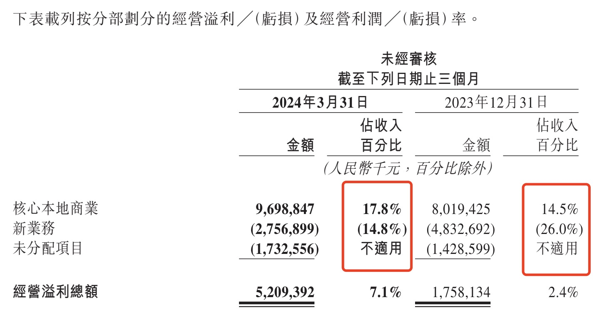
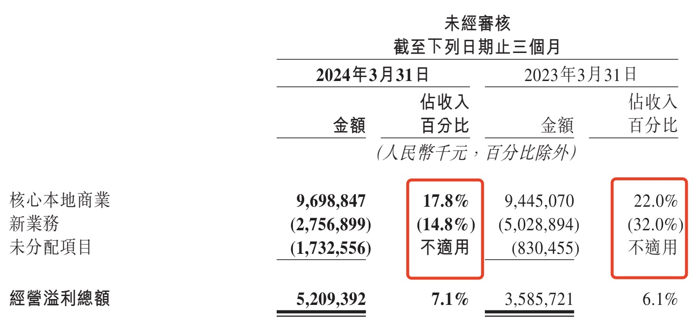
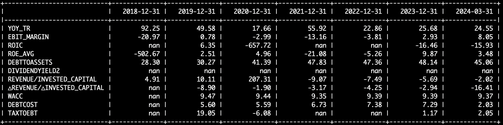
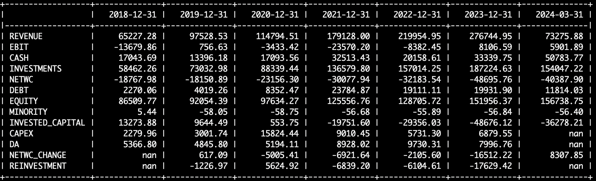

Since last December, Meituan's stock price has been on a roller coaster ride, tracing a V-shaped trajectory.

After the Q3 2023 earnings release, Meituan's stock price declined for two consecutive months, falling nearly 50%. Following the Chinese New Year, the stock began a sustained rebound, rallying close to 100%. As of now, Meituan's share price has essentially recovered to levels seen before the Q3 2023 earnings release.

Today, after the Hong Kong market close, Meituan released its Q1 2024 earnings. Upon seeing the numbers, my immediate takeaway was that Meituan is on solid ground, with further upside potential in the stock price. Here is why.

## Meituan's Operating Margin

When Meituan's stock price plunged last December, I wrote an article titled "How to View the Competition Between Meituan and Douyin," arguing that the primary driver of the decline was deteriorating operating margins, which fueled market concerns about intensifying competition from Douyin. The just-released Q1 report shows a notable improvement in Meituan's operating margin, suggesting to a certain extent that Meituan's competitive moat remains wide and that the Douyin threat is not as severe as the market previously feared.

### Q1 Operating Margin -- Sequential Analysis

Let's first look at how Meituan's Q1 operating margin compares with Q4 of last year:

Clearly, both the core local commerce segment and the new initiatives segment showed meaningful margin improvement compared to Q4 last year, with the overall operating margin reaching 7.1%.

Regarding the improvement in core local commerce, Meituan's Q1 report explained it was primarily driven by "reduced user incentives as well as lower promotion and advertising expenses." This suggests that Meituan is handling the competition from Douyin with greater composure and confidence. The 17.8% operating margin actually represents an improvement even compared to the 17.5% reported in Q3 last year.

As for new initiatives, while the market had already anticipated continued margin improvement, the pace of loss narrowing likely exceeded expectations. Meituan has long been known for its operational efficiency -- its employees even refer to the company as the "boiled water company" (a nod to its extreme frugality). The new initiatives segment once again demonstrates Meituan's outstanding management capabilities.

### Q1 Operating Margin -- Year-over-Year Analysis

Now let's examine how Meituan's Q1 operating margin compares with Q1 of last year:

The core local commerce operating margin declined versus the same period last year. Meituan attributed this in the Q1 report primarily to lower average order values and increased transaction subsidies (mainly due to competition from Douyin). However, I believe the year-over-year decline is not particularly concerning, as the market has already priced in the competitive impact from Douyin and the shift in the current consumption environment.

Thanks to the rapid narrowing of losses in new initiatives, the overall operating margin for Q1 still improved year over year.

### Meituan's Revenue Growth and Operating Margin over the Past 5 Years

As shown above, Meituan's operating margin (EBIT_MARGIN) has been on a continuous upward trajectory over the past five years. It stood at approximately 3% in 2023 and reached 8% in Q1 this year (this figure differs slightly from the periodic report numbers cited earlier, primarily due to differences in calculation methodology).

In terms of revenue growth (YOY_TR), Meituan's performance has been equally impressive. Q1 revenue growth came in at 24%, essentially maintaining last year's pace. Considering the high base from post-pandemic revenge spending last year and the competitive pressure from Douyin, sustaining this level of revenue growth is no small feat. It indicates that the local services market remains a growth market with significant room for expansion.

## Meituan DCF Valuation Analysis

As I have emphasized in previous articles, revenue growth and operating margin are the two core drivers of valuation.

For Meituan, operating margin is the more critical factor compared to revenue growth. There are several reasons for this: first, competition from Douyin has raised market concerns about margin deterioration; second, losses from new initiatives have made many investors skeptical about near-term profitability; and third, some view the food delivery business as lacking imagination, with the industry's inherent characteristics making it difficult to generate outsized profits.

Meituan only turned profitable in 2023, and its operating margin remains thin, which means that margin fluctuations have a disproportionately large impact on valuation. Moreover, compared to revenue, improvements in operating margin are harder to predict.

Meituan's Q1 operating margin exceeded expectations, which is a significant positive for DCF valuation.

### DCF Forecast Assumptions

- **Revenue growth rate**: Assumed 2024 revenue growth of 20%, below the current Q1 run rate. Revenue growth of 10% for 2025 through 2028. Compared to the consensus estimate of approximately 15%, this assumption is conservative.
- **Operating margin**: New initiative losses are expected to continue narrowing, contributing to overall margin improvement. The terminal operating margin is assumed to rise from the current 8% to 10% (on a valuation-consistent basis).
- **Reinvestment**: Looking at Meituan's reinvestment over the past three years, it has been roughly equal to or even less than depreciation. Therefore, net reinvestment (capex minus depreciation) is assumed to be zero over the forecast period.
- **Non-core business and investment income**: Like Tencent, Meituan is also an investment company. As of Q1, Meituan held approximately RMB 187 billion in investment assets (INVESTMENTS in the chart below) and about RMB 33.3 billion in readily available cash. Compared to Meituan's current market capitalization of approximately HKD 700 billion, investment assets and cash account for roughly 34%.

    The revenue growth and operating margin assumptions above do not factor in investment income. The DCF valuation calculated below also excludes future returns from the investment portfolio, adding back only the current book value of investment assets.

- **Other assumptions**: WACC of 10% and an income tax rate of 15%.

### DCF Valuation Result

Based on the above assumptions, Meituan's intrinsic value per share is approximately RMB 117.

Since the financial data is reported in RMB, the intrinsic value calculated above is also in RMB. Converting to HKD at the current exchange rate yields approximately HKD 128 per share.

### Sensitivity Analysis

The assumptions underlying the above calculation are generally conservative. Revenue growth, in particular, has significant upside potential given that Meituan is expanding into new markets with considerable room for growth in the coming years.

Below is a sensitivity analysis based on two variables: revenue growth and operating margin:

Holding the target operating margin at 10%, if revenue growth for 2025 through 2028 is raised to 15%, the intrinsic value per share would be approximately RMB 139.

Alternatively, maintaining the 10% revenue growth assumption but raising the EBIT margin to 15%, the intrinsic value per share would be approximately RMB 160.

This also illustrates that, for the same change from 10% to 15%, operating margin has a greater impact on valuation than revenue growth.
