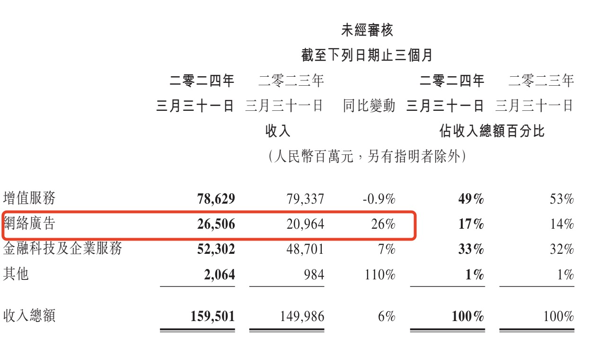
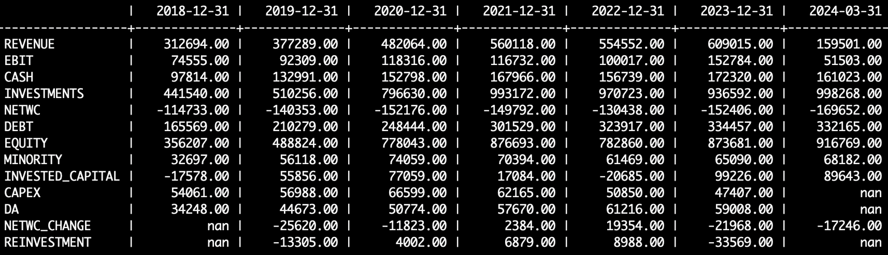
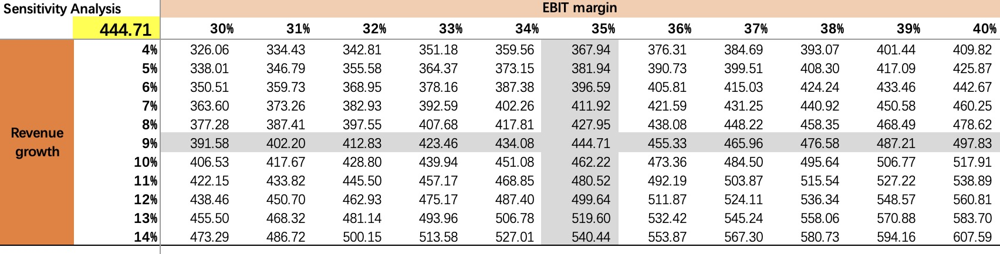

Two nights ago, Tencent Holdings released its Q1 2024 earnings report. Revenue grew 6% year-over-year, while net profit attributable to shareholders surged 62% YoY. Both metrics exceeded market expectations, making for a very impressive quarter.

Yesterday was Buddha's Birthday in Hong Kong, so the Hong Kong stock market was closed. On the U.S. side, Tencent's ADR rose approximately 5% over the past two days.

## Q1 2024 Revenue and Gross Profit

Below is the revenue breakdown by segment. The Q1 revenue growth was primarily driven by a significant increase in advertising revenue from content platforms such as WeChat Video Accounts and Official Accounts. The gaming business (value-added services) showed essentially no growth, while fintech business revenue growth decelerated.

As shown in the chart below, gross profit across all business segments grew significantly year-over-year, with growth rates notably exceeding those of the respective revenue lines. This indicates improved operational efficiency at Tencent, which is the primary reason net profit surged well beyond expectations.

## **Five-Year Historical and Q1 2024 Performance**

Let's take a look at Tencent's revenue growth and EBIT margin over the past five years and in Q1 2024.

In terms of revenue growth (YOY_TR), Tencent maintained annual revenue growth above 15% from 2018 to 2021. 2022 was the most challenging year during this period, and 2023 saw a return to strong growth. Considering that 2023 was the first year of post-pandemic recovery with pent-up consumer spending effects, the 6% growth rate in Q1 2024 is not low.

In terms of EBIT margin (EBIT_MARGIN), from 2018 to 2020, Tencent's EBIT margin was very stable, ranging between 24% and 25%. After two consecutive years of decline in 2021 and 2022, the EBIT margin recovered to 25% in 2023 and jumped to 32% in Q1 of this year.

## DCF Valuation

As previously discussed, revenue growth and operating margin (EBIT margin) are the core drivers of a company's intrinsic value. Revenue growth is typically easier to observe from external market data, but improvements in operating margin reflect enhanced operational efficiency, which is difficult for outsiders to assess.

Tencent's share price has risen considerably in recent months. The strong Q1 results suggest the market had partially priced in the improvement in operating margins. Even so, market expectations may still be conservative.

### Can Revenue Growth and Operating Margin Continue to Improve?

Currently, Tencent's short-video business is still in a rapid growth phase, with Q1 short-video user watch time increasing 80% year-over-year. Although management noted during the Q1 earnings call that advertising revenue growth may slow in the coming quarters, the monetization potential of short-video suggests that advertising revenue will likely maintain strong long-term growth.

On the gaming front, the market has high expectations for the upcoming title *Dungeon & Fighter*. Based on discussions about the gaming business in Tencent's recent earnings calls, it is clear that the company has developed better management practices from past lessons. The operational efficiency gains seen in Q1 are therefore expected to continue.

Below are excerpts from the Q1 earnings call:

> We've been working on revitalizing some of our key games, and that process is going well. We've gained some lessons from this experience. Games categorized as "evergreen" appear to have the ability to recover on their own. A great example is *Brawl Stars*, which not only achieved gross receipts more than four times last year's level but also doubled its daily active users.

> The second lesson is that when an evergreen game stagnates, the issue usually isn't the game itself but its operations. We need to make changes to the operations team, and when we do, we quickly see positive results. Large competitive multiplayer games are inherently evergreen, much like major sports such as football and basketball. With the right people managing the game, you get the right results.

On fintech, Tencent believes that the government is implementing multiple stimulus measures to revitalize the economy and consumer confidence. As these government stimulus measures take effect, the slowdown in fintech growth is expected to reverse.

In summary, Tencent's advertising business is poised to maintain strong growth, the gaming business will return to positive growth, and fintech revenue growth will accelerate. As revenue grows, economies of scale will drive further improvement in operating margins across all business segments.

### DCF Forecast Assumptions

- **Revenue Growth Rate**: Referencing Wind consensus estimates, we assume a 5-year compound annual revenue growth rate of 9%. This is largely in line with 2023 growth but above the current Q1 rate of 6%. Based on the analysis above, and considering that China's economy is still in recovery, Tencent's business is well-positioned for a continued recovery, making a 9% growth rate reasonably justified.

- **Operating Margin**: Based on the analysis above, we assume the operating margin will continue to improve over the next few years, rising from the current 32% to 35%.
- **Terminal RONIC**: Given Tencent's sustainable competitive advantages, we assume the return on new invested capital (RONIC) in the terminal period will remain above the cost of capital (WACC), with an excess return spread of 5%.
- **Reinvestment**: Tencent's capital expenditure (CAPEX, shown in the chart below) was approximately RMB 50-60 billion from 2018 to 2022, dropping slightly to RMB 47 billion in 2023. Q1 capital expenditure was RMB 14.3 billion. Meanwhile, Tencent's depreciation and amortization amounted to RMB 60 billion in 2023. This shows that Tencent's net new reinvestment after depreciation is minimal. Using Q1 data to project the full year and subtracting 2023 depreciation and amortization, net reinvestment is estimated at approximately RMB 4 billion.
- **Non-Operating Activities and Investment Income**: Beyond the gaming, advertising, and fintech businesses discussed above, Tencent is also an investment company. As of Q1, Tencent's investment assets (INVESTMENTS in the chart below) amounted to nearly RMB 1 trillion, with readily available cash of RMB 161 billion.

    Many consider Tencent to be the Berkshire Hathaway of China. Starting with the Q4 2023 report, Tencent reclassified investment income below operating profit, no longer treating it as part of core operating revenue. This reflects management's evolving approach to investments. During the Q1 earnings call, management stated that the investment portfolio has reached a sufficient scale and they do not plan to deploy additional capital, instead focusing on recycling capital within the existing portfolio.

    The revenue and operating margin assumptions above do not account for the investment portfolio. The DCF valuation calculated below also excludes future returns from the investment portfolio, with only the book value of investment assets added back at the end.

- **Other Assumptions**: WACC is set at 10%, and the income tax rate uses the standard rate of 25%.

### DCF Calculation Results

Based on the above assumptions, Tencent's intrinsic value per share is approximately RMB 440.

Note that since the financial data is reported in RMB, the intrinsic value calculated above is also in RMB. Converting to HKD would yield a slightly higher figure. Given the minor impact of the exchange rate, no further conversion is performed here. Additionally, as stated in the forecast assumptions section, the DCF valuation does not account for future returns from investment assets, making it a relatively conservative estimate overall.

Below is a sensitivity analysis based on the two key variables of revenue growth and operating margin:

Assuming the 35% operating margin remains unchanged, if the 5-year revenue growth rate is 6% (consistent with Q1), the intrinsic value per share would be approximately RMB 396.

Assuming the 9% revenue growth rate remains unchanged, if the EBIT margin stays at the current Q1 level of 32%, the intrinsic value per share would be approximately RMB 412.

Under a conservative scenario where both the 5-year revenue growth and operating margin remain at Q1 levels of 6% and 32% respectively, the intrinsic value per share would be approximately RMB 368.

In conclusion, although Tencent's share price has risen considerably in recent months, the current price is still not expensive and there remains room for further upside.
