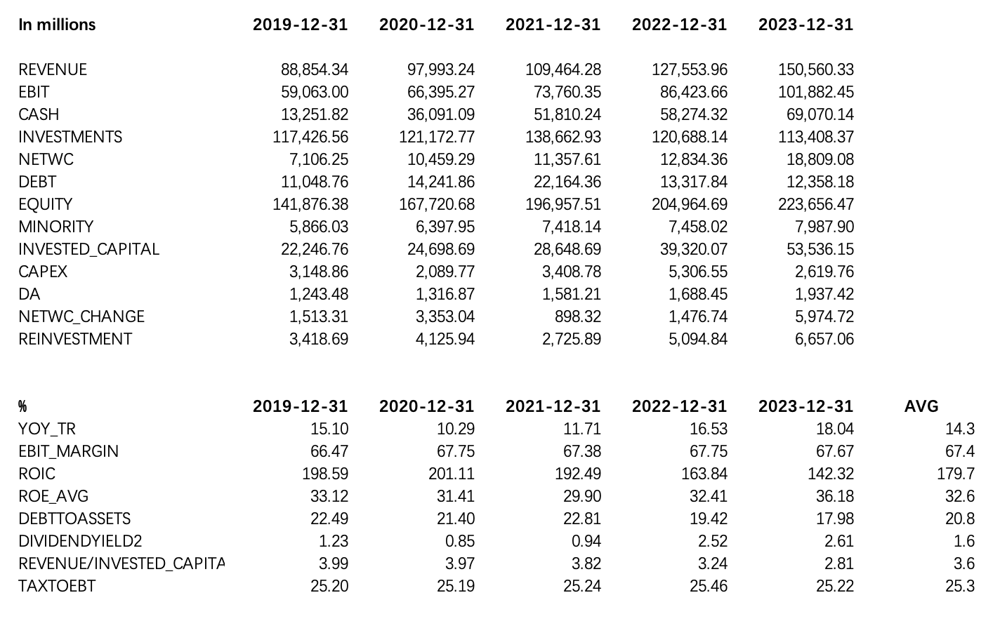
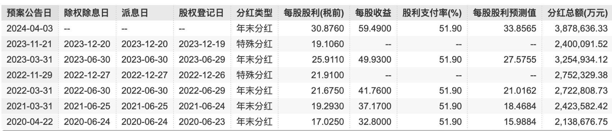
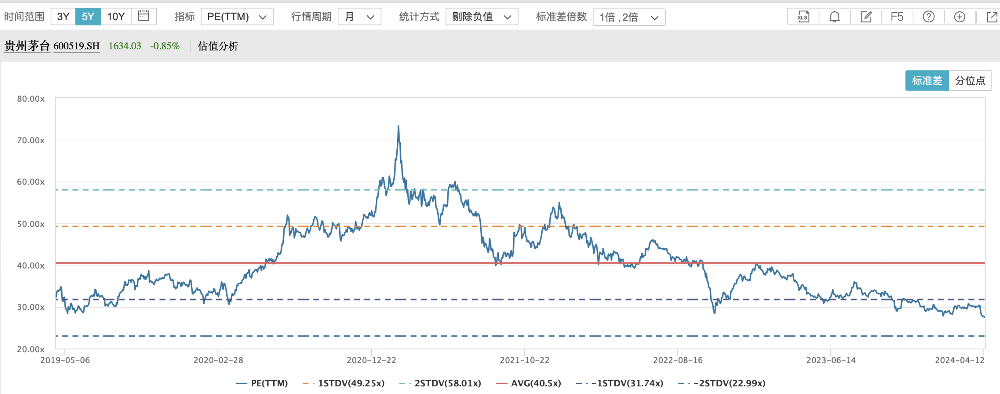

In previous articles, we discussed extensively the topics of competitive strategy, value creation, and valuation methodologies. For those less familiar with finance or not working in the investment industry, this content may have felt somewhat abstract, making it difficult to form a concrete understanding of how valuation calculations actually work.

In this article, we use Kweichow Moutai as a case study to perform a discounted cash flow (DCF) valuation. Why Moutai? First, the company's core business is relatively straightforward and easy to understand. Second, Kweichow Moutai has an exceptionally stable historical financial track record, which makes future cash flow projections more manageable.

## Historical Data

Let's begin by reviewing Kweichow Moutai's key financial metrics over the past five years, as these are essential for the subsequent DCF valuation:

Looking at the table below, Kweichow Moutai maintained double-digit revenue growth (YOY_TR) over the past five years, with a 5-year average of 14%. The operating margin (EBIT margin) has been remarkably stable, consistently around 67%. As previously discussed, revenue growth and operating margin are the core drivers of valuation.

From a return on capital perspective, Kweichow Moutai's ROIC has declined steadily over the past five years. This is likely attributable to the growing cash balance on the company's books, which dilutes the return on capital. As shown in the table above, cash (CASH) increased from RMB 13.2 billion at the end of 2019 to RMB 69 billion by the end of 2023. Kweichow Moutai's annual dividend payout ratio is approximately 52%, although in 2022 and 2023 the company increased distributions through special dividends. This was partly to attract investors and stabilize the share price, and partly to improve capital returns.

Looking at ROE (return on equity), Kweichow Moutai's ROE has been very stable, averaging 32%. Compared to its 30%+ return on equity, the 10%+ revenue growth rate may not appear particularly remarkable. However, its average P/E ratio over the past five years has been approximately 40x, which to some extent reinforces the concept discussed earlier: return on capital is also a key driver of the P/E multiple.

In addition to revenue growth, operating margin, and return on capital, the reinvestment rate is also a critical factor in DCF calculations.

Compared to the other metrics, historical reinvestment data tends to be more volatile and harder to forecast. Generally speaking, a company's invested capital correlates more closely with revenue, so reinvestment can be planned as a fixed proportion of revenue growth. If the company's future reinvestment becomes more efficient, this ratio can be gradually reduced.

By examining the past five years of historical data, we can see that Kweichow Moutai's REVENUE/INVESTED_CAPITAL ratio has been relatively stable, ranging from roughly 3x to 4x, with an average of approximately 3.6x.

## DCF Forecast Assumptions

With these key metrics in hand, we can make reasonable forecasts of Kweichow Moutai's future free cash flows and their discounted value.

### Base Year Selection

We use the latest 2023 annual report data as the base year, meaning all future projections are built upon reasonable growth from the 2023 financials.

### Forecast Period Length

Kweichow Moutai has historically outperformed the industry average and is expected to maintain its competitive advantages over the long term. Accordingly, we adopt a three-stage growth model: a 5-year detailed cash flow forecast period, followed by a 5-year transition period that gradually converges to the terminal period.

### Revenue Growth and Operating Margin Assumptions

Based on the past five years of revenue growth and considering the current economic environment, we assume a 5-year compound annual growth rate of 10% for Kweichow Moutai. This is below the historical average growth rate but above the macroeconomic growth rate of 5%. The operating margin (EBIT margin) is assumed to remain stable at 67%.

### Reinvestment

Using the revenue-to-invested-capital multiple as the basis for calculating reinvestment, we assume a ratio of 3x for the next two years, slightly above the 2023 level of 2.8x. Given that 2023 reinvestment was on the higher end historically, we assume reinvestment efficiency gradually improves, with the ratio rising to 3.5x in subsequent years and eventually reaching 4x, in line with earlier historical levels.

### Income Tax Rate

Kweichow Moutai's effective tax rate (TAXTOEBT) over the past five years has been very stable at approximately 25%. We use the 5-year average effective tax rate as the basis for the income tax rate.

### WACC

We assume a weighted average cost of capital (WACC) of 9% for Kweichow Moutai. As revenue growth gradually converges to the long-term economic growth rate, the terminal period WACC is set slightly lower at 7.9%. We will not discuss the WACC calculation in detail here, as perceptions of risk and return vary from person to person. Overall, given Kweichow Moutai's operational stability and its status as a favored holding among value investors, a 9% discount rate is reasonably appropriate.

## DCF Calculation Results

The results show that, under the above assumptions, Kweichow Moutai's fair value per share is approximately RMB 1,600. Given that the valuation is highly sensitive to the underlying assumptions, we conduct a further sensitivity analysis using revenue growth and operating margin as the two key variables.

Assuming the operating margin remains at 67%, looking along the vertical axis corresponding to the 67% margin:

Considering the current economic environment, if the 5-year revenue growth rate matches or slightly exceeds macroeconomic growth at 5%, the corresponding intrinsic value per share is approximately RMB 1,300. Given Moutai's scarcity value, if revenue continues to grow faster than the macro economy over the next five years, maintaining the historical average of 14%, the intrinsic value per share could reach approximately RMB 1,900.

Assuming a 10% compound annual revenue growth rate is reasonable, looking along the horizontal axis corresponding to 10% growth:

Considering the recent pressure on Moutai liquor demand, with signs of declining retail prices, if the operating margin drops 5 percentage points to 62%, the corresponding intrinsic value per share would be approximately RMB 1,500.

A decline in revenue growth could make it difficult for the company to maintain its current operating margin. Combining the above scenario analysis, under an extreme assumption where both revenue growth and operating margin decline simultaneously over the next five years, the table shows that with 5% revenue growth and a 62% operating margin, the corresponding intrinsic value per share would be approximately RMB 1,200.

## Summary

Valuation is as much an art as it is a science -- being roughly right is better than being precisely wrong. The purpose of DCF valuation is not to arrive at an exact figure. Rather, its benefits are twofold. First, by deeply analyzing the core financial metrics that drive intrinsic value, we develop a more thorough understanding of a company's financials, moving beyond intuition to a more quantitative grasp of intrinsic value. Second, through sensitivity analysis, we can identify the valuation floor and better understand what market expectations are implied by the current price. If we believe that market prices ultimately converge to intrinsic value, then even amid significant share price volatility, we can use conservatively extreme assumptions to establish a margin of safety, enabling us to remain calm during market downturns.
