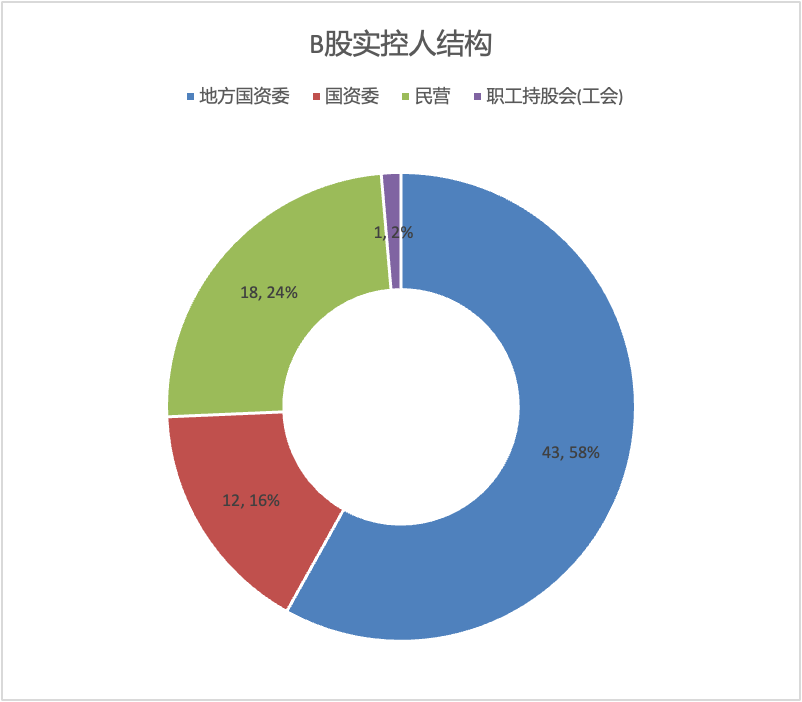
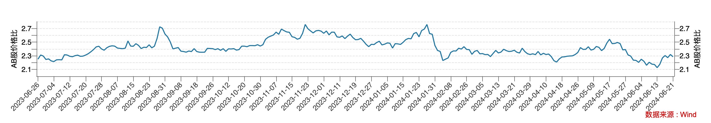

China's stock market is perhaps the most fragmented in the world. Not only do we have a large number of companies dual-listed on both A-shares and H-shares, but there are also quite a few companies dual-listed on A-shares and B-shares.

Same company, same shareholder rights, yet vastly different prices across different exchanges. It is well known that H-shares trade at a significant discount to A-shares. A+B dual-listed companies face the same issue, and the B-share discount relative to A-shares is even steeper than the H-share discount.

## B-Share Market Overview

Many people may not be familiar with B-shares — some may not have even heard of them — but B-shares have a history nearly as long as A-shares. The first B-share was Vacuum B, listed in February 1992.

B-shares are foreign-invested shares listed domestically, denominated in RMB but subscribed and traded in foreign currencies. Shanghai B-shares are traded in US dollars, while Shenzhen B-shares are traded in Hong Kong dollars.

Currently, there are 74 companies dual-listed with both A-shares and B-shares across the Shanghai and Shenzhen exchanges, plus another 11 companies listed exclusively as B-shares. Below is an overview of the 74 A+B dual-listed companies.

### B-Share Industry Distribution

B-share listed companies are primarily concentrated in the automotive supply chain, real estate (mainly commercial properties), electronics and electrical appliances, and consumer sectors. The following shows the industry distribution based on the Shenwan Level 2 industry classification:

### B-Share Controlling Shareholder Attributes

A notable characteristic of B-shares is the high concentration of state-owned enterprises (SOEs). Among them, 43 are local SOEs, accounting for 58%, and 12 are directly overseen by SASAC, accounting for 16%. Overall, 55 out of 74 B-share companies are state-owned, representing 74%.

### B-Share Capital Proportion

The proportion of B-share capital relative to total share capital of A+B dual-listed companies is quite dispersed. The lowest is just 1%, as in the case of Haikong B-share, while the highest is Shennandian B at 44%. On average, B-shares account for approximately 25%–30% of total share capital.

### B-Share Current Valuation

The following uses relative valuation metrics from the B-Share Index as a reference. The B-Share Index sample comprises all 44 B-shares listed on the Shanghai Stock Exchange.

In terms of the P/E ratio, the trailing twelve-month average is 12x, sitting at the 15th percentile over the past ten years. The current P/B ratio is 0.76x, at the 1st percentile over the past ten years.

### A-Share vs. B-Share Price Comparison

As of market close on June 21, the average A-to-B price ratio was 2.3x. This means that compared with their A-share counterparts, B-shares were approximately 56% cheaper.

For comparison, let us look at the A-to-H share situation. As of market close on June 21, the average A-to-H price ratio was 1.6x, meaning H-shares were about 38% cheaper than their A-share counterparts. Clearly, B-shares trade at an even deeper discount than H-shares.

Why are B-shares cheaper than A-shares, and even cheaper than H-shares, which already trade at a notable discount?

## Reasons for the B-Share Discount

### Market Segmentation Theory

The theory of market segmentation posits that differences in liquidity barriers, trading rules, and information flow between different stock markets lead to variations in pricing, returns, and risk for the same listed company across different markets.

Take A-shares and H-shares, for example. The Shanghai/Shenzhen exchanges and the Hong Kong Stock Exchange have clear market segmentation, with different listing rules, investor types, and transaction taxes. H-share pricing is determined by overseas investors, who have many investment alternatives and may hold different views on China's economic fundamentals than domestic investors. Additionally, high dividend withholding taxes are an important factor behind the H-share discount.

On the A-share side, one key factor is the high proportion of retail investors, who tend toward short-term speculation. Another is that capital controls limit retail investors' investment channels, creating trading congestion.

### B-Share Investor Composition and Capital Controls

Unlike A-shares and H-shares, which are separated by physically distinct exchanges, A-shares and B-shares do not have such a hard structural divide, and differences in trading rules are minimal. From a dividend tax perspective, A-shares and B-shares are treated the same. The market segmentation between A-shares and B-shares is primarily manifested in investor composition and foreign exchange controls.

When B-shares were first created, they were designed to attract foreign capital and were exclusively for overseas investors. After February 19, 2001, the B-share market was opened to domestic individual investors. Currently, B-share investors are predominantly domestic individuals, with limited foreign participation.

B-shares have never been opened to domestic institutional investors, likely due to foreign exchange control considerations. For ordinary individual investors, B-share trading is constrained by the annual $50,000 foreign exchange quota. For institutions, a $50,000 quota is far too small to be meaningful, and raising the limit could create control challenges.

By contrast, although H-shares are traded in Hong Kong dollars, the closed-loop management mechanism of Stock Connect means that purchasing Hong Kong stocks through Stock Connect does not face foreign exchange quota restrictions.

The above analysis shows that foreign exchange controls have made B-shares even less liquid than A-shares or H-shares.

The lack of liquidity creates a self-reinforcing feedback loop. Because of poor liquidity, B-shares hold little appeal for investors — especially foreign institutional investors — which in turn leads to even worse liquidity and less attention.

### High Concentration of SOEs Among B-Shares

Compared with A-shares and H-shares, B-shares have a higher proportion of state-owned enterprises. Perhaps only SOEs can tolerate such persistently low valuations without taking action.

SOEs shoulder the dual mandate of serving the state and creating shareholder value. Profit growth is not their top priority, which often leads to operational inefficiency, bureaucratic inertia, and in some cases, insider control and corruption. This is why SOE valuations have historically been low, and it is also a key reason why major A-share broad-based indices — such as the SSE 50 and CSI 300 (where SOEs account for approximately 62% and 51% respectively) — have struggled to create long-term value.

## Investment Value of B-Shares

Despite these issues, from a discount perspective, B-shares are genuinely cheap.

For long-term investors, B-share illiquidity is not a problem — the depressed valuations caused by poor liquidity are actually an opportunity to exploit.

For dividend-oriented investors, the B-share discount means dividend yields are more attractive than those of A-shares. Some high-quality, high-dividend stocks are particularly popular, such as Lao Feng Xiang, Gujing Tribute Wine, and Huangshan Tourism.

Given the nature of B-share companies, there may not be many "wonderful companies," but there are plenty of "fair companies at wonderful prices." B-shares are therefore a market well-suited for cigar-butt investing.

## The Future of B-Shares

With the expansion of channels for domestic companies to list overseas — such as H-shares and the red-chip structure — B-shares have lost their capital-raising function. The last B-share to be listed was Erong B, which went public on April 26, 2001.

For domestic individual investors, channels such as Stock Connect and QDII now provide access to overseas-listed companies. The introduction of the QFII system has also opened a direct pathway for foreign investors to access the A-share market. As a result, B-shares have become less attractive to both domestic and foreign investors, and liquidity has deteriorated further.

It is fair to say that B-shares have become a forgotten corner of the market — a haven for a niche group of retail investors who pursue long-term investing and high dividend yields.

### Share Conversion and Buybacks

To address the liquidity and undervaluation issues of B-shares, there have been historical precedents of B-to-H conversions, B-to-A conversions, and B-share buybacks.

The "B-to-H" conversion faces no legal compliance barriers, but it requires the B-share listed company to meet the listing requirements of the Hong Kong Stock Exchange. Only a handful of successful cases exist to date.

For the "B-to-A" model, the primary approach involves the controlling shareholder or an affiliate under common control absorbing and merging the B-share listed company, then listing on the A-share market. The implementation process is fairly complex. Since shareholders of both the absorbing entity and the absorbed entity must execute a share swap, and the share values before and after the swap may differ, the swap terms need to balance the interests of all parties.

In addition to the share-swap merger approach for achieving B-to-A conversion, it is theoretically possible for a B-share listed company to directly issue A-shares to B-share holders in exchange for their B-shares, which would then be cancelled. However, no successful precedent exists, and more definitive conclusions on legal compliance are still needed.

Furthermore, some B-share listed companies have repurchased a portion of their B-shares to bolster investor confidence and enhance market value. However, this involves significant foreign exchange purchases and is only feasible for B-share companies with ample cash flow.

### Alternative Approaches

The fundamental issue with B-shares is foreign exchange controls and investor restrictions. Drawing on the Stock Connect model, a closed-loop trading mechanism for B-shares could be created, opening the market to domestic institutional investors. Under such a mechanism, proceeds from B-share sales would not leave the country, which would help improve market liquidity.

B-shares are predominantly local SOEs. In the current economic environment, deepening SOE reform is of great significance for revitalizing existing assets and improving the return on economic investment. If SOE reform achieves more meaningful breakthroughs, it would help lift B-share valuations.
