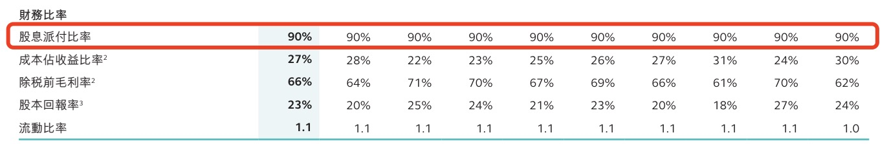
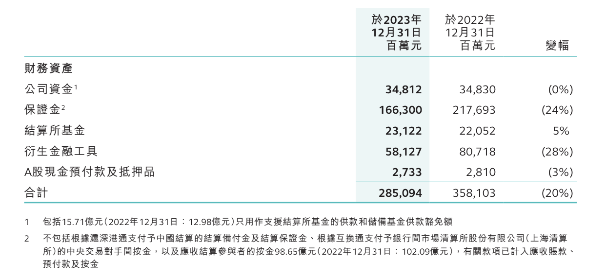
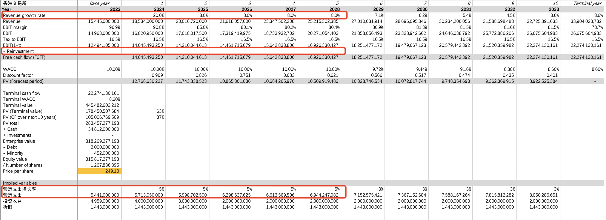

Hong Kong Exchanges and Clearing Limited (HKEX) is not just an exchange -- it is also a listed company, and a highly profitable one at that. Beyond its strong profitability, HKEX is also remarkably generous with its dividends.

## How Profitable Is HKEX

Just how profitable is it? The chart below shows the quarterly results over the past two years, including EBITDA margin performance. As you can see, the EBITDA margin has consistently stayed above 70%, with a slight decline in Q4 2023, primarily due to lower market trading volumes.

Below are HKEX's financial ratios for the past 10 years in reverse chronological order (with 2023 as the first year). The pre-tax gross margin has consistently exceeded 60%, while the return on equity has remained steadily above 20%.

Now let's look at the dividend situation. HKEX's payout ratio has consistently hovered around 90% -- a level of distribution that only listed REITs can rival.

## Where Does HKEX's Revenue Come From

What are HKEX's main revenue drivers? The chart below shows 2023 revenue by business segment:

The largest revenue contributors are the cash equities, equity securities and financial derivatives businesses, as well as commodities. Cash equities refer to stock trading, while equity securities and financial derivatives mainly include warrants, index futures and options, etc. Revenue from these three major businesses primarily consists of trading fees, clearing and settlement fees, as well as listing fees and custody fees. This is easy to understand -- as an exchange, HKEX takes a cut from every transaction, which is a natural source of business revenue. Moreover, as the sole exchange in Hong Kong's financial center, its business enjoys a monopolistic position.

Looking at total revenue, trading fees, clearing and settlement fees, listing fees, custody fees, and other related fees together exceed HK$12 billion, accounting for 60% of total revenue.

It is worth noting that in 2023, cash equities revenue declined, and equity securities and financial derivatives revenue also dropped noticeably when excluding investment income. This was primarily driven by the decline in stock trading volumes. Over the past three years, the daily trading value of stocks and derivatives on the Stock Exchange has been declining year over year due to the persistent weakness in Hong Kong's stock market. As shown in the chart below, the average daily trading value fell to approximately HK$105 billion in 2023.

Total revenue in 2023 grew 11% compared to 2022, driven primarily by investment income. Investment income is also a key revenue source for the exchange, especially in 2023. What is the nature of this investment income? It is mainly interest income. In fact, the gross interest income is much higher than this figure -- the reported amount is net of interest returned to market participants. Let's take a look at the overall interest income picture:

As shown, gross interest income in 2023 was approximately HK$10 billion, with HK$6 billion returned to participants. Including other interest income, HKEX earned a total of approximately HK$5 billion in interest income. The significant increase in 2023 interest income compared to 2022 was primarily due to rising HKD and USD interest rates.

Interest income is inherently a natural revenue source for exchanges. Exchanges collect large amounts of margin deposits from market participants, and as part of the funds on their balance sheet, they can invest in bonds and earn interest with virtually no risk. Of course, client funds are not used interest-free -- this is reflected in the interest that must be returned to participants as shown in the table.

In summary, HKEX's revenue primarily comes from fees charged for the listing, trading, clearing, and settlement of stocks, warrants, and financial derivatives, as well as net interest income earned on participant margin deposits. There are some other revenue sources, but none are significant.

## How Much Cash Does HKEX Have

Below is HKEX's balance sheet. Total assets in 2023 were as high as HK$340 billion, with liabilities also reaching approximately HK$290 billion. At first glance, HKEX's debt-to-asset ratio appears quite high at 85%.

Although HKEX appears to have very high total assets, the bulk of these consist of client margin deposits, which is also why the leverage ratio is so high. HKEX's annual report provides a detailed breakdown of the company's financial asset categories, as shown in the table below. The funds that truly belong to HKEX amount to HK$34.8 billion, with the remainder being mostly collected margin deposits and the like.

## Why Is the EBITDA Margin So High

Looking at the balance sheet, if we strip out the exchange's margin-related assets and liabilities, HKEX's remaining assets and liabilities are both in the tens-of-billions range. On the asset side, apart from the HK$34.8 billion in proprietary funds, the main items are goodwill, as well as property, plant, and equipment and intangible assets (primarily IT systems hardware and software). Clearly, HKEX operates an extremely asset-light business. In reality, HKEX's most important asset is its people -- something that cannot be recorded on the balance sheet but becomes immediately apparent from the income statement:

As shown in the income statement above, apart from employee costs and related expenses, HKEX has virtually no other significant expense items. Employee-related expenses account for 66% of total operating costs, as illustrated below:

## HKEX's Economies of Scale

Employee costs are semi-fixed costs that do not grow in proportion to revenue. Since HKEX's primary cost is its workforce, while its revenue is mainly driven by stock and derivatives trading volumes, the business exhibits meaningful economies of scale. This means that fluctuations in revenue will amplify changes in the EBITDA margin.

As shown in the quarterly results chart at the beginning of this article, over the past two years across eight quarters, HKEX's EBITDA margin has ranged between 68% and 76%.

## DCF Valuation of HKEX

Looking at Q1 of this year, HKEX's trading volume declined 22% year-over-year but grew 9% quarter-over-quarter compared to Q4 of last year. Recently, many have noticed that the Hong Kong stock market has been heating up significantly, with the Hang Seng Index rebounding above 19,000 points. There are many favorable factors driving this, including the RMB-denominated trading counter prospects analyzed previously, which we will not elaborate on here.

If Hong Kong stock market liquidity continues to improve and Stock Connect activity increases further under favorable policy support, HKEX's 2024 revenue should grow, and its economies of scale will lead to a significant improvement in the EBITDA margin. The sustained rise in HKEX's share price since April 19 also reflects the gradual recovery of market confidence.

Below are the key assumptions used in the DCF valuation, with 2023 as the base year:

- **Revenue and growth rate**: Core operating revenue (excluding investment income) is assumed to grow 20% in 2024, 8% annually from 2025 to 2028, and then gradually transition to the terminal growth phase. The higher 2024 growth rate assumption reflects the ongoing increase in Hong Kong stock trading volumes, assuming the average daily turnover recovers to the 2022 level shown in the chart above. The 8% growth rate for the subsequent four years is based on the approximately 8% compound annual revenue growth rate HKEX has achieved over the past decade.
- **Investment income and growth rate**: Investment income is significantly influenced by HKD and USD interest rates, with the past five years' investment income ranging from approximately HK$1.5 billion to HK$5 billion. Considering the expected downward trend in USD interest rates, investment income is assumed to gradually decline from 2024 to 2025, then stabilize at HK$2 billion.
- **Operating expenses**: Operating expenses are assumed to grow 5% annually.
- **Reinvestment**: HKEX's average capital expenditure over the past five years has been approximately HK$1.236 billion, while 2023 depreciation was approximately HK$1.4 billion. This implies that capital expenditure essentially covers maintenance depreciation. The assumption going forward is that this continues, meaning net reinvestment after depreciation is zero.

Based on the above assumptions, the DCF-derived intrinsic value of HKEX is approximately HK$250 per share.

As a final note, HKEX's annual report is very much worth reading, especially the Management Discussion and Analysis (MD&A) section. It is clearly structured, logically progressive, and thoroughly detailed. I highly recommend it to anyone involved in business operations or financial analysis -- it is an excellent reference.
