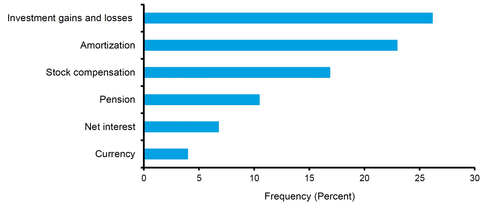
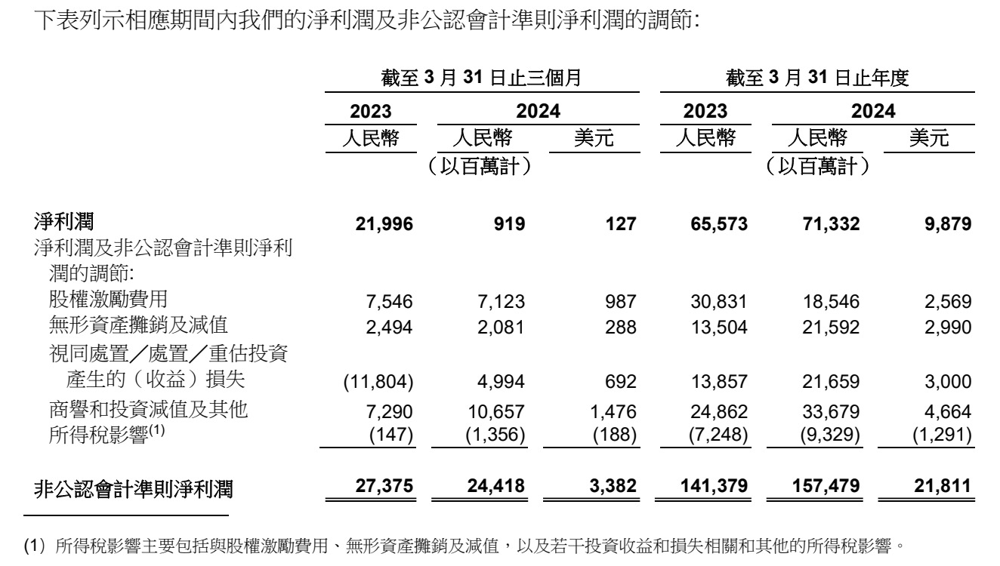
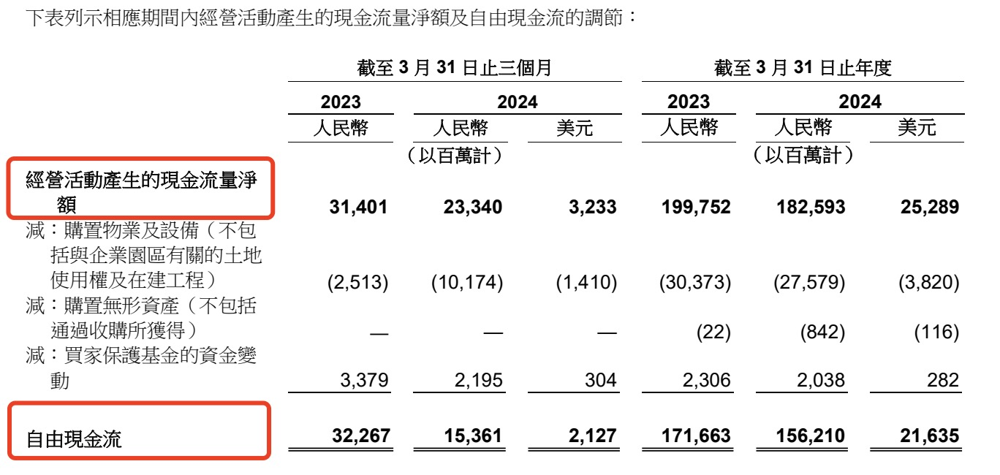
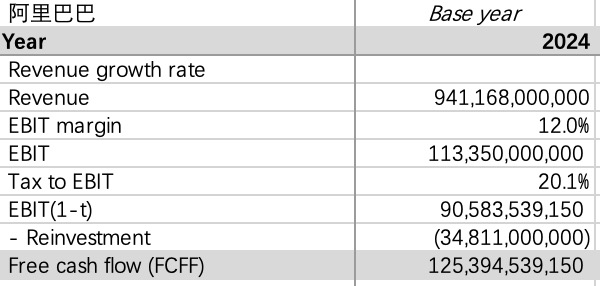

Alibaba recently released its Q1 2024 earnings on the same day as Tencent. Revenue grew 7% year-over-year, but net income attributable to shareholders plummeted by 96%.

At first glance, the decline in net income is staggering, and plenty of news outlets ran sensationalized headlines. Here is how Alibaba's earnings announcement explained the drop:

> Net income was RMB 919 million (US$127 million), a year-over-year decrease of 96%, or RMB 21.077 billion, primarily due to net losses from mark-to-market changes in our equity investments in listed companies, compared to net gains in the same period last year. Excluding share-based compensation expenses, investment gains (losses), impairment of intangible assets, and certain other items, non-GAAP net income for the quarter ended March 31, 2024 was RMB 24.418 billion (US$3.382 billion), an 11% decrease from RMB 27.375 billion in the same period of 2023.

This "non-GAAP net income" is the commonly referenced non-GAAP net income metric.

## What Is Non-GAAP Net Income

Non-GAAP net income, as the name suggests, is a profit figure calculated without strictly following GAAP (Generally Accepted Accounting Principles).

Many countries have their own accounting standards, typically converging with International Financial Reporting Standards (IFRS), such as China's PRC GAAP. The United States is somewhat unique -- its accounting standards, US GAAP, exist as a parallel system alongside IFRS, a status enabled by the sophistication of the U.S. capital markets. However, US GAAP and IFRS have been increasingly converging, which helps improve the consistency and comparability of financial statements across different capital markets.

Under GAAP, non-GAAP net income has no formal definition and is not a required disclosure item in financial statements. Nevertheless, reporting non-GAAP net income is extremely common among U.S.-listed companies. Data shows that over 95% of S&P 500 companies report both GAAP and non-GAAP net income.

Non-GAAP net income typically excludes intangible asset amortization and share-based compensation, as well as non-operating and non-recurring items such as investment gains and asset impairments.

Below are common non-GAAP adjustment items found in U.S.-listed company disclosures:

Listed companies typically provide a detailed reconciliation of each item added to or subtracted from GAAP net income to arrive at non-GAAP net income. The transition from GAAP to non-GAAP can radically transform a company's earnings picture, as illustrated by Alibaba's Q1 report below:

## Why Does Non-GAAP Exist

Traditional financial statements have become increasingly inadequate for effectively evaluating business performance. Modern companies rely more and more on R&D investment, brand building, customer relationships, software systems, and human capital. The economic purpose of these intangible assets is no different from the factories and buildings of industrial enterprises. However, under accounting standards, these intangible investments are often expensed immediately. This means that the more a company invests in knowledge-based assets to drive future profits, the larger the losses reported in its financial statements. As a result, the traditional net income figure has become a distorted metric for measuring a company's true earning power.

Beyond this, companies increasingly compensate employees through stock and stock options rather than cash. Under accounting standards, share-based payments are recorded as expenses in the income statement at the time of grant, even though no cash has actually been paid out.

Understanding this context helps explain why intangible asset amortization and share-based compensation are among the most common non-GAAP exclusions.

Internet companies are a prime example. During their startup phase, these companies are heavily reliant on human capital and require little in the way of tangible assets. To conserve precious cash while attracting risk-tolerant talent, internet companies frequently use stock and stock options to compensate employees. Even Hong Kong-listed internet companies commonly report non-GAAP net income, and investors often rely more heavily on non-GAAP metrics.

The rationale for excluding non-operating and non-recurring items is that these items are not important for understanding a company's future value, and their exclusion also enhances comparability across reporting periods.

## Non-GAAP Net Income vs. China's "Net Income Excluding Non-Recurring Items"

All A-share listed companies are required to disclose non-recurring items and net income attributable to shareholders excluding non-recurring items. Common non-recurring items include gains or losses on disposal of long-term assets, financial asset disposal gains for non-financial enterprises, and government subsidies.

Compared to the U.S. non-GAAP net income approach, China's disclosure requirements are mandatory and follow a standardized framework, as mandated by the CSRC's (China Securities Regulatory Commission) formatting requirements for public companies. In terms of scope, the definition of "non-recurring" means that the range of excluded items for A-share companies is narrower. For example, investment gains and intangible asset amortization clearly do not qualify as non-recurring items.

The mandatory and standardized disclosure requirements improve comparability among A-share listed companies but reduce flexibility and do not address the financial statement distortion issues discussed above.

## Non-GAAP Net Income and Free Cash Flow

The purpose of non-GAAP is not to approximate any particular free cash flow metric. While intangible asset amortization is a non-cash expense, non-GAAP does not exclude all non-cash expenses -- for example, depreciation of property, plant, and equipment is not excluded.

Free cash flow is also not a required disclosure item in financial statements. While non-GAAP reporting is widespread among U.S.-listed companies, free cash flow disclosure is far less common, with only about 20% of companies doing so.

Comparing or reconciling two non-GAAP metrics against each other is not appropriate, especially given that non-GAAP, compared to free cash flow, is a highly non-standardized measure.

### On Share-Based Compensation

It is worth noting that in practice, non-GAAP net income and free cash flow often treat share-based compensation the same way -- both exclude it.

When U.S.-listed companies voluntarily disclose free cash flow, most use a simplified approach starting from the cash flow statement:

*Simplified Free Cash Flow* = *Net Cash from Operating Activities* - *Capital Expenditures* (from investing activities)

Since share-based compensation is a non-cash expense, net cash from operating activities already adds back share-based compensation expense, and therefore so does the simplified free cash flow. This treatment is consistent with the non-GAAP net income adjustment approach.

In his 2015 letter to shareholders, Warren Buffett wrote the following about items that companies should not add back when calculating non-GAAP earnings:

> "Stock-based compensation" is the most egregious example. The very name says it all: "compensation." If compensation isn't an expense, what is it? And if real and recurring expenses don't belong in the calculation of earnings, where in the world do they belong?

Given that modern companies are increasingly dependent on intangible inputs including human capital, I believe there is some merit to the non-GAAP practice of adding back share-based compensation. Buffett's perspective likely comes more from the standpoint of valuing a company. If one uses a company's disclosed free cash flow figure that does not deduct share-based compensation as the basis for a valuation, the result may overstate the company's value.

Operating cash flow deducts financing costs but does not deduct share-based compensation. As discussed in the article on how to calculate free cash flow to the firm (FCFF), financing costs should be added back when calculating FCFF, while share-based compensation, though a non-cash expense, represents an economic benefit surrendered by the company and should therefore be deducted when computing free cash flow.

Now let's look at Alibaba's example. Alibaba has a tradition of disclosing FCFF in its earnings reports. The Q1 report and the annual report for the year ended March 31 present it as follows:

If we start from operating profit (EBIT) on the income statement and calculate Alibaba's FCFF for the year ended March 31, 2024, the result is as follows (in RMB):

Compared to the RMB 156 billion in free cash flow reported in the financial statements for the year ended March 31, 2024, the valuation-based free cash flow is approximately RMB 30 billion lower. The primary difference is share-based compensation. Over the past fiscal year, Alibaba's share-based compensation expense was approximately RMB 18.5 billion. The remaining difference is mainly attributable to financing costs and other net items that are not deducted from net cash from operating activities, which we will not elaborate on here.

Therefore, when using FCFF for enterprise valuation, one should not simply rely on the free cash flow figures disclosed by listed companies. In practice, companies do not disclose free cash flow primarily for the convenience of investor valuations. For instance, Alibaba stated in its 2023 annual report:

> We consider free cash flow to be a liquidity measure that provides useful information to management and investors about the amount of cash generated from operating activities that is available for strategic investments, including investing in new businesses, making strategic investments and acquisitions, and strengthening our financial position.
