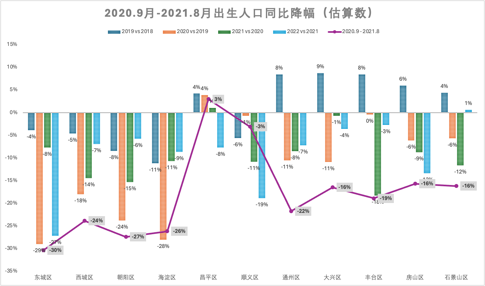
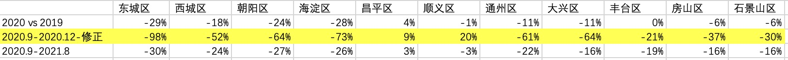

Kindergarten enrollment registration has recently kicked off across Beijing's districts. The word on the street is that there are so few children now that even public kindergartens are struggling to fill their spots. Is this really the case? And roughly how much smaller will this year's enrollment cohort be compared to previous years?

As a parent myself, I looked into the birth population data published by the Beijing Municipal Bureau of Statistics with these questions in mind, and attempted to make reasonable estimates of the enrollment decline across districts this year.

If you are a parent in Beijing or work in the early childhood education sector, the following statistical analysis may serve as a useful reference.

## Beijing's Administrative Districts and Population Distribution

Beijing comprises 16 districts. As of 2022 (the most recent year with available statistics), Beijing's permanent resident population stood at approximately 21.85 million, largely unchanged from the 21.90 million recorded in 2019 before the pandemic.

The most populous districts are Chaoyang and Haidian, each with a permanent resident population exceeding 3 million. Among the outer suburban districts, Yanqing, Huairou, Miyun, Pinggu, and Mentougou each have populations generally below 500,000.

From 2019 to 2022, the near-suburban districts — such as Changping, Shunyi, Tongzhou, Daxing, and Fangshan — saw population growth, while the core urban districts — Dongcheng, Xicheng, Chaoyang, and Haidian — experienced population declines. This aligns with the government's policy of actively dispersing residents from the six central urban districts to the suburban areas.

## Birth Population in Key Districts from 2019 to 2022

Below, we exclude the five outer suburban districts with populations under 500,000 (Yanqing, Huairou, Miyun, Pinggu, and Mentougou) and aggregate the total birth population from 2019 to 2022 for the remaining 11 districts:

2019 was the last pre-pandemic year. Compared to 2018, the overall birth population in 2019 declined by approximately 1%.

The years 2020 through 2022 spanned the three pandemic years. Beyond the broader downward trend in birth rates in recent years, pandemic-related risks clearly caused people to postpone marriage and childbearing. The data shows a pronounced decline in births over these three years, with overall declines exceeding 10% in both 2020 and 2021.

## Year-over-Year Changes in Birth Population by Key District, 2019–2022

Based on the data presented above, let us examine the year-over-year changes in births by district:

From the chart above, we can observe significant variation across districts. The overall trends from 2019 to 2022 are as follows:

- In Dongcheng, Xicheng, Chaoyang, and Haidian, births began declining continuously from 2019, with the decline accelerating during the three pandemic years — particularly in 2020, the first year of the pandemic, which saw the steepest drop;
- In the near-suburban districts (except Shunyi) and outer suburban districts, births were still growing in 2019. Declines began in 2020, with the main drop occurring in 2021 — one year later than in the core urban districts;
- Compared to the near-suburban districts, the decline in births was more pronounced in Dongcheng, Xicheng, Chaoyang, and Haidian. Beyond the pandemic's impact, this was also driven by the policy of dispersing population from the six central urban districts to the suburbs.
- Overall, 2020 and 2021 were the two years with the most significant declines in births. The 2020 decline was concentrated primarily in Dongcheng, Xicheng, Chaoyang, and Haidian. In 2021, the decline in these core districts narrowed somewhat, while the near-suburban and outer suburban districts began to experience steeper drops.

## Year-over-Year Change in Births from September 2020 to August 2021

The age requirement for kindergarten enrollment is that children must have turned three years old. This means the relevant birth date range for this year's enrollment is ***September 1, 2020 to August 31, 2021***. Accordingly, we focus on estimating the change in births during this period compared to the same period in the prior year — corresponding to **the red trend line in the chart below**.

The overall conclusions are:

- Births in Dongcheng, Xicheng, Chaoyang, and Haidian declined significantly, with estimated declines generally in the range of 25–30%;
- In the northern near-suburban districts of Changping and Shunyi, births may have remained roughly stable or even increased slightly;
- The remaining districts saw birth declines of approximately 15–20%, with Tongzhou and Fengtai likely experiencing more pronounced drops.

It should be noted that given potential population mobility and enrollment policies related to household registration and property ownership, the data above cannot precisely predict changes in enrollment numbers by district and should serve only as an approximate reference.

## Assumptions Behind the Estimates

Since the Bureau of Statistics reports population data by calendar year, it was necessary to segment the 2020 and 2021 birth decline data by time period and adjust the declines based on pandemic impact to calculate the birth decline for the September 2020 to August 2021 period.

Since the pandemic began in early 2020, its impact on postponing childbearing would not have been reflected in birth numbers until after September 2020. Before September, the birth trend should more closely follow the 2018 pattern, influenced primarily by the overall downward trend in birth rates.

We assume that the birth decline in the first three quarters of 2020 was 2 percentage points steeper than the 2019 rate of change, and then derive the decline for Q4 2020 (September to December). As can be seen, the Q4 2020 decline was steeper than the full-year overall change.

For January to August 2021, we simplify by assuming the decline matched the full-year overall rate.

Finally, by assigning weights to 2020 and 2021 according to the enrollment-relevant birth date range, we compute a weighted average of the assumed September–December 2020 and January–August 2021 birth declines to arrive at the estimated decline in this year's kindergarten enrollment.
