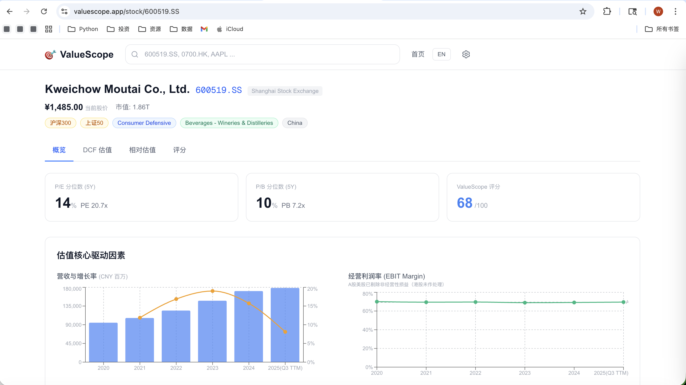

<h2>一个工具，看透一只股票</h2>

DCF 内在估值 · 相对估值分位 · 四维评分雷达 · AI 深度分析

覆盖 A 股 / 港股 / 美股 / 日股，免费使用，无需注册

<a href="https://valuescope.app/" class="vs-cta" target="_blank">开始分析 →</a>
<a href="https://github.com/alanhewenyu/ValueScope" class="vs-cta-secondary" target="_blank">GitHub</a>

---

### 四大分析维度

📊
<h4>DCF 内在估值</h4>
AI 加持

基于 Damodaran FCFF 框架的 10 年现金流折现模型，框架标准化、结果可复现。

<ul>
<li>AI 一键生成全部估值参数（DeepSeek R1 + 网络搜索）</li>
<li>增长率 × EBIT 利润率双维度敏感性矩阵</li>
<li>Gap 分析：AI 对比估值与市价差异并归因</li>
<li>完整预测表 + 估值桥 + BUY / HOLD / SELL 判定</li>
</ul>

📈
<h4>相对估值</h4>

当前价格贵不贵？放到自身历史里一看便知。

<ul>
<li>PE / PB / PS / EV/EBITDA 当前倍数</li>
<li>3 / 5 / 10 年历史分位可视化</li>
<li>分位条一目了然：当前值、均值、极值</li>
<li>PE、PB 历史走势图</li>
</ul>

🎯
<h4>四维评分</h4>

估值、质量、成长、动量——四个维度浓缩为一张雷达图。

<ul>
<li>估值维度：PE/PB 分位 + 均值回归信号</li>
<li>质量维度：ROIC、ROE、资产效率</li>
<li>成长维度：营收增速、盈利增速趋势</li>
<li>动量维度：价格趋势与技术指标</li>
<li>子因子透明可查，权重可调</li>
</ul>

🔎
<h4>财务总览</h4>

进入个股页第一眼就能快速建立全局印象。

<ul>
<li>5 年 PE / PB 分位卡片</li>
<li>营收增长、EBIT 利润率、ROIC & ROE、自由现金流四宫格</li>
<li>资产负债表关键指标：现金、债务、杠杆率</li>
<li>历史财务数据完整表格</li>
</ul>

---

### 三步开始

1

<h4>输入股票代码</h4>

A 股（600519）、港股（0700.HK）、美股（AAPL）、日股（7203.T）

2

<h4>浏览四个分析维度</h4>

总览、DCF 估值、相对估值、四维评分一键切换

3

<h4>AI 深度分析（可选）</h4>

一键让 AI 搜索基本面数据，生成估值参数并完成 DCF

✅ 覆盖全球主要市场
✅ DeepSeek R1 深度推理
✅ 完全免费
✅ 无需注册
✅ 开源透明

---

### 热门股票快捷入口

<a href="https://valuescope.app/stock/600519.SS">🥃 茅台</a>
<a href="https://valuescope.app/stock/0700.HK">💬 腾讯</a>
<a href="https://valuescope.app/stock/AAPL">🍎 苹果</a>
<a href="https://valuescope.app/stock/NVDA">🖥️ 英伟达</a>
<a href="https://valuescope.app/stock/PDD">🛒 拼多多</a>
<a href="https://valuescope.app/stock/3690.HK">🍜 美团</a>
<a href="https://valuescope.app/stock/9988.HK">🛍️ 阿里巴巴</a>
<a href="https://valuescope.app/stock/MSFT">💻 微软</a>

---

### 产品截图

---

### 和同类工具对比

<table class="vs-compare">
<tr><th>功能</th><th>ValueScope</th><th>同花顺/雪球</th><th>GuruFocus</th></tr>
<tr><td>DCF 估值</td><td>✅ 完整 FCFF 模型</td><td>❌</td><td>✅ 简化版</td></tr>
<tr><td>AI 参数估算</td><td>✅ DeepSeek + 网络搜索</td><td>❌</td><td>❌</td></tr>
<tr><td>敏感性分析</td><td>✅ 双维度矩阵</td><td>❌</td><td>❌</td></tr>
<tr><td>相对估值分位</td><td>✅ 3/5/10 年</td><td>部分</td><td>✅</td></tr>
<tr><td>多维评分雷达</td><td>✅ 四维透明评分</td><td>❌</td><td>部分</td></tr>
<tr><td>A 股 / 港股</td><td>✅</td><td>✅</td><td>部分</td></tr>
<tr><td>免费使用</td><td>✅ 完全免费</td><td>部分</td><td>💰 $450/年</td></tr>
<tr><td>开源</td><td>✅</td><td>❌</td><td>❌</td></tr>
</table>

---

### 关于 ValueScope

ValueScope 是一个开源的 AI 驱动股票分析平台。底层是标准化的 Damodaran FCFF 估值框架（10 年现金流折现 + WACC + 终值），结合相对估值历史分位和四维评分体系，帮助你从多个角度理解一只股票的价值。AI 层负责搜索和分析，但最终判断始终在你手上。

项目完全开源：[GitHub](https://github.com/alanhewenyu/ValueScope)

<a href="https://valuescope.app/" class="vs-cta" target="_blank">立即免费试用 →</a>

