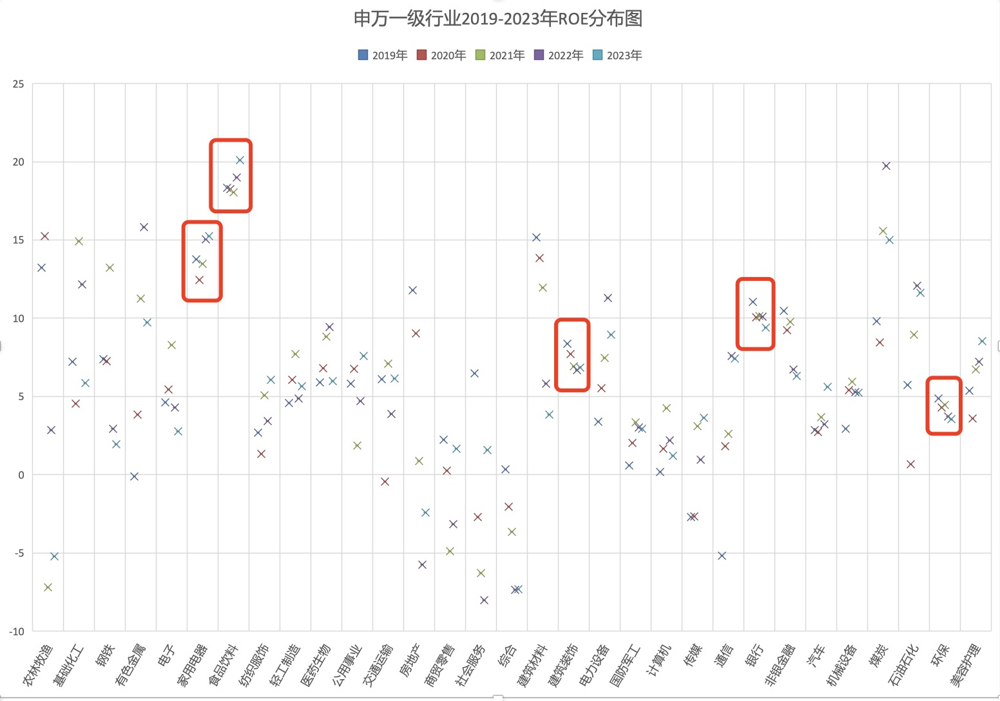

## Buy what you know

在20世纪80年代和90年代初，buy what you know(“购买你所知道的东西”)是最流行的投资口号之一。彼得·林奇是这一理念最具魅力的宣扬者。

林奇认为，我们最好的股票研究工具是我们的眼睛、耳朵和常识。业余投资者拥有专业投资机构已经忘记如何利用的优势：“常识的力量”。

很多上市公司的业务都是面向个人消费者（to C）的。如果某些东西吸引了你作为消费者的注意力，它也应该引起你作为投资者的兴趣。如果你发现了一家很棒的餐厅、饮料或者酒店，那么你就对这个生意有了一个投资机构可能尚未捕捉到的个人见解。正如林奇所说：“在一生中购买汽车或相机时，你会逐渐形成对好坏、热卖与否的判断……而最重要的是，你比华尔街知道得早。”

但林奇的规则还有一个补充原则：“找到有前途的公司只是第一步。下一步是进行研究。” 无论公司产品多么出色，没有研究其财务报表和估计其投资价值，就不应该投资。

## **消费行业通常具有较高的净资产收益率**

消费行业普遍做的是品牌生意，存在品牌效应。品牌可以带来消费者的高忠诚度，提高产品溢价，也一定程度上阻碍了想要进入行业的竞争对手。品牌的优势，可以让公司长期保持高于平均资本成本的投资回报率。

让我们看下A股上市公司的情况，以下是按照申万一级行业分类的各行业过去5年的净资产回报率（ROE）分布图：

可以看到，家用电器和食品饮料行业的ROE总体较高，且波动不大，其中家电平均在15%左右，食品饮料平均在20%左右。

其他ROE波动相对较小的行业有建筑装饰、银行和环保等。但这些行业的平均ROE低于家用电器和食品饮料。

我们再选取跟消费相关的几个行业看下，具体包括家用电器、食品饮料、纺织服饰、商贸零售、建筑材料、汽车和美容护理。以下是这几个行业过去5年的ROE走势图。

需要说明的是，A股上市公司并不能代表所有细分消费行业的特点。尤其是在服饰和美容护理领域，世界知名的消费品牌基本都在港股和美股上市。相比而言，中国的家用电器走向了世界，而食品饮料本土属性更强，这两个细分行业的上市公司基本都在A股，行业代表性更好。

可以看到，家用电器和食品饮料不仅ROE高，而且过去5年总体还呈现增长趋势。这两个行业A股可选择的投资标的较多，是最好的消费行业投资选择。

其他几个消费相关的行业中，ROE都没有超过10%的。其中，建筑装饰行业这两年受地产行业影响大一些，ROE稳中有降；汽车行业和商贸零售行业竞争激烈，ROE总体较差。

## 消费行业是最适合普通投资者的投资赛道

为什么A股市场总是大起大落？这其中一个重要原因是产业的周期性。

中国作为一个大政府、强中央管理的国家，政府通过制定产业政策和提供补贴来引导各行各业的发展。这种模式常常导致新兴行业出现蜂拥而上的现象，紧随其后的往往是产能过剩，最终留下的是一地鸡毛。可以说，A股市场就是产业政策和产业周期的一面镜子。

作为普通投资者，如果不深耕于具体行业内部，仅凭眼睛、耳朵和常识，很难准确把握产业周期，从而抓住周期性上升或反转的机会。这种信息不对称和专业知识的缺乏，使得普通投资者在面对市场波动时处于不利地位。

相比之下，消费行业是我们看得见、摸得着的。尤其是日常生活相关的消费行业，具有刚需性，能够穿越经济周期。人们对美好生活的追求是永恒的主题。如上图所示，即使在经济不景气的环境下，家用电器和食品饮料投资回报率仍在持续提升。即便这些行业不增长，由于其具有较高的ROE，仍然可以实现较好的投资回报。这也是为什么像巴菲特这样的投资大师钟情于消费类投资的原因。