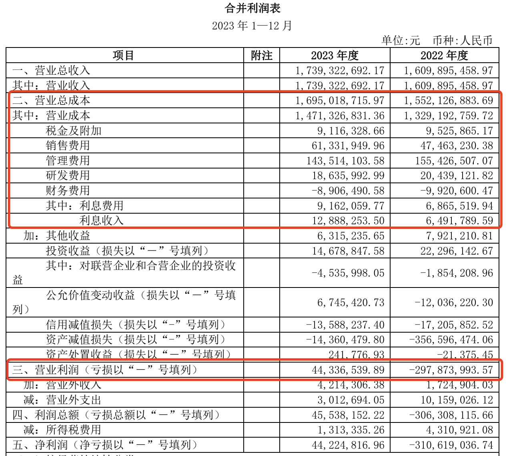

2024年4月9日，国际会计准则理事会发布了《国际财务报告准则第18号——财务报表列示和披露》（IFRS 18），该准则将替代《国际会计准则第1号——财务报表列报》，并将于2027年1月1日生效，允许企业提前采用。

IFRS 18最显著的一个变化是在利润表引入了经营、投资和筹资的视角，要求企业按照这三个类别归类收入和费用，并新增了经营利润和筹资及所得税前利润两个小计项目。

## IFRS 18让DCF估值计算更简单了

对利润表做出明确的列示要求有助于提升财务报表的可比性和披露信息的有用性。具体到企业估值而言，这个新的列示方式简直是一大福音。

为什么这么说呢？让我们回顾一下如何计算企业自由现金流（FCFF）。

计算DCF估值时，常用的方法是从归属于企业的自由现金流（FCFF）出发，进而减掉有息负债，得出归属于权益的现金流以及折现价值。从FCFF出发计算估值的好处是无需预测筹资活动的变动。

FCFF是税后经营利润（NOPAT）扣除再投资的剩余部分。这个税后经营利润没有相应的报表科目，实务中可以基于EBIT*（1-所得税税率）计算。

FCFF的利益方既有股东，也包括债权人，因此不扣除利息费用，也就是before interest，EBIT的口径跟它是一致的。

然而，EBIT的定义没有排除投资活动的影响。对于不以投资为主业的一般性企业而言，投资收益不具有连续性和可预测性。由于FCFF是基于对企业主营业务长期稳定的预测，投资类的非主营业务活动应该单独考虑。

例如之前分析的香港交易所，它的投资收益受利率影响较大，就不能跟交易费和结算费预测同步考虑。

再来看一下上图按照IFRS 18列示的利润表结构。区分经营、投资和筹资之后，新增的经营利润小计跟计算FCFF所用的税后经营利润（NOPAT）就差一个税项，即NOPAT = 经营利润*（1-所得税税率），这简直就是为计算FCFF准备的。对计算DCF估值来说，从新的利润表范例提取数据方便多了。

## 当前现状

### A股上市公司的利润表

目前国内上市公司的财务报表有统一的列示和披露格式，这源于财政部对一般企业财务报表格式的要求，以及证监会对公开发行证券的公司信息披露内容和格式的指引。以下是一个利润表示例：

这个利润表结构比较扁平：1）把所有的成本、费用都混合到了一起。从营业收入到营业利润，中间没有小计，甚至连毛利的列示都没有；2）没有区分经营和筹资，把财务费用放在了营业成本里。这意味着，利润表没有归属股东和债权人在内的经营利润视角。

如果想计算A股上市公司的EBIT（近似经营利润）甚至最基本的毛利，还得自己做加减计算。

### 港股上市公司的利润表

再来看下香港上市公司按照国际会计准则披露的利润表情况，以腾讯控股为例：

可以明显感觉到，这个报表格式要比A股公司清晰很多，尤其是财务费用和投资收益是在经营利润（operating profit）以下列示的。这个经营利润基本就等于EBIT，而且进一步排除了投资收益，可以直接用作计算NOPAT和FCFF的基础。

港股公司和美股上市公司的利润表格式基本都是类似的列示方式，不再列举更多例子。

### 总结

总体来看，A股上市公司当前的利润表列报方式没有区分经营和融资，小计少，这对利用财务报表进行公司分析和估值的使用者来说不太友好。港股和美股公司的利润表格式明确区分了经营和投融资，主营和非主营，已经非常接近于IFRS 18的列示要求，对估值计算来说要方便的多。

IFRS 18要到2027年才能生效，期待财政部和证监会能够提前采用，及早革新A股上市公司利润表列报方式，提高报表披露信息的有用性。