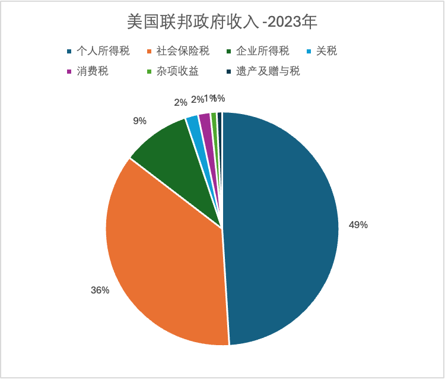
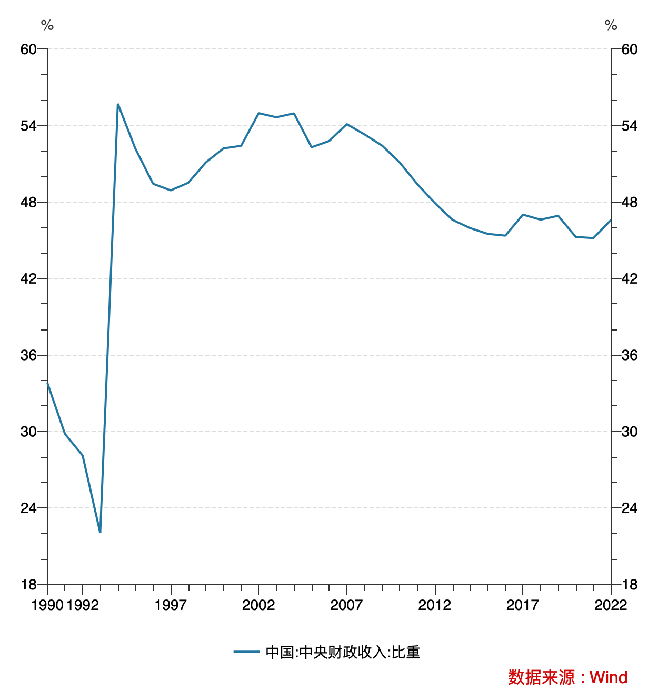

4月底的政治局会议宣布将于今年7月召开二十届三中全会。回顾历史，凡是三中全会，都关乎国家重大的经济和体制改革。比如著名的十一届三中全会，拉开了改革开放的序幕。再比如最近的十九届三中全会，主要是讨论党和国家机构改革方案。这次政治局会议新闻稿强调要“把改革摆在更加突出位置，紧紧围绕推进中国式现代化进一步全面深化改革”，应该是给二十届三中全会吹风。

结合去年底的中央经济工作会议强调“要谋划新一轮财税体制改革”，因此，财税体制改革预计将会是二十届三中全会的重点议题之一。

本文先对中美的税收差异进行比较分析，然后再简单讨论下当前经济环境下，新一轮财税体制改革可能要解决的一些问题。

## 间接税 vs 直接税

以纳税义务人是不是税收实际负担人划分，税收可以分为间接税和直接税。所谓间接税，是指纳税义务人不是税收的实际负担人，纳税义务人能够用提高价格把税收负担转嫁给别人的税种。具体而言，增值税、消费税以及关税等都属于间接税；而直接税的预期税负不能转嫁，纳税人就是实际税收负担人，如企业所得税、个人所得税、财产税等。

中国的税收以间接税为主，多数发达国家以直接税为主体。下面以美国为例，看下中美税收上的具体差异。由于中美地方政府财政收入都有较大一部分来自于非税收入，为了方便对比，中美地方政府收入的构成都不考虑非税收入影响。此外要注意的是，美国的社保费是税收的一部分，而我们是单独收取的，不在财政收入的范围内。

## 中美税收差异

### 中国

中国税收主要是增值税、消费税两大间接税种，以及企业所得税和个人所得税两大直接税税种。其中，增值税由中央和地方按5/5分成，企业、个人所得税由中央和地方按6/4分成。消费税归中央。

除上述几个大的税项，其他还有一些小税种，比如关税归中央，资源税按不同的资源品种划分，海洋石油资源税归中央收入，其余归地方。

完全归属地方的独立税种主要是土地增值税、城市建设维护税、城镇土地使用税、房产税、车船税、契税等。

2023年，中央政府总的财政收入约为9.6万亿人民币,其中增值税占比约为36%；消费税占比约为17%，这两项间接税加起来占到了财政收入总额的约53%。直接税中，企业所得税占财政收入总额约27%，而个人所得税的占财政收入比例仅为9%。

中国地方政府的收入最新数据到2022年，总收入约7.7万亿人民币，其中增值税和企业所得税占大头，占比分别约为32%和21%。其他几个重要的税种，如土地增值税、个人所得税、契税，城建税、房产税等，占比5%-8%不等。

此外，地方政府非税收入较高，2022年金额约为3.2万亿（未包含在下表），其中主要是土地收入和国有资产有偿使用收入。

综合中央和地方来看，财政收入约20万亿人民币，不含地方政府非税收入的财政收入合计约为17万亿。除个人和企业所得税和财产税（车辆购置税和车船税）等直接税，间接税占财政收入比例约为53%。如果不考虑地方政府非税收入，间接税占比约为63%。

### 美国

美国税收分为联邦、州、地方三个层面，每个层级政府都有相对独立的主体税种，相对独立。其中，联邦政府以个人所得税和社保税为主，州政府以所得税和销售税为主，而地方政府以包括房地产在内的财产税为主。除了常规税收，州和地方政府还有其他几个财政收入来源：使用者付费和专项收益(主要是指公立医院学校收费、高速路收费等)，公用事业和酒类专卖收入和保险信托收入。保险信托收入类似我们的社保费，以下分析不考虑。

2023年，联邦政府收入约为4.4万亿美金，其中个人所得税占比约49%，其次是社会保险税，占比36%。这两项都是直接税，加起来占联邦政府收入比例约为85%。剩余部分主要也是直接税，即企业所得税，占比9%。值得注意的是，美国的这个社会保险税对应我们的口径是社保费，以税收形式缴纳。

州和地方政府一级的税收收入最新数据到2021年，总收入约2.1亿美金，其中主要包括销售税占比31%，房产税占比31%，个人所得税占比26%。这个销售税类似我们的消费税，属于间接税。

此外，上述提到的州和地方政府其他几个收入来源中，使用者付费和专项收益，以及公用事业和酒类专卖收入金额合计约为1万亿美金。

综合联邦政府及州和地方收入来看，如果不考虑联邦社会保险和地方政府保险和信托等社保性质的收入，财政收入约5.9万亿美金（与之对应的中国同口径财政收入为20万亿）。其中，主要的间接税是销售税，占比约12%。

## 当前财税体制改革要解决的问题

### 地方政府财权事权不匹配的问题

1994年分税制税改革后，中央税收占比明显提高，但地方政府承担的事权并未显著减少，导致了地方政府财权事权不匹配的问题。2016年营业税改增值税后，过去完全归属地方的营业税成为中央和地方的共享税。为缓解地方财政压力，营改增后，地方按税收缴纳地分享的增值税比例提升至5/5分成，而此前中央和地方的增值税分成比例大体上是7/3。

解决地方政府财权事权不匹配问题目前主要靠中央的转移支付，中央转移支付同时也发挥了调节区域发展差距的作用。另一方面，地方政府为了扩充财源，严重依赖非税收入，比如土地收入和罚款等，并利用隐性地方债务驱动发展。当前房地产行业深度调整，地方政府土地收入严重减少，未来难以成为地方的重要收入来源。与此同时，由于投资缺乏效率，地方债务问题难以为继。

因此，如何调整中央和地方财政关系格局，制定长期及可持续的框架，以解决地方政府面临的财政压力，调动地方政府的积极性，可能是这一轮财税改革要重点解决的问题。

### 间接税的“累退”性质

增值税和消费税都是间接税，在流通环节征收，并最终转移和体现到终端消费价格中，因此本质上是对需求和消费征税。这意味着，收入越高，承担的税负越低。例如生活必需品，各收入阶层需求量相似，但与高收入人群相比，低收入阶层的税负感显然更高。

因此，间接税具有“累退”的性质，而非“累进”。累退性的税制结构与调节收入分配背道而驰，实际上加剧了贫富差距。

可见，直接税对于调整收入分配、提升老百姓购买力、刺激消费具有积极意义。考虑到中美国情不同，转变为直接税为主的税收体系短期内看不太现实，但增加直接税的比重一直是政府改革的目标。十八届三中全会明确提出的建立现代税收制度行动主线是“逐步提高直接税比重”，“十四五”规划也重申了“优化税制结构，健全直接税体系，适当提高直接税比重”的目标任务。

直接税中，目前主要是所得税和部分城市试点的房产税。考虑当前地产行业的困难局面，房产税改革可能要继续推迟了。提升直接税比重目前看只能靠所得税，包括个人所得税和企业所得税。

增加个税来源有两种途径，一是扩大税基，二是高收入阶层多纳税。当前经济环境下，我国面临有效需求不足的问题，扩大税基不利于刺激消费，短期内不是一个好的选择。针对高收入人群，目前最高45%的边际税率并不低（美国个税的最高边际税率是37%）。当前的问题是，工薪阶层成了个人所得税的主要纳税群体，而富人和高收入阶层却有许多避税手段。实际上，地方政府的一些税收优惠政策也在变相帮助高收入阶层避税，例如，许多地方政府为了吸引企业投资，给企业一些享受个税返还的名额。企业显然将这些名额都分配给了公司高管，实际上加剧了税负不公和分配不公的问题。此外，像明星偷税漏税的问题，近年来虽有所好转，但如何让类似这样的高收入人群承担应承担的税额，就像美国总统拜登所说的，pay your fair share，仍然有许多问题需要解决。

从企业所得税来看，当前我国的企业所得税税率是25%，高新技术企业是15%。对照看美国，当前的企业所得税税率是21%。由于美国目前的财政赤字很大，企业所得税税率明年大概率会提高，可能会到28%。巴菲特在刚刚落幕的2024年股东大会也谈了这个问题。假设美国的所得税税率明年提高到28%，我们也可以适当调高企业所得税税率，同时在保持总的税负不变的情况下，降低企业的增值税和消费税税负，以促进终端消费。