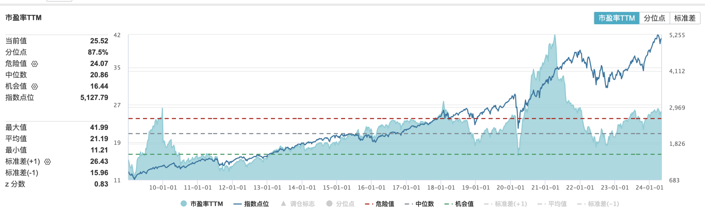

2024年的巴菲特股东大会刚刚落幕。这个会号称投资界的春晚，每年都吸引着全球投资者的目光。作为中国的观众，自然很关心巴菲特对投资中国的看法。

今年的问答环节，第一个问题居然就是关于中国的。一位来自中国香港的股东提问：“巴菲特先生，伯克希尔此前曾投资过比亚迪。您未来是否会继续投资中国的其他公司？”。

巴菲特对此回答道：“**我们主要的投资标的将会位于美国，这是我们坚信不疑的。**你看我们所投资的可口可乐或运通，都是在全球扩张业务的公司。而像美国运通或可口可乐这样在全球都有业务的公司，在全球都很难寻觅，这是全球的共识。而我觉得对于比亚迪的投资，跟我们5年前在日本做出的投资比较相似：我们快速地在日本投资了5家商社，你很少会看到我们在美国海外做出这样的投资，尽管我们正在通过这些公司参与世界经济。**我了解美国的规则、弱点和优势....我在世界其他地方没有这种感觉。**"

巴菲特似乎是打了一个太极，相比于之后对印度市场的看法，他回避了直接谈论对中国的看法，又很委婉地拒绝了这位股东的问题。巴菲特给出的理由也算是合情合理，毕竟更了解美国市场嘛。

巴菲特在美国以外的投资的确较少。他投资比亚迪已经是8年前的事情，而且主要是受到已故合作伙伴查理·芒格的建议。阿里巴巴的投资则是由查理·芒格管理的Daily Journal公司所投的，不是巴菲特管理的伯克希尔公司的投资。对日本五大商社的投资开始于2020年，时机把握的很好，现在看买的极其便宜，甚至还有些carry trade（套利交易）的味道：通过发行近乎零利率的日本债券购买日本稳定分红的公司。目前看这笔投资的安全边际已经很高，简直就是稳稳的套利。

除了更了解美国市场之外，巴菲特在上述回答中还触及了投资美国股票的本质，即购买美国股票就是在全球范围内投资，同样可以获得其他国家的回报。比如可口可乐，美国运通，“都是在全球扩张业务的公司。我们正在通过这些公司参与世界经济。”

由此就想聊聊，美股长牛的原因。

## 美股长牛的原因

2008年次贷危机之后，美股大幅下跌，直至2009年2月触及低点，然后开始了长达十多年的牛市。尽管受到2020年疫情影响和2022年开始的美元加息周期的影响，美股经历了两次大幅下跌，但最终仍然重回新高。

以下是标普500指数从2009年至2024年目前的走势图：

分析美股长牛的原因，核心离不开美国的创新能力。经济学讲，驱动生产率的因素有三个：物质资本、人力资本、自然资源和技术知识。先不论美国优越的自然资源和优秀的人力资本，美国在技术知识方面的创新是绝对领先的，这是决定美股长牛的根本。比如最近的人工智能浪潮，使得美国在高利率环境下持续保持了经济活力，有望实现通胀软着陆。

其他重要原因还包括美元长期低利率的影响，这也是显而易见的，因为流动性是股市的重要推动力。

这里想重点说下美国上市公司的全球性。

美国有很多这样的跨国公司，比如苹果、英伟达、前面说到的可口可乐，以及很多的知名制药公司，他们的生产和销售遍布全球，尽管总部设在美国。

苹果超过60%的收入来自国际市场，其中19%来自大中华区，可口可乐的数字类似，而英伟达则有56%的收入来自美国以外的市场。

因此，投资这样的全球性的跨国公司，实际上就分享了全世界增长的红利，包括中国这样的新兴市场国家，这是美股长牛的另一个重要原因。

对于普通的散户投资者来说，如果无法把握个股风险，投资包括美国巨头在内的被动全球指数基金可能是最好的选择，这样既可以获得新兴市场增长的红利，同时又可以分散单一市场风险。