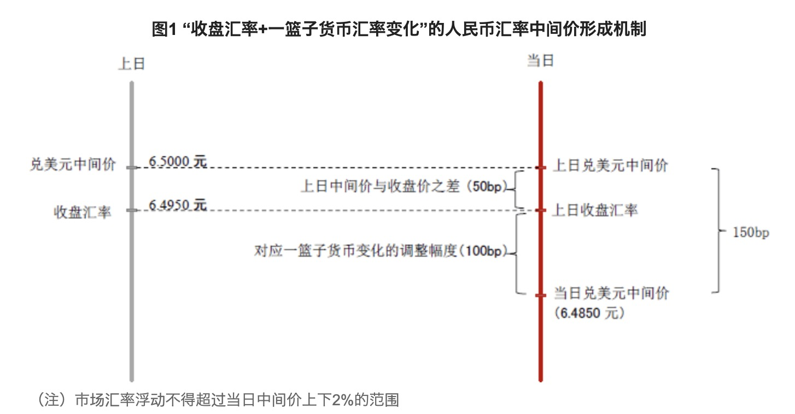
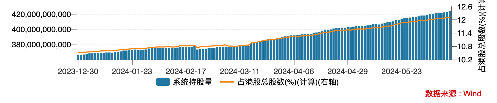
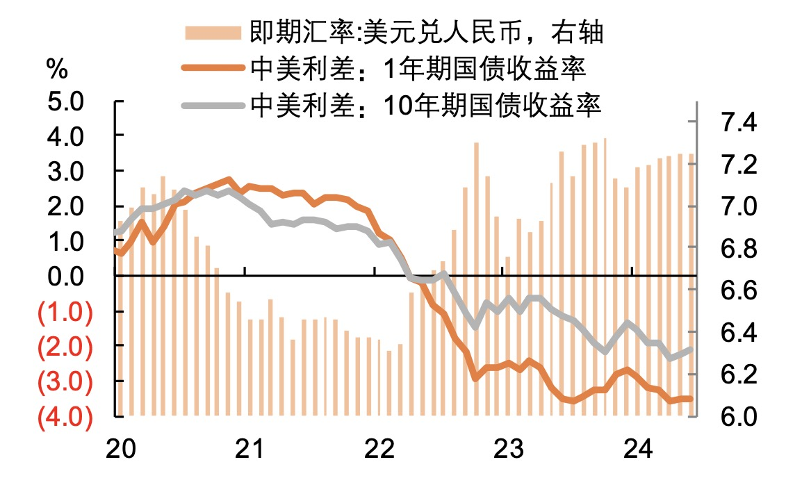

## 决定汇率的因素

在有关汇率决定的理论中 ，凯恩斯在1923年出版的《论货币改革》中提出的利率平价理论是最基本的学说，其核心观点是两国间的利率差导致资本的国际流动，对汇率尤其是短期汇率起决定性的作用。

虽然说利率平价理论是决定汇率的最基础因素，但是很多时候无法简单用利率差来预测汇率走势，这是由于汇率反映的两个国家之间的相对强弱。相对强弱的背后还有很多的因素，比如经济基本面好坏、通货膨胀，以及外汇管制等。

### 日本的例子

美元加息导致的其他国家货币对美元贬值是利率平价理论的最好验证。以日本为例，当前日美的利率差高达5%以上，这是日元对美元持续贬值的核心因素。

日元被压制在低价，而日本央行的货币政策却含糊其辞，不敢大规模干预，这主要是由于日本政府债务高达GDP的250%，难以承受加息的负担。此外，日本刚刚有走出长期通缩的迹象，贸然加息将会给温和增长的经济泼上冷水。实际上，日本企业也乐见货币贬值，因为日本经济属于外向型，货币贬值有助于出口，并促进入境旅游。因此，国际投资者大多认为日元汇率很难持续升值，甚至有进一步贬值的可能。但随着日元贬值，工资无法跟上实际物价的增长，家庭消费正在面临压力。

这几年，人民币对美元也贬值了不少，其中，中美利率差是一个核心原因；另一个主要原因是中美当前面临的经济周期不同，尤其是国内经济不景气。

但是，与日本情况不同，中国存在资本管制，人民币还不能自由流动，汇率并非完全市场化，而是实行有管理的浮动汇率制度。

## 人民币汇率中间价

人民银行管理人民币汇率的主要手段是通过每天早上发布的人民币汇率中间价，即期汇率只能围绕中间价上下浮动不超过2%。如果把即期结算汇率比喻为风筝，这个汇率中间价就像风筝线。风筝高低借风力上下，国内经济、利率、通胀，以及国际市场环境等都对风力有重要影响，但是风筝线牢牢把握着它的方向和波动。

这个汇率中间价是如何产生的呢？它的定价模式是“收盘汇率+一篮子货币汇率变化”。即在制定当日中间价时候，首先参考上日“收盘汇率”，即前一天银行间外汇市场的人民币兑美元收盘汇率；同时参考“一篮子货币汇率变化”，“一篮子货币汇率变化”是指为保持人民币对一篮子货币汇率基本稳定所要求的人民币对美元双边汇率的调整幅度。以下是一个示例：

由于人民币不能自由流动，我们在香港还有一个相对独立的离岸人民币市场。相对来说，离岸人民币汇率更加市场化。虽然每日汇率中间价是离岸人民币投资者观察的重要指标，但它的走势是独立的，没有上下波动限制。由于离岸人民币更好反映了市场的“风力”，在岸人民币的即期汇率受离岸人民币走势影响较大，基本上是被牵着鼻子走的。

## 当前人民币面临的贬值压力

以美元兑人民币汇率为例，以下是过去10年的人民币汇率中间价和即期汇率走势图：

可以看到，虽然人民币即期汇率允许围绕汇率中间价上下波动2%，绝大多数时间，即期汇率与汇率中间价是基本吻合的，只有有两个时间段出现了明显的背离，一个是2015年1-7月，最终导致“811汇改“，一个就是今年以来。这两个时间段的即期汇率达到了汇率中间价的2%波动上限，这说明当前市场上存在较大的人民币贬值预期，汇率中间价这跟风筝线越来越难以拉住想要高飞的风筝了。

如果你近期换美元，发现结算汇率跟汇率中间价差异较大，原因就在这里。

### 港股通市场显示出的迹象

今年以来，内地投资者通过港股通持续买入港股。赚钱效应是一个方面，考虑到当前人民币汇率处于高位，内地投资者却无惧汇率风险，加速买入港股，这背后可能反映了投资者对人民币继续贬值的预期。

### 当前人民币贬值压力的主要原因

总体来说，中美利差是决定美元兑人民币汇率走势的主要因素。2024年初，中美利差仍有扩大，但最近几个月的利差有所收窄。从即期汇率来看，最近几个月人民币汇率仍呈现出持续贬值的迹象。这显示出，当前人民币汇率的贬值趋势，除了中美利差的因素，当前国内低迷的经济环境可能是另一个重要原因。

当前市场所体现的人民币贬值预期最终会走向何处呢？回顾历史来看，人民币会不会再次出现2015年那样的一次性贬值呢？让我们先来看下2015年汇改的影响。

### 2015年“811汇改”

2015人民币汇率中间价与即期汇率的明显背离，最终导致了人民币汇率的一次性贬值。2015年8月11日，中国央行将人民币汇率中间价下调1000点，人民币一次性贬值2%。811汇改目的是让人民币兑美元汇率的中间价定价机制更加市场化，形成了上述“收盘汇率+一篮子货币汇率变化”的新的中间价报价模式。

“811汇改”一定程度上释放了人民币的贬值压力，改善了人民币有效汇率高估的状况，但也带来了强烈的人民币继续贬值的预期。在汇改之后的5个月里，人民币继续贬值。人民银行不得不使用收紧资本管制、动用外汇储备干预香港离岸市场等手段来稳定人民币汇率。从股市来看，811汇改之后，在短短的两周内，上证指数从3900多点一路下跌到了2850点。

## 人民币银行面临的两难

年初，人民银行行长潘功胜在谈到2024年支撑人民币汇率的主要因素时提到，“市场对美联储货币政策的转向以及美元升值动能减弱，这一点应该是市场比较普遍的共识。中美货币政策周期的错位有望得到改善，这将推动中美利差趋于收敛，有助于人民币汇率和跨境资金流动更加趋于稳定和平衡。”

从6月份美联储议息会议来看，今年美元可能只有一次降息。与年初普遍三次降息的预期相比，美元的降息时间表一直在推迟，而且降息路径充满不确定性。

当前我国经济仍然面临内需不足，通货紧缩的局面。降息对于降低居民和企业融资成本，扩大内需，刺激经济增长有积极意义。但是，由于当前中美货币政策周期的错位，降息将会对稳定人民币汇率形成压力。

降利率，还是保汇率，这是人民银行面临的两难。我们过去及当前的政策是既要又要，小心降息，同时适度干预汇率，维持人民币汇率基本稳定。

鉴于美元降息的不确定性，我们的货币政策能继续等下去吗？考虑到当前不断积累的人民币贬值预期，我们的汇率管控是否应该适当放松呢？

### 放松汇率的积极意义

如果我们适度放松对人民币汇率的管控，可以为降息带来更多空间。如前所说，降息对于降低居民和企业融资成本，扩大内需，刺激经济增长有积极意义。而且，汇率贬值会输入通胀，有助于走出当前的通缩局面。

另一方面，从外需来看，出口在上半年对经济增长的带动作用更加明显。当前，国外对中国输出过剩产能的批评越来越多。美国、欧洲采取的惩罚性关税等贸易保护措施正在制约中国企业的海外扩张。在此环境下，人民币贬值有助于增强我国企业的出口竞争力。

### 稳定汇率的积极意义

股市、汇市反映的不仅是当下，更重要的是对未来的预期。放松汇率可能导致投资者预期变差，汇率会出现进一步贬值，对当前仍然较为脆弱的股市构成下跌压力。

另一个考量的因素是人民币的国际化。如果人民币汇率贬值，将会影响人民币作为外汇储备的信心。

截至2023年，人民币在全球外汇储备中的占比约为2.3%，相比高峰期2022年一季度的2.8%有所下降，一定程度上反映出人民币汇率贬值的影响。考虑到人民币外汇储备规模并不大，权衡国内当前货币政策需要，人民币的国际化不一定需要作为政策制定的重要考量因素。

[7PQN4LWXJVHWZLMJI52TWX4SKU.avif](%E4%BA%BA%E6%B0%91%E5%B8%81%E7%9A%84%E5%89%8D%E6%99%AF%EF%BC%9A%E9%99%8D%E5%88%A9%E7%8E%87%EF%BC%8C%E8%BF%98%E6%98%AF%E4%BF%9D%E6%B1%87%E7%8E%87%EF%BC%9F/7PQN4LWXJVHWZLMJI52TWX4SKU.avif)

综上分析，鉴于当前的经济环境，利率政策更多还是应该以我为主，降息应该是优先考虑的选项。

降息不必然意味着汇率贬值。影响汇率的因素是多方面的。如果降息后，国内经济能得到有效复苏，将会对人民币形成有效支撑，从而可以对冲利率差导致的人民币贬值压力。

从811汇改来看，人民币一次性贬值的负面影响较大。通过降息引导汇率适当贬值，可能比直接调整汇率中间价贬值更温和一些。