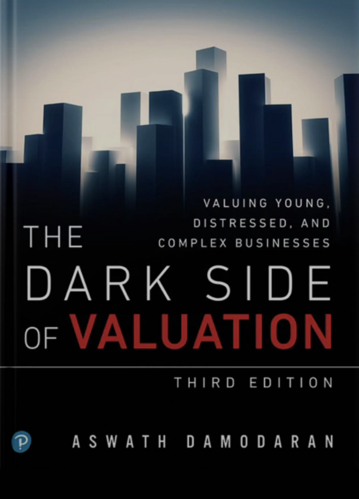
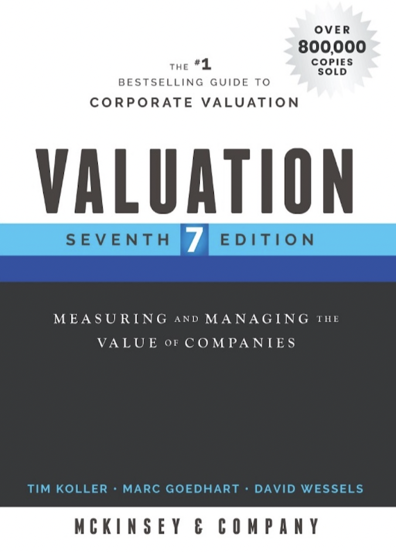
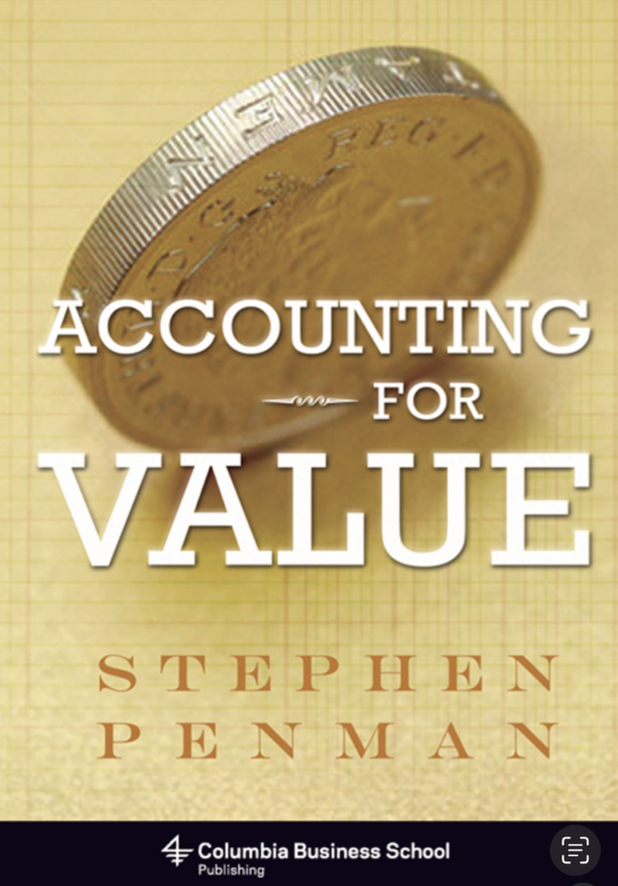

今天为大家整理了一份了解价值投资思想和系统学习公司估值的进阶书单。无论你是从事财务工作还是投资，这些书籍都能为你的工作和业务提供有益指导。

以下是一个简单的导图：

这种专业投资的书翻译成中文之后往往更难理解，因此建议还是尽量读英文原本。如果感觉英语阅读难度高，可以搜一下对应的中文版。

以下是这些书籍的简单介绍：

## 关于价值投资思想

### **《Berkshire Hathaway Letters to Shareholders, 1965-2019》***作者：Warren E. Buffett*

巴菲特历年致股东的信其实可以去Berkshire Hathaway的官网上下载。这本书是个汇编，读起来会更方便，但是只到2009年。虽然这些信件内容量极大，但只有读原文，你才能够全面深入了解巴菲特的投资哲学和对商业世界的看法。

### **《The Intelligent Investor, Rev. Ed》***作者：Benjamin Graham*

格雷厄姆被誉为价值投资之父，他的《聪明的投资者》是巴菲特推崇的价值投资经典之作。书中详细阐述了价值投资的基本原则，强调了长期投资、安全边际和市场心理的重要性。

## 如何计算公司估值

### **《The Dark Side of Valuation: Valuing Young, Distressed, and Complex Businesses》***作者：Aswath Damodaran*

达莫达兰是估值领域的权威，他的这本书深入探讨了绝对估值和相对估值的技术方法和估值中的难点问题。通过学习这本书，你可以掌握从财务报表中提取关键数据，并将其转化为有意义的估值的方法。

### **《Valuation: Measuring and Managing the Value of Companies, 7th Edition》***作者：McKinsey & Company Inc.*

由麦肯锡公司编写的这本书将估值和公司战略相结合，以价值创造为导向，为估值理论和实践提供了更高层次的视角。这本书不仅适合投资者，也适合企业管理者和财务分析人员，帮助他们在公司管理和投资决策中应用估值技术。如果说达莫达兰的书讲的是估值的“术”，麦肯锡的这本书更多讲述了估值之“道”。

### **《Accounting for Value》***作者：Stephen Penman*

斯蒂芬·彭曼的书读起来较为晦涩，但他推崇的仍然是价值投资之道。与传统DCF估值基于现金流量表不同，他的估值体系以账面净资产和利润表剩余利润为起点，提供了另一种视角来评估企业价值。本书对财务报表和公司价值以及估值之间思辨有助于我们加深对财务报表和估值的理解。

### 结语

希望大家能从这些书中汲取到丰富的投资智慧，加深对财务报表和企业价值的理解，知行合一，在实践中不断提升认知能力。