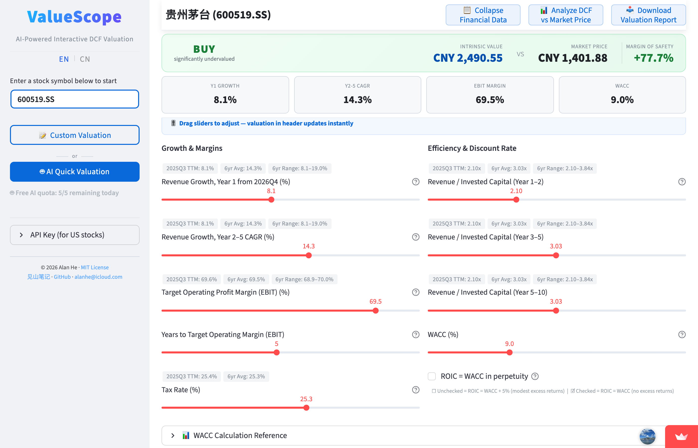

> **更新于 2026-03-11**：项目已正式更名为 **ValueScope**，网页版新增 Cloud AI 功能（DeepSeek R1 深度推理 + Serper 联网搜索），无需安装即可在线使用 AI 驱动估值。以下内容已同步更新。

春节假期，我一直在重度使用Claude。一个很明显的感觉是，大模型进化到今天，它已经不仅仅是个聊天机器人，而是真正可以干活的生产力工具。理解能力很强，交付质量也很高，很多任务基本可以一遍过——效率远高于现实工作中反复沟通、多次返工的状态。

之前我分享过，Claude最新的Opus 4.6模型可以直接帮你做完整的DCF估值——从搜索财务数据，到生成假设参数，到计算内在价值，再到输出Excel，全流程对话完成。

但用了一段时间后，我发现一个现实问题：

每次估值，AI 都要从头搜索财报、重新计算各种指标。这不仅需要消耗不少 token，而且每次输出的格式也未必完全一致，结果不方便横向比较。

偶尔计算一两家公司估值当然没问题。但如果需要经常跟踪不同公司估值、反复调整参数假设，这种方式的成本其实不低。

于是我重新思考分工：

**机械性的工作**——数据获取、清洗和计算——其实更适合交给标准化的金融数据库和程序自动完成；**需要判断的部分**——未来增长率怎么定、利润率的合理区间是多少——交给AI来分析。

这就是 **ValueScope** 的设计思路：一个AI驱动的交互式DCF估值工具。底层是标准化的DCF模型（10年预测期、加权资本成本、终值、敏感性分析），框架固定、结果可复现；上层接入AI，帮你做参数判断。

## 最简单的开始方式：网页版（免费，无需安装）

如果你只是想快速算一下某只股票值多少钱，**网页版是最好的起点**——打开就能用，不需要下载任何东西，完全免费。

网页版提供两种估值模式：

- **🤖 AI 一键估值**：点击按钮，Cloud AI（DeepSeek R1）自动联网搜索公司业绩指引、分析师预期和行业数据，给出所有 DCF 参数建议，一键完成估值。
- **📝 自定义估值**：拖动滑块手动设置估值参数（收入增长率、利润率等），每个参数都给出了历史数据作为参考，估值结果实时更新。

两种模式都会同步生成敏感性分析和估值判定（买入/持有/卖出）。

**A股、港股完全免费。** 美股也支持，需要一个免费的金融数据账号。

网页版地址：https://valuescope.app

## AI 能帮你做什么？

DCF估值真正的难点在于——**参数怎么定？** 未来收入增长率给多少？经营利润率假设多少合理？这些判断往往需要大量研究。ValueScope的AI功能，就是为了解决这个问题。

无论是网页版的 Cloud AI，还是本地版的 AI Copilot，它们都会帮你做这些事：

- **搜索最新数据，给出参数建议。** 针对每个估值参数，AI会搜索公司业绩指引、分析师一致预期、行业数据，给出建议值并附上分析理由。比如："未来一年收入增长率建议8%，依据是公司最新业绩指引和分析师平均预期"。
- **你来审核，最终决定权在你手上。** AI给的每个参数都可以单独审核和调整。觉得合理，直接确认；觉得不对，拖动滑块或输入你自己的数字覆盖掉。
- **AI分析估值与市场价格的差异。** 算完后，AI会把估值结果和当前股价做对比，搜索分析师目标价，分析差异原因——是市场给了情绪溢价，还是你的假设偏保守了？
- **一键导出Excel。** 估值结果、历史财务数据、AI分析，全部导出到一份Excel文件里，方便存档回顾。

## 进阶玩法：本地版

如果你想获得更完整的终端体验，可以把ValueScope下载到本地运行（安装方法见文末GitHub链接，有详细说明）。有两种使用方式：

- **终端版**：通过命令行交互，有自定义、AI辅助、AI自动生成估值等不同运行模式可选。

- **本地网页版**：和在线版一样的可视化界面，拖动滑块、实时更新估值，也可以使用AI自动生成估值。

两个版本功能完全一样，都支持中英文双语；都可以选择AI一键估值，或者自定义输入参数。

## 关于AI引擎

**网页版（在线使用）：** 内置 Cloud AI，无需安装任何东西：

- **DeepSeek R1**：深度推理模型，负责分析公司基本面和生成参数建议。
- **Serper**：联网搜索 + 网页抓取，自动获取最新的业绩指引、分析师预期和行业数据。

**本地版（下载使用）：** 支持三种AI CLI引擎：

- **Claude**：分析质量最好，需要Claude付费订阅。
- **Gemini**：Google出品，Google账号登录即可**免费使用**。
- **通义千问**：阿里出品，注册账号即可**免费使用**。

也就是说，即使你不想花一分钱，也可以直接使用网页版的 Cloud AI，或者在本地用Gemini、通义千问做AI辅助估值。如果没有安装任何AI引擎，工具会自动切换到自定义估值模式，不影响估值计算。

## 为什么做这个工具

这个工具从最初一个简陋的脚本，到今天变成一个相对完整的估值工具，经历了好几年的迭代。大部分时间它只是我自己用的东西——能做到今天这个样子，靠的是现在流行的vibe coding，让我这样的非专业程序员也能把想法变成产品。

价值投资最大的门槛，从来不仅仅是理念——巴菲特的语录相信很多人都看过。真正的门槛是实践：内在价值怎么算，估值数据从哪来，模型怎么搭，参数怎么定。

**ValueScope想要做的，就是把这个门槛降到零。** 让每个人都能动手算一算，自己关注的公司内在价值大概是多少，从而找到投资的安全边际。

项目完全开源，以下是Github项目链接，欢迎体验和反馈：

GitHub：https://github.com/alanhewenyu/ValueScope
