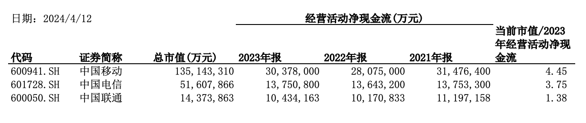

相对估值在实践中较为简单易行。其中，分子端常采用的指标是股价（P）或企业价值（EV）。而分母则可选用收入、利润、现金流、账面净值，以及EBITDA等指标。以下介绍几个常见的指标及应注意的事项。

## 市盈率（P/E）

如之前文章所分析，市盈率和公司预期增长率的关系经常被简单滥用为线性关系的假设。例如很多人用的PEG的指标，衡量的是市盈率与公司预期增长率之比。通过之前文章的案例可见，市盈率与公司的增长率并不是这么简单的线性对应关系。公司的资本回报率（ROIC）也是影响市盈率高低的关键因素。由于市盈率反映的是公司权益部分的价值，也可以说，公司的净资产收益率（ROE）也会影响市盈率高低。

### 资本回报率

以三大电信运营商为例，中国移动过去三年的净利润复合增长率明显低于中国电信和中国联通，但从市盈率来看，三家公司却相差无几。一个合理的解释是中国移动的净资产收益率（ROE）更高，因此其再投资效率更高。

成长性好且投资回报率高，这种类型的生意当然是最理想的投资标的。但是，考虑投资风险，成熟期的公司也是不错的选择，尤其是那些具有可验证的历史业绩的公司。即使这些公司没有很强的成长性，但如果它们维持竞争优势所需的再投资比较少，也就是资本回报率高，同样是不错的投资。这正是巴菲特所青睐的投资，这样的公司拥有护城河，每年的资本投入较少，比如喜诗糖果。

### 增长的陷阱

另一个需要注意的问题是，并非所有的收入增长都能够创造价值，也不一定能够带来高市盈率。尽管之前的文章提到，收入增长通常会转化为利润增长，但也可能出现增收不增利的情况，这往往是由于再投资效率较低所致。

只有当用于推动增长的再投资创造出超过投入资本的长期市场价值时，增长才能够实现价值创造。量化来看，为了实现收入增长所进行的再投资回报率（ROIC）只有超过其资本成本（WACC），再投资才能创造价值。对于需要额外资金投入且回报率低于资本成本的业务而言，增长将对投资者造成损害。

许多上市公司不舍得分红，却将留存收益投资于低于当前公司资本回报率甚至资本成本的生意，这种行为是一种伤害股东利益的行为。

刚刚发布的推动资本市场发展的新国九条，对上市公司分红提出了明确要求。分红不符合规定的，将面临ST的风险。可以说，这对保护投资者是个重大利好。

## 市净率（P/B）

低市净率并不一定意味着真正的低估，这时需要仔细审视公司的资产构成，尤其要注意是否存在大额的商誉。

### 商誉

先前的文章已经讨论了巴菲特对并购产生的商誉的看法。从A股市场来看，上市公司并购后业绩下滑、净资产收益率下降的案例并不少见，而商誉减值更是常见现象。

如果某上市公司的市净率很低，同时存在大额商誉，那么可能意味着市场并不认为商誉具有价值。

### 资产负债率

另一个需要审视的因素是公司的资产负债率。财务杠杆像一把放大镜，能够放大公司盈利时的收益，但在公司亏损时也会放大亏损。由于债务具有刚性特点，当公司负债率很高时，涉及小部分资产的错误，也可能摧毁大部分净资产。举例来说，对于负债率通常高达90%的银行而言，资产端10%的跌价就可能导致净资产归零。

如果公司的资产具有很强的金融资产属性和周期性，那么受到经济衰退的冲击会更加严重。银行和房地产行业都属于高杠杆行业，其资产端容易受到经济周期的影响。这也是当前银行和房地产行业市净率普遍低于1x甚至腰斩的原因之一。

## 市现率（P/CF）

市现率的问题在于分子和分母的口径不匹配。分子P代表公司股权的价值，而分母CF则代表公司层面的经营现金净流入，即之前文章所提及的包括权益和负债在内的总投入资本（IC）所对应的现金流创造。

再以电信运营商为例。从过去三年的经营活动净现金流来看，各家运营商均保持了基本稳定。将当前市值与最新年度的经营活动净现金流相比，即P/CF，可以发现中国联通的P/CF明显低于其他两家。这是否意味着中国联通的股价被低估呢？

从上述市盈率可见，三家运营商的市盈率是基本相近的。事实上，中国联通的P/CF明显偏低主要是因为其少数股东权益占比较高，少数股东权益所对应的现金流也是公司层面现金流的一部分，但股价并未反映出少数股东权益的价值。

## EV/EBITDA

EV指的是企业价值，即包括权益和负债的价值，这与我们之前计算公司自由现金流（FCFF）的口径是一致的。息税折旧摊销前利润（EBITDA）作为一个指标，其名称本身就暗示了它的作用：消除了不同公司财务结构和会计折旧政策的影响，使得不同公司之间的盈利比较更为公平和准确。这一特性使得EBITDA在比较行业不同公司估值方面扮演着重要的角色。

举例来说，像数据中心这样的资本密集型行业，通常需要大量的资本投入，而财务杠杆往往较高。如果行业内不同公司的负债率存在较大差异，或者折旧政策不同，使用市盈率进行估值可能会导致不同公司之间的估值比较失真。相比之下，EV/EBITDA能够更全面地考虑到这些利息和资本支出对企业利润的影响，为投资者提供更准确地评估企业盈利能力和投资价值的指标。

## 绝对估值 vs 相对估值

使用绝对估值时，即自由现金流折现模型（DCF），我们的假设是，市场会犯错，并随时间推移纠正这些错误，最终公司的市场价值将接近按照DCF计算的内在价值。而在相对估值中，我们的假设是，即使市场在个别股票上犯了错，但行业内的平均估值总是正确的。因此，将个别公司估值与行业均值做比较是有意义的。

对于价值投资者而言，安全边际的概念就是要买的足够便宜。这个安全边际的唯一衡量标准是，使用DCF计算的公司内在价值要低于公司的市场价值。正如巴菲特所说，

> “无论业务是否增长，收入是否波动，以及价格与当前收入和账面净资产相比是高还是低（注：即相对估值），DCF计算所显示的最便宜的投资都是投资者应该购买的投资。”
>