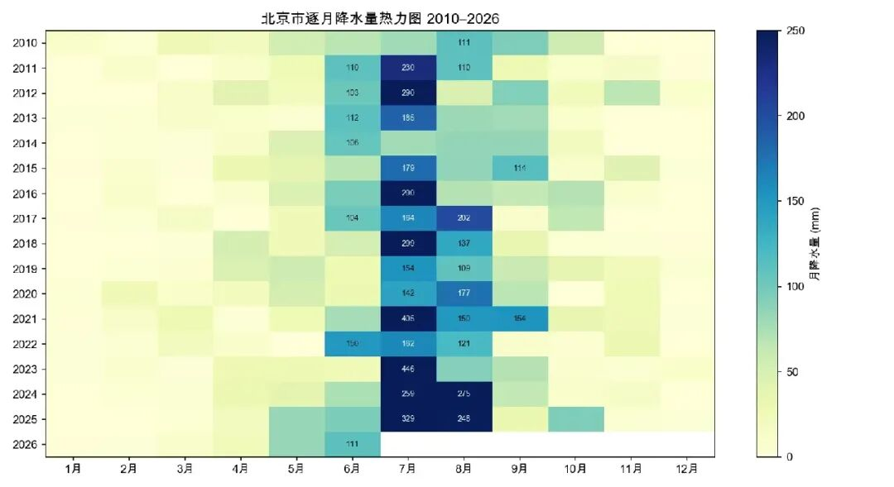

最近几年的北京，明显感觉雨水更多了，酷热天气似乎少了一些，甚至有人说北京越来越像南方——**更湿润，更凉爽，更宜居了**。

记得差不多二十年前我刚来北京的时候，新闻里还不时提醒大家：北京是一座严重缺水的城市，地下水位更是一度连年下降。南水北调工程，就是在那样的背景下修到北京的。而最近这几年，缺水的话题很少再有人提起。体感靠得住吗？让我们用数据说话：**北京到底是不是真的变湿润了？**

北京市水务局的官网上有一张每天更新的"雨情表"，记录着全市121个水文监测雨量站每天的降雨量。这份数据可以逐日回溯到2009年。我把2010年至今约**6000天、46万条站点记录**全部抓了下来，整理成完整的时间序列。结论比我预想的更明确。

## 不是错觉：近五年降水比多年平均多了三成

中学地理课本上有一条著名的**400毫米等降水量线**——大致沿大兴安岭、张家口、兰州、拉萨一线延伸。它是半湿润区与半干旱区的分界，也是历史上农耕与游牧的分界，长城的走向和它大体重合。这条线正好从北京西北方向的张家口一带穿过——换句话说，**北京虽然在"湿润"的一侧，但离那条干旱的边界，只有一百多公里**。北京多年平均585毫米的降水量，正是这种"半湿润边缘"位置的写照。

在这个背景下再看北京过去16年降雨量数据：

2010到2020年这十一年，只有2012年——就是发生"7·21"特大暴雨那一年——明显超过585毫米这条线。其余年份大多在500毫米上下，2014年甚至只有439毫米。

转折发生在2021年。这一年北京下了**924毫米**。此后：2023年727毫米，2024年782毫米，2025年917毫米——**近五年有四年超过700毫米，而此前十一年只有一年**。2021–2025年五年均值766毫米，比多年平均整整高出31%。

今年延续了这个态势：截至7月22日，全市累计降水375.7毫米，比去年同期高出20%，比多年平均同期更是多\*\*39%\*\*。这已经是连续第六个丰水年。

## 降雨量的时间分布：多出来的雨，全下在了盛夏

把逐月数据画成热力图，规律一目了然：

颜色越深，当月雨越多。可以看到两点：

一是**深色格子几乎全部集中在7、8月这两列**——北京降水的增加，不是全年雨水均匀变多，而是盛夏的雨变得更猛了。2010到2020年，北京没有任何一个月降水超过300毫米；2021年之后，7月405毫米（2021）、446毫米（2023）、329毫米（2025）接连出现。

二是**2021年之后的7、8月颜色明显变深**——这不是某一年的偶然，而是连续五年的持续状态。

北京的汛期是6月到9月，但拆开看，6月这些年只多下了5%，9月几乎没变——**多出来的雨，精确地集中在7、8两个月**（比转折前分别多了68%和61%）。

盛夏的雨不光更多，也更猛了。2010–2020年，全市平均每年记录到159场暴雨（一个观测点一天下够50毫米算一场），2021–2025年平均312场——**几乎翻了一倍**。单站纪录也被大幅改写：2012年"7·21"那天，房山漫水河下了408毫米，在当时已是骇人的数字；2023年"23·7"暴雨中，门头沟清水站一天下了**575毫米**——相当于把北京一整年的雨，下在了一天里。

那汛期（6–9月）之外呢？**变化不大**：其余八个月加起来，2010–2020年平均降水122毫米，2021–2025年平均119毫米。北京多出来的雨，几乎全部下在了夏天——春天依然干燥，冬天依然少雪。变湿的不是全年，是夏天。

## 降雨量的区域分布：全域增加，山区最猛

把转折前后两个时期（2010–2020 vs 2021–2025）各区的全年降水放到地图上对比：

先说大多数人生活的城区和近郊：年均降水从512毫米涨到749毫米，\*\*多了46%\*\*。这个幅度不小，但在全市只算中游。增幅更大的是西部山区和南部平原——门头沟+62%、房山+59%、昌平+53%（大兴+92%居首，但该区站点少、基数低，百分比有放大成分）；增幅较小的是东北部——顺义+27%、密云+32%、平谷+35%。不过就连垫底的顺义，也多了四分之一。

这个空间格局值得留意——增幅居前的门头沟、房山、昌平，和近年山区洪灾的位置高度重合：2023年的门头沟、房山，2025年的密云、怀柔。雨越来越多地下在山前迎风坡上，而这正是短时间内最容易汇集成山洪的地方。

## 我们正在亲历的转变

回到开头的问题：北京变湿润，不是错觉。**过去十六年，降水以每年约17毫米的速度增加，2021年之后明显加速**——按最近五年的水平，北京事实上已经是一座年降水700毫米以上的城市，超过了石家庄（常年约570毫米）、济南、郑州这些华北邻居的常年水平。不过要说明：这一轮变湿是整个华北的现象，这些城市近年的雨水也在增加——北京不是孤例，而是身处一场更大的区域性转变之中。

生活里的感受，数据基本都能对上：永定河的水量更大了，夏天雨后的凉意确实来得更勤——体感没有骗人。

这场转变会持续多久还很难说。华北的降水历来有周期，上世纪五六十年代就是一段公认的丰水期：1954、1956、1963年，海河流域接连发生特大洪水——2023年"23·7"暴雨的官方定性，就是"海河流域1963年以来最强降雨"；1959年北京更是下了1406毫米，至今仍是有气象记录以来的最高值（观象台单站口径，与本文的全市平均略有差异）。那之后，北京的降水进入了长达数十年的下行通道，平均每十年减少约31毫米，到1999–2007年跌入谷底：连续九年干旱，年均降水只有462毫米。从1406到462，再到这几年的重新走高——拉长了看，眼下的变湿更像一个大周期的又一次摆动，只是这一次，可能还叠加了全球变暖的推力：大气温度每升高1°C，能装下的水汽就多约7%，装得多，下起来也就更猛。

近年来还有一个受到关注的趋势：**中国的降水线正在北移**。从公开资料看，这有两类相互独立的证据。一类来自学术研究对400毫米等降水量线的测算：近几十年这条线确实在向北、向西推进，平均每年约0.5到1.5公里，个别地段更快——宁夏固原一带已经北移了约22公里。另一类来自国家气候中心的业务监测：2010年以来中国主雨带明显北扩，年降水400到800毫米的区域面积在扩大。两类证据指向同一个方向。北京的变湿，正处在这个大背景之中。

---

*数据说明：本文数据来自北京市水务局网站公开的雨情表（市级水文监测雨量数据），逐日抓取2009-06-01至2026-07-22共6161天、约46万条站点记录。全市平均降水量等统计口径以市气象局公布为准，本文数值为水文站网监测值，与气象局国家站序列略有差异。2024年起站网调整为全年121站，此前非汛期站数较少；分区对比采用"逐日分区平均再逐年求和"的方法消除站数变化影响，为全年口径。*
