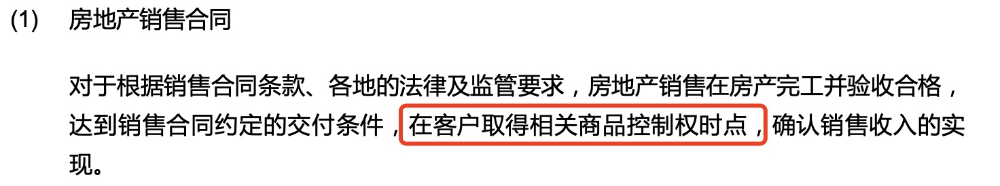
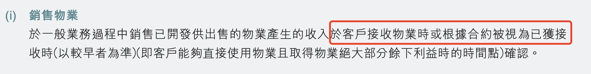

## 恒大财务造假的方式

证监会前天发布了对恒大地产涉及公司债违法事项的行政处罚。之所以从公司债入手，是因为恒大并没有在国内上市，但是在交易所发行了大量公司债。

违法事项中最重要的一条是财务造假，2019年和2020年年度报告存在虚假记载。原话是这么说的：

> 恒大地产通过**提前确认收入方式**实施财务造假, 2019年虚增收入2,139.89亿元, 占当期营业收入的50.14%, 对应虚增成本1,732.67亿元, 虚增利润407.22亿元, 占当期利润总额的63.31%; 2020年虚增收入3,501.57亿元, 占当期营业收入的78.54%, 对应虚增成本2,988.68亿元, 虚增利润512.89亿元, 占当期利润总额的86.88%。
> 

注意看，恒大财务造假的方式是“提前确认收入”，这跟常见的虚构交易和流水情况不一样。虚构交易往往资料做全套，银行流水都是假的，隐蔽性更强，审计师更难发现。恒大这个造假似乎只是收入确认早与晚的问题，没有触碰到现金流。

恒大2019年和2020年的财务报告是由普华永道审计的。作为知名的会计师事务所，普华永道在收入确认上出现问题的可能性似乎很低，因为收入确认时点有行业惯例，行业内都会相互比较。普华永道服务的地产客户不在少数，经验丰富。这让我很困惑，于是我查阅了恒大公司债年度报告和普华永道的审计报告。

## 会计政策有问题吗

### 恒大的收入确认时点

查阅普华永道为公司债发行主体恒大地产出具的2021审计报告，关于收入确认的会计政策，是这么说的：

这个收入确认时点核心一条就是“交付”。怎么算是“交付”呢？公司债报告没说。我又查阅了恒大在香港的上市公司中国恒大（03333.hk）的2020年报。

中国恒大是恒大地产的海外控股和上市平台，财务报表合并范围比恒大地产大一些，收入确认方法与恒大地产应该是一致的。

中国恒大的年报对收入确认时点的描述相对更具体一些：

根据这份年报，收入确认是在当客户实际占有（obtains the physical possession）已完工房产或者拿到房产证时。

从会计政策来看，有没有提前确认收入的问题？作为对照，我们先来看下地产行业模范生万科的公司债2020年度报告。万科的审计师是毕马威。

### 万科的收入确认时点

查阅2020年万科的公司债年报，收入确认政策如下：

这一政策一直延续到现在，万科2023年的公司债年报仍然是同样的描述。同样查看万科的香港上市主体年报，收入确认政策如下：

总结来看，万科的收入确认时点标准是“交付”或者“视同客户接收”。万科境内发债主体报告里所说的“在客户取得相关商品控制权时点”，可以理解为是“视同客户接收”，至于怎么个判断标准，没有细说，留有余地。

比较两家公司的会计政策，本质上没什么区别。恒大所说的当客户实际占有（obtains the physical possession）已完工房产或者拿到房产证，其实也可以理解为是“视同客户接收”，而且这个标准比万科的描述更具体。

### 普华似乎给自己挖了个坑

如果只看普华永道为恒大公司债出具的2020年审计报告，收入确认时点标准只讲了“交付”，没有提到“视同客户接收”，似乎范围更窄。但是对照恒大香港年报来看，收入确认标准包括了“视同客户接收”，即“实际占用”。

那么，监管机构是不是因为普华永道没有严格按公司债报告里的“交付”来审计收入而追责呢？问题可能不是这么简单。通过对比万科的会计政策可以看到，“视同客户接收”这个原则没有问题，行业其他地产公司通常也是这么干的。总体来说，普华永道认定的恒大收入确认政策与行业做法并无大区别。

## 恒大是怎么提前确认收入的？

如果会计政策没有问题，恒大是怎么提前确认收入的呢？先来看，这个问题是怎么发现的。

### 恒大自爆家丑

普华永道为恒大出具的最后一份审计报告是2020年。之后几年，恒大年报难产，无法按时披露，普华永道于2023年1月正式辞任，随后在2023年8月，恒大发布了公司债2021年度报告，新聘的审计师利安达会计师事务所为恒大出具了2021年审计报告。

在这份公司债年报中，恒大地产以会计政策变更的名义调整了收入确认时点。显然，这是跟新任审计师沟通妥协的结果。调整的理由是这么说的：

> 在2021年以前，本公司认为客户接受物业或根据销售合同被视为物业已获得客户接受（以较早者为准）时确认收入。但自2021年以来，由于本公司逐渐陷入流动资金困难，本公司认为将**获得项目竣工备案证或交付业主使用作为收入确认的额外条件**更能反映本公司的状况，且更具实际可操作性。
> 

我们在文章开头提到的恒大公司债2020年度报告中的收入确认时点就是“交付”，而且前提是”房地产存货完工并验收合格“，现在增加了项目竣工备案或者交付作为收入确认的额外条件，似乎有点画蛇添足的感觉，但言外之意可能是之前年度的收入没有按会计政策所说的“交付”来确认，甚至项目没有完工就按照”视同接受“确认收入了。恒大的表述是，以前是按“客户接受物业”或“视同物业已获得客户接受”孰早。

恒大地产在这份年报里披露了收入确认标准调整对之前年度的影响，2021年初应计入合同负债而不是确认为收入的余额为人民币（不含增值税）为5,780.65亿元，这个金额跟证监会认定的恒大地产2019和2020年收入造假金额合计基本一致。

重新调整收入的结果是恒大2021年财务报表合同负债（即收取的预售款）激增，从2020年的1450亿增加至2021年的约8000亿，资产负债表相应出现净负债和净流动负债。

### “视同接收“的尺度

前面对比万科的年报，我们提到，“视同客户接收”符合行业惯例。但”视同客户接收“的标准是什么，很少明说。比如万科的会计政策并没有把项目竣工备案作为确认条件写出来。

综合上述信息判断，最大的问题可能在于恒大地产对“视同接收”的执行标准，虽然“实际占有已完工项目”是普华永道认定的“视同接收”标准，但是项目可能在还没有完工就被“视同接收”了，否则恒大地产不会突兀地把项目竣工备案证作为收入补充确认条件。

至于普华永道是放宽了“视同接收”的审计标准，还是审计程序没做到位，就无法得知了。但是考虑到普华永道作为行业老大的地位，配合恒大造假的可能性不大，更可能是审计质量的问题。

前段时间，普华永道内部吹哨人发表的公开信说到：”因为恒大的财务造假太严重了，对“房子”和“现金/银行存款”这两个会计科目的审计工作都没有做到位，在法律上，普华永道是否应该被视为参与造假？“。这里的房子，应该就是房地产存货，涉及的就是收入确认时点的问题。但是公开信提到的”现金/银行存款“问题，证监会的违法事项里并没有提到。

## 普华永道的其他审计问题：持续经营假设

早在2021年10月，普华永道就因为恒大审计问题被香港会计及财务汇报局调查。香港监管机构2021年开展的调查不涉及收入确认的问题，主要关注的是普华永道2020年审计报告中对恒大持续经营假设的披露是否充分。目前这个调查还没有公开结论。

### 持续经营假设

持续经营假设，简单来说，就是评估企业在未来12个月内是否能够继续正常经营。触发持续经营疑虑的常见因素是企业的流动性问题，例如流动资产小于流动负债。

即便审计师对客户的持续经营有疑虑，通常也不会影响出具无保留审计意见，除非问题非常严重。如果对持续经营有疑虑，一般情况下，审计师会在财务报表附注中详细说明按持续经营假设编制财务报表的理由。如果问题严重到难以消除持续经营的不确定性，审计师会出具带强调事项段的无保留意见审计报告。相较于标准无保留意见，带强调事项段的报告更容易引起投资人的关注，警示潜在风险。

### **普华永道的审计意见**

普华永道为恒大公司债出具的2020年审计报告是干净的标准无保留审计意见，而且报表附注也没有提及持续经营的任何疑虑或者不确定性。

如果单纯比较流动资产和流动负债，恒大2020年的确是净流动资产，似乎没有流动性问题。然而，这个净流动资产状况与恒大的收入确认时点有直接关系。收入提前确认的结果是合同负债减少。对比2021年调整收入确认标准后来看，恒大2021年的财务报告出现大变脸，净流动负债高达6000多亿元。

站在事后来看，用2021年的财务状况评判2020年持续经营假设可能存在的不确定性显然不恰当。那么，站在2020年时点看，即便恒大2020年报是净流动资产，普华永道是否可以不对持续经营假设做任何补充披露？

### 2**020年恒大的流动性问题已经显现**

事实上，2020年下半年恒大已经出现了流动性问题，2021年上半年，恒大的流动性问题进一步暴露。

2020年9月，监管机构为房地产企业融资设置了著名的三道红线，即“房企剔除预收款后的资产负债率不得大于70%；房企的净负债率不得大于100%；房企的现金短债比小于1”，以限制房地产企业的融资活动。当时沪深港上市的133家房地产企业中有七成违反该规定，其中包括恒大在内有19家企业同时踩中三条红线，受到最严格的融资限制，不得新增有息贷款。

2020年11月，恒大商票首次出现逾期，2021年初恒大商票相关传言不断，据恒大供应商描述，恒大自4月开始出现拖延支付的情况。

在这种情况下，普华永道于2021年3月31日出具的审计报告完全没有提及对恒大的持续经营疑虑，就有点难以理解了。

综上所述，普华永道在恒大审计中的问题可能不仅仅限于收入确认，还包括对恒大持续经营假设的评估和披露。这些问题的暴露，难免让外界对普华永道的审计质量和独立性存疑，具体原因要等监管机构的调查结论。

在当前资本市场监管要”长牙带刺“的情况下，审计师面临的职业风险越来越大了。恒大事件是个很好的警示，提醒其他审计机构在执行审计工作时应更加审慎。