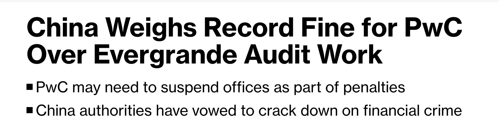
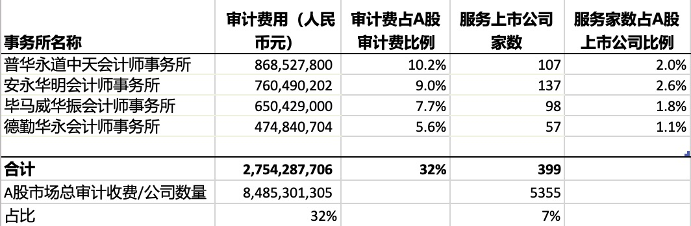
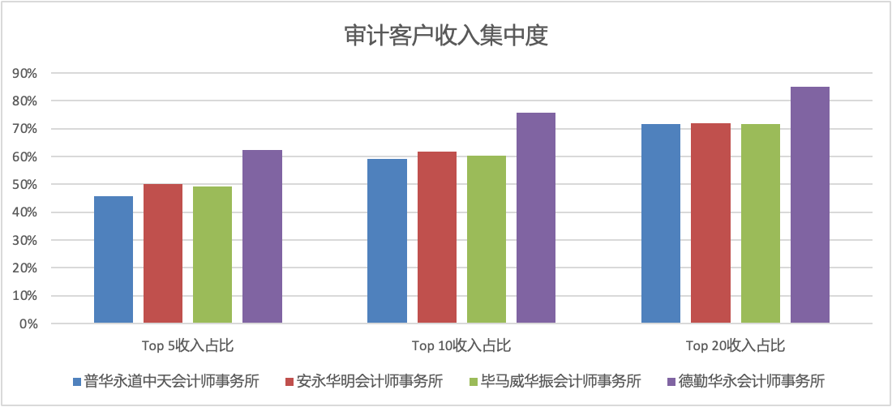
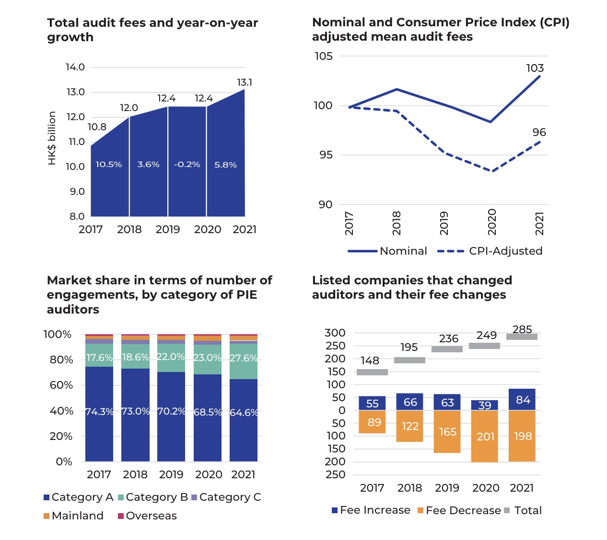

彭博社传出消息，财政部可能会在本周宣布对普华永道因其在恒大集团审计工作中的表现而处以罚款。据称，普华永道面临至少10亿元人民币的罚款。这将超过此前会计师事务所的最高罚款记录，即德勤在2023年被罚的2.12亿元人民币。处罚可能还包括暂停普华永道在中国大陆部分办公室的运营。

普华永道为恒大提供了15年专业服务，统计数据显示，累计收取的审计费约为2.76亿人民币（不包括恒大物业、恒大汽车的情况）。最近一年的服务是在2020年，审计收费4500万。

根据中国注册会计师协会发布的2022年会计师事务所综合评价百家排名，普华永道排名第一，2022年总收入79.2亿，分所数量23家。如果按10亿罚款算，这一处罚占普华永道年收入比例大概为13%。

暂停办公室运营可能会导致上市公司客户和IPO项目流失。从5月情况来看，已经有几家原属于普华永道的A股上市公司更换了会计师。

## 普华永道及其他四大A股审计客户收费情况

2023年，A股已披露财报的5300多家上市公司总的审计收费约为85亿人民币，其中国际四大会计师事务所以占比7%的审计客户数量，收取了A股市场32%的审计费。详见下表：

其中，普华永道的A股上市公司审计收费约为8.7亿，占A股审计收费的10%；客户数为107家，占A股公司数量约为2%。

如果跟普华永道2022年总收入比，其2023年来自A股的审计收费只占总收入的11%。因此，即便普华永道受处罚影响，有更多A股客户流失，对总收入的影响可能不大。但是，IPO项目的影响就难以估计了，而且IPO项目的收费往往更高。

## 普华永道及其他四大A股审计客户收费集中度

上图数据基于2023年。可见，四大会计师事务所前五大A股客户的收费占比都在40%以上，前十大客户收费占比在60%左右，前二十大客户收费占比70%以上。这其中，普华永道的客户收费集中度相对其他几家还算是偏低的。

集中度之所以这么高的原因，是因为收费排行靠前的客户往往都是中字头的巨无霸客户，单个客户收费基本都在1000万以上。

如果单看收费在1000万以上的A股审计客户，四大会计师事务所的审计客户数量占比约为85%，可以说，超大型的审计客户和收费基本都掌握在四大手上。

## 普华永道A股审计客户收费分布图

上图数据基于2023年。可见，普华永道收费在500万以下的客户，呈现明显的正态分布，平均收费约为250万人民币。收费在500万以上的客户，总体较为分散，但是长尾很长。审计收费最高的A股客户为中国银行，收费1.93亿。

## A股和港股审计市场规模及四大收入占比推算

早有研究表明，审计收费集中度是影响审计师独立性的一个重要因素。

四大在内地和香港虽然分属两个事务所，但本质上是一套人马，两个招牌。从审计客户来看，A+H两地上市的公司通常用的都是同一家审计师。

如果能把中国内地和香港市场的审计客户和收费合并来看，分析四大的审计客户收费集中度，将会是一个有趣的话题。可惜的是，难以找到香港市场各家会计师事务所的审计客户收费明细。

但是，港股上市公司的总审计收费是有数据的。根据香港会计及财务汇报局（AFRC）统计的2021年港股上市公司审计收费情况，总的审计收费约为130亿港币，其中A类（Category A）的事务所收入占比为64.6%，即约为84亿港币。

如果加上2023年A股的85亿，减去A+H上市公司可能重复计费的影响，中国内地和香港上市公司年审计收费合计在200亿人民币左右。

AFRC定义的A类事务所是指审计客户数量在100家以上的事务所。实际上，在香港上市的2600多家公司中，审计客户超过100家的事务所只有5家，四大全部在列，审计客户数量总计约为1100家左右，其中普华永道有360家左右。剩余一家是香港立信德豪，审计客户有160家左右。如果我们按照审计客户数量占比作为审计收费占比简单推算，四大在港股的审计收费约为70-80亿港币，其中普华永道的审计收费估计在30-40亿港币左右。

如果把内地和香港上市公司合起来看，上述大概200亿人民币规模的审计市场中，四大的审计收入大概在100亿人民币左右，其中普华永道的收入估计在30亿人民币以上。

需要说明的是，上述分析是基于已公开数据的简单推断，且数据年份不一，不代表准确的数据。至于单个客户收入占比多少算是显著，甚至影响独立性，仁者见仁，无法评论。仅提供上述大概审计市场规模和四大事务所收入情况分析，供大家参考。