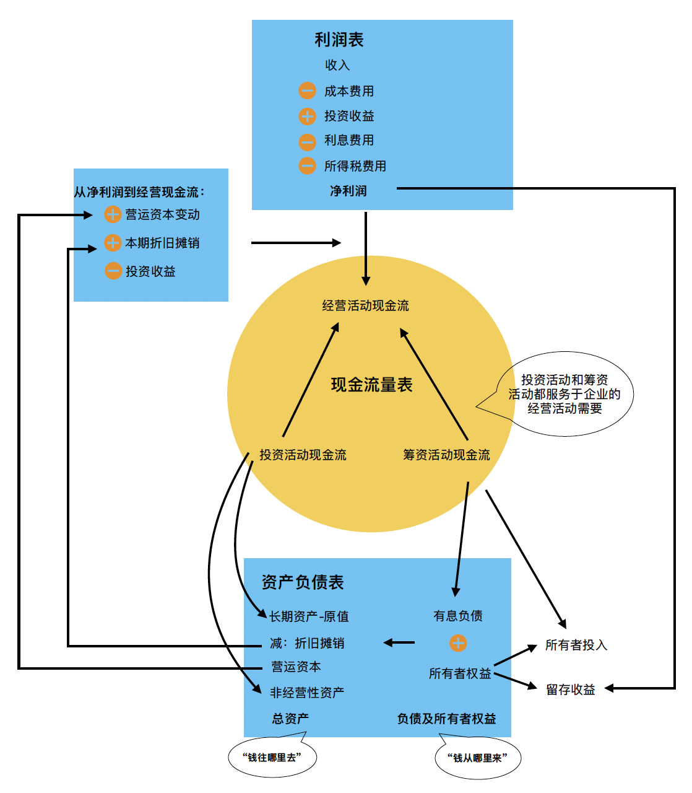
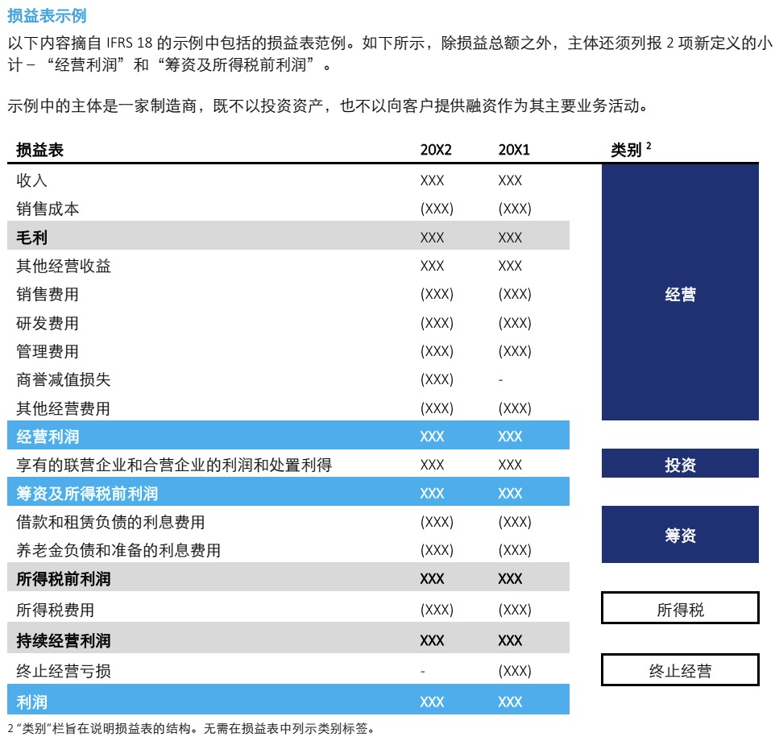

在价值投资与公司估值之间，还需要一座沟通的桥梁，那就是财务报表。

会计是商业社会的语言，而财务报表则是这一语言的具体呈现。在当前的数字化时代，数据在商业决策中变得越来越重要，每个人都应该懂点会计。

对于财务报表使用者来说，不一定需要学习借贷和会计分录，关键在于如何用报表。从理解会计如何反映企业的业务和经济活动入手，看懂财务报表的逻辑，并能够基于财务报表进行分析就可以了。

会计这门语言记录的是企业的经济活动，解决的核心问题有两个：确认和计量。如果再加一个，那就是报表披露。

确认是计量的前提。“确认”解决的是何时确认、如何确认的问题。“计量”解决的是如何计价的问题，有时候这很简单，有时候却很复杂，这取决于具体的经济事项。对于初学者来说，如果只是想看懂财报，可以从披露入手，先忽略会计如何确认和计量的问题。

关于披露，首先呈现给报表使用者的是三张报表。资产负债表反映的是企业在某一时点的财务状况；利润表和现金流量表反映的分别是企业在一个期间内的财务表现和现金流情况。会计政策和财务报表附注是对财务报表的进一步解释。

要看懂财务报表的逻辑，最好的起点是现金流量表。为此，我画了一张图：

## 现金流量表

现金流量表有三大经济活动：经营、投资和筹资。这三大活动高度概括了企业的经济活动，也是财务管理的三大主题。

如果把现金流量表看作一座大厦，经营是屋顶，投资和筹资则是大厦的两大支柱，都是为企业的经营服务的。

先说筹资活动。企业的经营首先要解决资金来源的问题，这可以是自有资金，也可以是负债。筹资活动对应的是资产负债表的右端，即负债和所有者权益。

投资活动反映的是企业经营所需的资本投入。先有鸡后有蛋，有投入才有产出。企业在有闲置资金时，还面临如何保值增值的问题，这就会产生投资收益，也是投资活动的一部分。

经营活动是企业的核心业务，体现了企业存在的使命和价值。这一使命和价值体现在通过提供产品或服务满足社会需求。围绕公司业务的主要管理职能都体现在经营活动现金流中：销售、采购、运营和人力资源管理。

## 利润表与现金流量表

利润表虽然科目看起来和现金流量表中的项目描述不太一样，但实际上反映的也是企业的三大经济活动。我们再来回顾下根据IFRS 18指引编制的利润表示例：

典型的利润表科目就像上图示例的一样，通常是按照成本费用的功能（by function）分类的，如成本、销售、研发和管理费用等。相比而言，现金流量表的项目分类更像是按性质（by nature）划分的，例如通常会列示人力成本。当然，利润表也可以按照费用性质来分类，企业可以自行选择。

从现金流量表到利润表，一个重要的差异在于会计的权责发生制。收入在公司对客户有索偿权（应收账款）时记账，而不是在收到现金时。费用在对供应商产生负债（应付账款）时记账，而不是在支付现金时。这两者将未来的现金收付事项提前到现在。甚至一些不涉及现金流支出的事项，权责发生制下会计也会确认，比如股份支付，权责发生制会记录员工费用，即使没有现金流出。

商业社会免不了赊销赊购，企业经营不仅需要长期资本投入，往往还需要垫付资金，比如应收账款、存货本质上是对企业资金的占用。与此同时，企业也会占用下游供应商的资金，比如应付账款。营运资本（流动资产减去流动负债）反映的就是对企业资金的净占用。因此，如之前文章所说，营运资本和长期资本投入都是企业再投资的一部分。

从上述角度分析，权责发生制显然更好地反映了商业企业的经济实质。相反，这也是为何非盈利性机构，如事业单位和公益组织，无需使用权责发生制。

权责发生制属于会计的“确认”原则。如果说权责发生制让会计有了一点前瞻性，那么在“计量”方面，公允价值的引入，则让会计从历史的故纸堆里走了出来，从幕后走向了台前。

企业的投资活动现金流中，除了经营所需的长期资本开支，往往会有长期股权投资和金融资产的买卖。这两类资产绝大多数情况都是公允价值计量的。针对未实现的盈亏，企业可以选择记录在利润表，或直接计入所有者权益。如果记录在利润表，就属于非现金损益，这是利润表和现金流量表的另一大差异来源。

财务报表会披露从利润表净利润到经营活动现金流的调节过程，其中主要有三大调节项：营运资本变动、本期非付现支出（折旧摊销），以及非经营性损益（比如投资收益）。由于调节的目标是企业的经营活动现金流，包括未实现的部分的投资收益，通常是作为非经营性项目调节的，算是殊途同归吧。

## 资产负债表与现金流量表

资产是企业所拥有的，负债是企业欠付的，剩余部分就是所有者权益，反映的是企业的家底。

很多企业列示资产负债表的习惯是左边是资产，右边是负债和所有者权益，这样正好左右两边相等。直观看，右边反映的是企业的融资结构，即“钱从哪里来”；左边反映的是企业的资产类型，即“钱往哪里去”。

如果将无息负债挪到资产负债表的左边，与流动资产相抵，就是企业的营运资本。这样调整后的资产负债表就像我最开始的画图一样，更方便进行估值计算，也更方便与现金流量表比对。

可以看到，筹资活动的现金流体现在资产负债表右边有息负债和所有者投入的变动，投资活动的现金流体现在资产负债表左侧的长期资产和非经营性资产的变动。资产负债表左侧的营运资本变动和折旧变动，则反应在了利润表，这也是利润表与现金流量表的主要差异事项。

## 哪个报表对决策更重要

与资产负债表不同，利润表和现金流量表反映的是期间表现，都源于会计分期。想象一下，如果没有会计分期，利润表和现金流量表还重要么？可能资产负债表就够了。

大多数人看财务报表时，首先关心的是企业的期间表现，赚不赚钱，有多赚钱。因此，利润表的关注度通常最高。然而，利润表往往不可靠。前面提到，金融资产按照公允价值计量的未实现盈亏可以选择计入利润表，但这些损益可能转瞬即逝。另一个问题是一次性的损益项目，如资产减值、存货跌价和重组费用，这些项目的操作空间很大，企业可以通过这种方式将收入转移到未来。过度减值会导致未来较低的折旧（从而提高利润率），而过度的存货跌价则会导致未来较低的销售成本（从而提高毛利率）。新上任的管理层通常有动机采取这样的做法，俗称“洗个大澡”（take a big bath）。

哪个报表更重要，取决于报表使用者。如果通过报表分析企业的商业模式和未来前景，利润表可能更重要。如果要计算企业估值，之前介绍过，实务中有从利润表出发和现金流量表两种思路，但不管哪种方法，估值都离不开资产负债表。如果担心财务报表有水分，现金流量表显然比利润表更可靠。