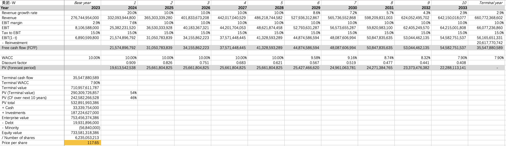
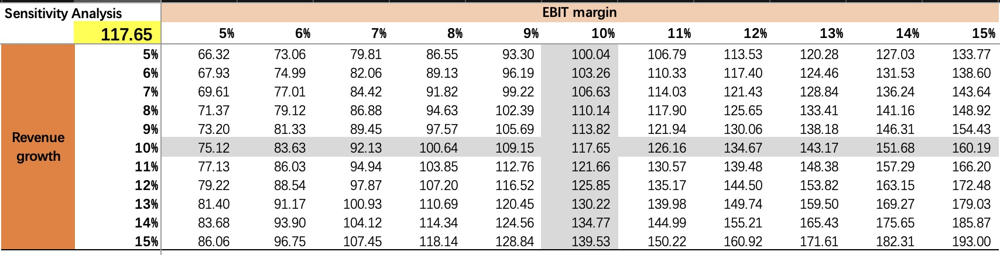

自去年12月以来，美团股价经历了过山车般的起伏，呈现出V字形走势。

2023年三季报发布后，美团股价持续跌了两个月，几近腰斩。春节过后，美团股价开始持续反弹，涨幅接近100%。目前，美团的股价已基本回到去年第三季度财报发布前的水平。

今天港股收盘后，美团发布了2024年一季报。看到这个一季报数字，我就觉得美团稳了，股价还有进一步上涨空间。为什么这么说呢？

## 美团的经营利润率

去年12月美团股价大跌后，我曾写了一篇文章《如何看待美团与抖音的竞争》，指出股价下跌的主要原因是经营利润率的下滑，导致市场对美团与抖音竞争加剧的担忧。而刚刚发布的一季报数据显示，美团经营利润率有明显改善，这一定程度上说明，美团的护城河依旧宽广，抖音的威胁并没有市场之前担心的那么严重。

### 一季报经营利润率环比分析

先来看看，与去年四季度相比，美团一季度的经营利润率表现：

可以看到，不管是核心本地商业还是新业务，经营利润率与去年四季度相比都有明显改善，总体经营利润达到了7.1%。

关于核心本地商业的经营改善，美团在一季报里解释称，主要是由于“交易用户激励以及推广及广告开支减少所致”。可见，美团应对的抖音更显从容和镇定了。这个17.8%的经营利润率，即便与去年三季报的17.5%相比，也是有所提高的。

关于新业务，虽然市场早有预期经营利润率会持续改善，但估计没想到亏损收窄如此之快。美团一向以经营效率著称，内部员工甚至称之为“开水团”。新业务再次验证了美团卓越的管理能力。

### 一季报经营利润率同比分析

再来看看，与去年一季度相比，美团一季度的经营利润率表现：

核心本地商业的经营利润率不及去年同期，美团在一季报中解释原因主要是客单价下降及交易补贴增加（主要是由于抖音的竞争）。但我认为，与去年同期相比下降并不重要，因为市场早已反映了抖音的竞争影响和当前消费环境的变化。

由于新业务经营亏损的快速收窄，一季报总体经营利润率与去年同期相比还是有所改善的。

### 美团过去5年的收入增长率和经营利润率

可以看到，美团过去5年的经营利润率（EBIT_MARGIN）持续提升。2023年大概为3%，今年一季报达到了8%（这个数字与前面列示的定期报告数字有差异，主要是口径差异）。

从收入增长率（YOY_TR）来看，美团更是非常优秀。一季度的收入增长率24%，基本保持在去年的水平。考虑到去年疫情放开后的报复性消费影响及抖音的竞争，今年仍能保持这样的收入增速实属不易。这表明，本地生活市场仍然是一个增量市场，仍有很多增长机会和空间。

## 美团DCF估值分析

之前文章反复提到，收入增长和经营利润率是驱动估值的两个核心因素。

对于美团来说，相比收入增长，经营利润率是影响估值更为关键的因素。主要的原因有这么几个方面，首先是抖音的竞争导致市场担忧美团的经营利润率恶化；其次是新业务的亏损让很多人觉得短期盈利无望；再者，一些人觉得外卖仔没什么想象力，行业属性决定难以赚大钱。

美团2023年刚开始盈利，经营利润率较小，这意味着其变动对估值的敏感性更高。而且，与收入相比，经营利润率的改善更难以预测。

美团一季报的经营利润率是超预期的，这对DCF估值是个显著的提升。

### DCF预测指标假设

- **收入增长率**：假设2024年收入增速20%，低于当前一季度。2025至2028年收入增长10%。与市场一致预测约15%相比，这一假设偏保守；
- **经营利润率**：预计新业务亏损仍将持续收窄，并贡献总体的经营利润率改善。假设最终的经营利润率从当前8%提升至10%（估值计算的口径）。
- **再投资**：观察过去3年美团的再投资，基本等于甚至小于折旧。因此，假设未来几年扣除折旧的再投资为零。
- **非主营业务及收益**：与腾讯类似，美团也是一家投资公司。截至一季度，美团持有的投资类资产（下图INVESTMENTS）约1,870亿人民币，随时可动用的现金约333亿。与美团当前7,000亿港币市值相比，投资类资产和现金占比约为34%。
    
    上述收入增长和经营利润率假设没有考虑投资影响，以下计算的DCF估值，也没有考虑投资组合未来的收益，仅加回了投资类资产当前的账面净值。
    
- **其他假设**：WACC为10%，所得税税率15%。

### DCF估值结果

基于上述假设计算，美团每股内在价值约为为117元人民币。

由于财务数据是按人民币列示的，上述计算出的内在价值是人民币。如果折算成港币，以当前汇率计算，大概为128港币。

### 敏感性分析

上述计算的依据假设总体较为保守。尤其是收入增长，考虑到美团正在拓展新的市场，未来几年仍有很大的想象空间。

以下是基于收入增长和经营利润率两个变量的敏感性分析：

假设10%的目标经营利润率不变，2025至2028年收入增长提升到15%，每股内在价值约为139元人民币。

如果谨慎起见，维持未来几年10%的收入增长假设，将EBIT利润率提升至15%，每股内在价值约为160元人民币。

由此也可见，同样是10%到15%，经营利润率对估值提升的敏感度更高。