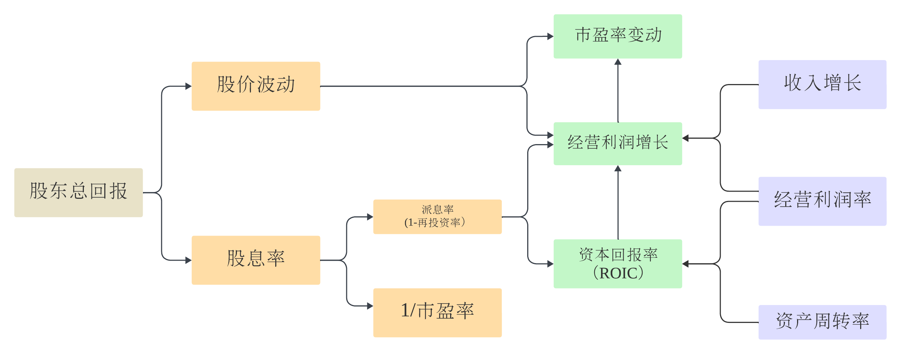

## 股票的投资回报与公司内在价值

股票的投资回报率简单地理解，就是持有期间的股价变化，再加上公司支付的任何股息。例如，如果一只股票过去一年里上涨了8%，并且公司支付的股息率为2%，那么股票的年度回报率就是10%。

股价每天都是波动，甚至巨幅波动。看起来，股价是非理性的，似乎与公司的基本面或者内在价值关系不大。但实际上，公司的内在价值是股价的地心引力，价格永远围绕价值在波动。

正如巴菲特在2005年的股东信里所说，

> “在大多数情况下，投资者从现在开始到世界末日期间所能获得的收益与他们所拥有的公司总体而言的收益相等。当然，通过聪明地买入和卖出，投资者A能够比投资者B获得更多的收益，但总体而言，A赚的正好相当于B赔的，总的收益还是那么多。当股市上涨时，所有的投资者都会感觉更有钱了，但一个股东要退出，前提必须是有新的股东加入接替他的位置。如果一个投资者高价卖出，另一个投资者必须高价买入。所有的股东作为一个整体而言，如果没有从天而降的金钱暴雨神话发生的话，根本不可能从公司那里得到比公司所创造的收益更多的财富。”
> 

公司的内在价值是未来现金流的折现现值。因此，股价是对未来的期望，反映的是公司未来而非当下的财务业绩。拿市盈率来说，分子价格反映了未来许多年的现金流期望，而分母收益却是过去或者现在的快照。当市盈率倍数走高时，可能意味着对公司未来的收益或者现金流预期上修了。

不同投资者对公司未来的期望看法不一，对内在价值的估计偏差可能也很大，但这不重要。重要的是要理解，股价的背后，也就是驱动股票投资回报和公司内在价值的核心财务指标有哪些？如果对股票投资回报从何而来没有清晰的认知，就很难知道哪些核心财务指标在影响股价。

## 股票投资回报的驱动因素

### 股价变动

股价变动影响投资回报似乎是正确的废话。但如果进一步去分解股价变动的原因，可以发现：
股价P=每股收益(EPS)x市盈率(P/E)。因此，股价的变动首先可以归因为两类，业绩（每股收益的预期变动）和估值（市盈率的预期变动）。

股价在一段时间内的波动是每股收益（EPS）与市盈率（P/E）多重变化的结合。当估值中枢上移，也就是市盈率扩张时，股价上涨往往超过 EPS 增长；当估值中枢下降，也就是市盈率收缩时，股价上涨往往不及 EPS 增长。

市场对公司未来业绩的预期在不断调整，市盈率的变动往往是对这种调整的反映。当然，很多时候，也有可能仅仅是人性的恐惧和贪婪在主导市场。所以，区分是公司预期的变化，还是仅仅是投资情绪的变化，对把握投资时机是很重要的。

### 股息率

股息率可以表达为：派息率 x（净利润/股价）=派息率 x 市盈率(P/E)倒数。可分派的股息是公司税后利润扣除维持或发展业务所需投资的剩余部分。

不考虑外部融资的情况下，公司利润的自然增长率是有天花板的，这个上限就是公司的资本回报率(ROIC)。公司往往需要留存一定的利润用于资本开支，也就是再投资率。因此，经营利润增长率=资本回报率（ROIC）再投资率=资本回报率（1-派息率）。

### 收入增长和经营利润率是核心驱动指标

进一步归因分析发现，经营利润的增长（或者说每股收益的提升）取决于收入增长和经营利润率的改善。而ROIC可以通过杜邦分析进一步分解为经营利润率和资产周转率。显然，收入增长和经营利润率是驱动股票投资回报的核心指标。由于股票的长期投资回报与公司内在价值一致，这也是驱动公司估值的核心因素。

请注意，核心指标高不代表股票的投资回报就高，关键要看核心驱动指标的未来变动与当下的市场预期比是好还是坏。

财务指标表现良好的公司，与投资者持有股票期间的回报是两回事。原因在于股票价格反映了市场对公司未来财务业绩的期望，股票的超额回报是对未来期望进一步上修的结果。如果一家高速增长的公司未能随着时间不断超越期望，股票将难以获取有吸引力的回报。所以，市场永远活在预期中。

## 如何分析公司的内在价值

股票的超额回报来自于对期望上修的结果。预期的变动或者修订涉及对公司的未来现金流预测和战略优势分析。

对公司进行长期现金流预测是估算内在价值的基础，而销售增长和经营利润率应作为现金流预测的核心变量。

由于现金流预测存在不确定性，分析公司的护城河是同等重要的。要在对标同行的基础上仔细评估公司的市场地位，并考虑市场增长和稳定性、竞争对手关系以及竞争优势等问题。通过战略优势分析，反过来验证公司现金流预测核心变量的合理性，尤其是要确保不盲目乐观，不盲目拔高预测。