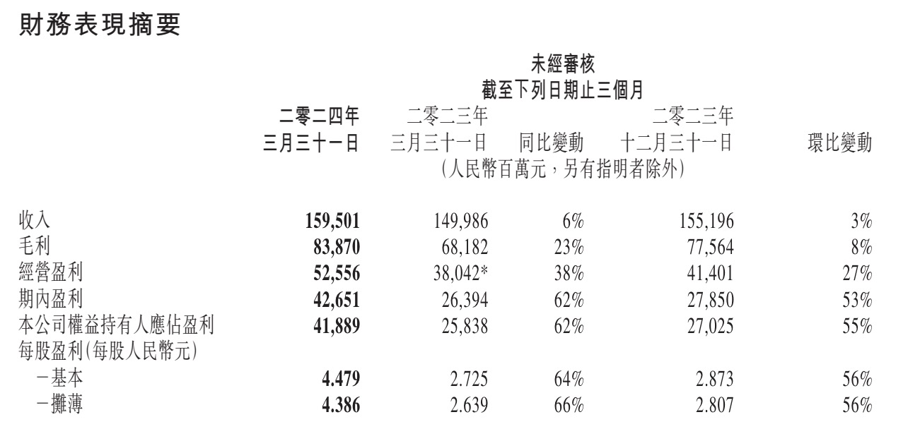
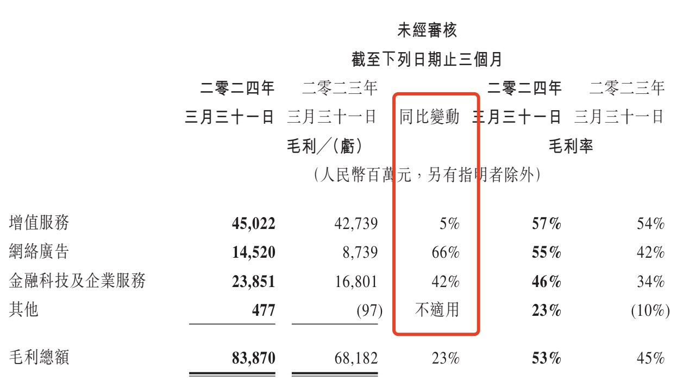
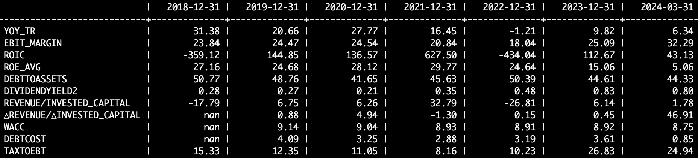
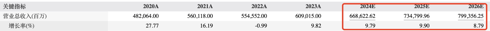
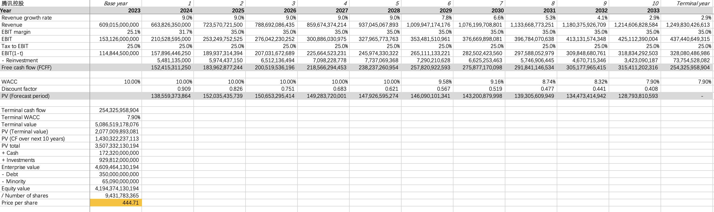

前天晚上，腾讯控股发布了2024年一季度财报，其中收入与去年同期相比增长6%，归母净利润同比大增62%，两项指标均超出了市场预期，业绩表现非常亮眼。

昨天是香港佛诞日，港股休市。美股那边，腾讯控股ADR在过去两天上涨了5%左右。

## 2024一季度收入及毛利情况

以下是分部收入情况。一季度收入增长主要是来自于微信视频号、公众号等内容平台的广告收入大幅增长贡献。游戏业务（增值服务）基本没有增长，金融科技业务的收入增幅有所放缓。

从下图可以看出，各业务线毛利同比去年均实现了显著增长，且增幅明显高于各业务线收入增幅。这表明腾讯的运营效率提升，这是归母净利润大幅增长并超预期的主要原因。

## **过去五年及2024年一季度业绩情况**

我们再来看一下过去五年及2024年一季度腾讯的收入增幅和EBIT利润率表现。

从收入增速（YOY_TR）来看，从2018至2021年，腾讯收入年度增速都在15%以上，2022年是历史期间最困难的一年，2023年再次恢复了显著增长。考虑到2023年是疫情恢复第一年，存在报复性消费的影响，2024年一季度6%的增速并不低。

从EBIT利润率（EBIT_MARGIN）来看，从2018至2020年，腾讯的EBIT利润率非常稳定，在24%-25%之间。经历2021和2022年两年连续下滑之后，腾讯的EBIT利润率于2023年重回25%，今年一季度更是跃迁至32%。

## DCF估值

之前说过，收入增长和经营利润率（EBIT利润率）是驱动公司内在价值增长的核心因素。收入增长通常更容易从外部市场数据观察，但经营利润率的改善反映的是运营效率的提升，外界难以观察。

腾讯股价最近涨了不少。一季度亮眼的业绩显示市场提前预期了其经营利润率的改善。即便如此，市场的预期可能仍较保守。

### 收入增长和经营利润率能持续改善吗？

当前，腾讯的短视频业务仍处于快速增长阶段，一季度短视频用户观看时长比去年同期增长了80%。虽然在一季报电话会议中，管理层认为接下来的季度广告收入增长可能会有所放缓，但从短视频的商业变现空间来看，预计广告收入仍将保持长期的高增长。

游戏方面，市场对即将推出的新游戏《地下城与勇士》寄予厚望。从腾讯过去几次业绩电话会对游戏业务的讨论来看，腾讯显然从过往经验教训中找到了更好的管理方法，因此一季度运营效率的提升有望继续延续。

以下是摘自一季度业绩电话会的部分内容：

> 我们一直在努力恢复一些关键游戏的活力，这个过程目前进行顺利。我们从这段经历中获得了一些经验教训，归类为“常青”之类的游戏似乎有能力自我恢复。一个很好的例子是《荒野乱斗》，不仅流水超过去年同期的四倍，而且每日活跃用户数量翻倍。
> 

> 第二个教训是，如果常青款游戏的游戏停滞不前，那么问题通常不在于游戏，而在于游戏的运营方面。我们需要对运营团队进行改变，当我们做出这些改变时，我们会很快看到积极的结果。大型竞技多人游戏本质上是常青的，就像足球、篮球等关键运动的本质上一样。有正确的人来管理游戏，就会得到正确的结果。
> 

金融科技方面，腾讯认为，政府正在实施多项刺激措施以重振经济和消费信心，随着政府刺激措施的实施，预计金融科技增长放缓的趋势将逆转。

综上，腾讯广告业务有望继续保持高增长，游戏业务将恢复正增长，金融科技业务收入增速将有所提升。随着收入增长，规模效应将推动各业务线经营利润率进一步提升。

### DCF预测指标假设

- **收入增长率**：参考万得的盈利预测，假设未来5年主营业务收入复合增长率为9%。这一增速与2023年增速基本一致，但高于当前一季度6%的增速。基于上述分析，考虑中国经济仍处于回升过程，腾讯业务有望继续恢复性增长，9%的增速基本合理。

- **经营利润率**：基于上述分析，假设经营利润率未来几年继续改善，从当前32%提升至35%。
- **永续期RONIC**：基于腾讯拥有的持续竞争优势，假设永续期新增投资的回报（RONIC）仍可以高于资本成本（WACC），超额收益率为5%。
- **再投资**：腾讯2018至2022年的资本开支（下图CAPEX）约为500-600亿，2023年为470亿，略有下降。今年一季度的资本开支为143亿。同时，腾讯2023年折旧摊销金额为600亿。可见，腾讯扣除折旧的新增再投资基本很少。这里使用1季度数据预测全年，减去2023年折旧摊销，假设扣除折旧的再投资为40亿左右。
- **非主营业务及收益**：除了上述游戏、广告和金融业务，腾讯还是一家投资公司。截至一季度，腾讯持有的投资类资产（下图INVESTMENTS）高达近万亿人民币，随时可动用的现金高达1610亿。
    
    很多人将腾讯视为中国的berkshire。2023年4季报开始，腾讯把投资收益列示在了经营利润以下，也就是不再作为主营业务收入，这反映出管理层对投资的态度。今年一季度业绩电话会，管理层表示投资组合规模已经足够大，不打算再投入额外的资金，而是在投资组合内部进行一些投资的循环利用。
    
    上述收入和经营利润率假设没有考虑投资组合，以下计算的DCF估值，也没有考虑投资组合未来的收益，仅在最后加回了投资类资产的账面价值。
    
- **其他假设**：WACC为10%，所得税率使用标准所得税率25%。

### DCF计算结果

按照上述假设，腾讯每股内在价值为440元左右。

注意，由于财务数据是按人民币列示的，上述计算出的内在价值也是人民币。如果折算成港币，价值会略高。由于汇率影响不大，这里不再进一步转换。此外，如预测指标假设部分所述，DCF估值没有考虑投资类资产未来的收益，总体来说是偏保守的。

以下是基于收入增长和经营利润率两个变量的敏感性分析：

假设35%的经营利润不变，未来5年收入增长6%，与当前一季度一致，每股内在价值约为396元。

假设9%的收入增长不变，EBIT利润率维持当前一季度32%的水平，每股内在价值约为412元。

保守估计，未来5年收入增长和经营利润率全部与一季度数据一致，也就是分别为6%和32%，每股内在价值约为368元。

综上所述，虽然腾讯股价最近上涨不少，当前价格仍不算贵，有进一步上涨空间。