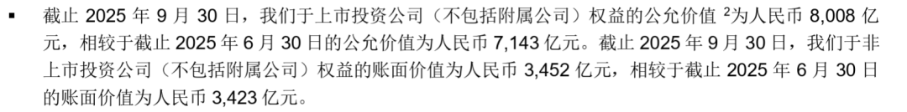

腾讯控股的股价在过去两周内下跌了10%以上，截至2月12日收盘价为535.5港币，创了近期新低。

至于下跌的原因，最开始市场传的消息是担心受三大运营商增值税率上调影响，腾讯这样的公司业务增值税税率可能也会上调，然后是元宝在微信里发红包、腾讯内部似乎左右互搏的争议，最近大家又开始在说腾讯在AI方面落后了。

这些消息要不是捕风捉影，要不是难以验证。当然，AI落后可能是显而易见的，腾讯元宝主要使用的是DeepSeek，没有像阿里千问那样排行靠前的自有模型，字节Seedance 2.0的视频生成能力更是让人惊叹。

是不是不自己造轮子，或者现在自有模型不够先进就会伤害它的业务呢？我看未必。苹果公司没有自己搞AI大模型，但不影响它的护城河。无论怎么看，腾讯都是AI的超级受益者——历史数据已经显示了AI对它广告业务效率的提升，游戏业务显然是下一个机会，而微信独特的公众号生态已经成为快速增长的搜索入口（包括AI搜索）。关于腾讯的独特护城河，之后再写文章专门聊。

总之，市场恐慌起来可以有各种难以证实也难以证伪的鬼消息，仁者见仁，这里就不详细展开了。我们还是回到估值这个事，基于腾讯过往的财务数据，算一下腾讯到底值多少钱。

## 市盈率的迷惑性

从相对估值指标来看，腾讯当前的动态市盈率约20倍。单看这个倍数，考虑到它当前不到10%的收入增长率，似乎也不算低估。

但是，市盈率这一指标用在腾讯身上相当有迷惑性。除了游戏、广告和金融服务这三大主营业务之外，截至2025年9月季报披露，腾讯持有约1.1万亿人民币的上市股权和非上市股权投资。这部分投资在利润表上只体现了少量的投资收益和公允价值变动，金额并不大。

当前腾讯的市值约为4.9万亿港币（折合约4.3万亿人民币）。如果扣除这1.1万亿的股权投资价值，腾讯主营业务对应的市值只有约3.2万亿人民币，市盈率需要打个七五折，大概是15倍左右。可以说，这个"真实的"市盈率倍数相当有吸引力了。

（注：这里还没有考虑净现金的价值——腾讯账上的现金减去有息负债后，大约还有1000亿人民币的净现金。）

## DCF估值

再来看DCF（现金流折现）估值。以下是过去几年腾讯的收入增长和经营利润率情况：

| 年度 | 收入（亿元） | 同比增速 | 经营利润（亿元） | 经营利润率 |
|------|-------------|---------|----------------|----------|
| FY2020 | 4,821 | — | 1,262 | 26.2% |
| FY2021 | 5,601 | +16.2% | 1,247 | 22.3% |
| FY2022 | 5,546 | -1.0% | 1,108 | 20.0% |
| FY2023 | 6,090 | +9.8% | 1,601 | 26.3% |
| FY2024 | 6,603 | +8.4% | 2,081 | 31.5% |
| TTM 2025 | 7,298 | +10.5% | 2,327 | 31.9% |

*数据来源：腾讯各年年报及季度业绩公告。TTM = 2025年Q1-Q3 + 2024年Q4。*

可以看到，腾讯在经历2022年收入增长停滞后，2023年开始重拾增长，过去几年的收入增幅都在8%-10%。与此同时，2022年开始经营利润率有明显的稳步提升，从2022年的20%提升到最新TTM约32%。这是过去两年股价上涨最主要的驱动因素。

利润率的改善并非单靠"降本增效"。2022年的确是起点——腾讯大刀阔斧砍掉非核心业务、精简人员，期间费用率明显下降。但更关键的是收入结构的变化：视频号广告、小程序、小游戏等高毛利业务占比持续提升，广告业务受益于AI大模型驱动的精准推荐，毛利率从2022年的42%提升到了50%以上。

基于以下假设做一个DCF基准估值：

- 未来5年收入复合增速维持在当前的 **8%** 左右；
- 得益于AI对经营效率的持续提升以及高毛利业务占比的扩大，假设未来目标经营利润率为 **36%**；
- 再投资方面，腾讯过去一直是轻资产模式（2020-2023年折旧摊销大于资本开支），但2024年因AI基础设施投资，资本开支同比暴增至768亿，加上营运资金变动，年度总再投资约255亿元。未来几年的再投资基于Revenue/Capital比率计算，反映AI投入对收入增长的贡献，假设未来5年每年约200亿上下；
- WACC约8.5%，终值增长率2.5%。

在这组假设下，腾讯的内在价值约为 **~700港币/股** ——这恰好是腾讯的股票代码数字（0700.HK）。

## 逆向思维：当前股价隐含了什么？

我们换一个角度来看。与其讨论腾讯应该值多少钱，不如反过来问：当前股价到底隐含了多高的收入增速和多高的经营利润率？

以下是股价相对于这两个变量的敏感性分析（单位：港币/股）：

| 收入增速 ＼ 经营利润率 | 28% | 30% | 32% | 34% | 36% | 38% |
|:---:|:---:|:---:|:---:|:---:|:---:|:---:|
| 0% | 382 | 412 | 443 | 473 | 503 | 534 |
| 2% | 426 | 457 | 487 | 518 | 549 | 580 |
| 4% | 473 | 504 | 535 | 567 | 598 | 629 |
| 6% | 523 | 555 | 587 | 618 | 650 | 681 |
| 8% | 577 | 609 | 641 | 673 | 705 | 737 |
| 10% | 634 | 666 | 699 | 731 | 763 | 796 |

可以看到：

- 如果维持当前约32%的经营利润率不变，当前535港币的股价对应的未来5年收入复合增长率仅为 **4%** 左右——大约只有腾讯当前实际增速的一半。
- 如果维持当前8%的收入增速不变，当前股价对应的未来经营利润率仅约 **26%**，这比腾讯当前32%的水平低了整整6个百分点，甚至低于过去5年的平均水平。

无论从哪个维度看，当前股价所隐含的悲观预期，都显著偏离了腾讯过去几年的实际经营表现。

## 小结

短期的股价波动往往由情绪驱动，但长期终究要回归基本面。市场给腾讯的定价，似乎已经包含了相当悲观的预期。至于这种悲观是否合理，就留给各位读者自己判断了。

*免责声明：本文仅为学习交流目的，不构成任何投资建议。DCF估值对假设高度敏感，不同假设下估值可能差异巨大。投资有风险，决策需谨慎。*
