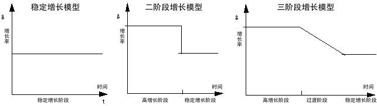
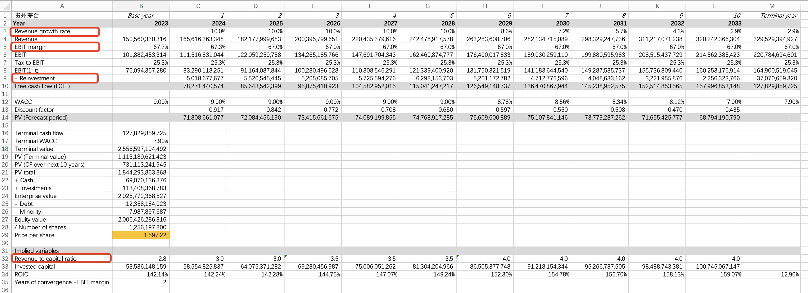
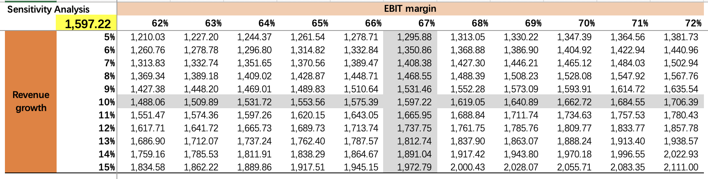

在之前的文章中，我们谈了大量关于公司竞争战略、价值创造以及如何进行估值的知识。对于那些对财务知识不太熟悉或不从事投资行业的人来说，这些内容可能有些晦涩，难以形成对估值计算的具体认知。

在这篇文章中，我们以贵州茅台为例，使用自由现金流折现法（DCF）进行估值测算。为什么选择茅台呢，一个是因为公司从事的主营业务比较单一，且容易理解；再一个，贵州茅台的过往历史财务业绩非常稳健，这意味着未来现金流预测更容易。

## 历史数据

我们先来看一下贵州茅台公司过去5年的关键财务指标，这些指标对后续的DCF估值计算至关重要：

先看下方的表格，贵州茅台在过去5年里收入增速（YOY_TR）都保持在双位数以上,5年均值为14%。经营利润率（EBIT margin）更是非常之稳健，常年保持在67%左右。之前说过，收入增长和经营利润率是驱动估值的核心因素。

从资本回报率来看，贵州茅台过去5年的ROIC呈连续下降，这可能主要是由于公司账面积累的现金资产越来越多，拉低了资本回报率。从上表可见，CASH从2019年末的132增加到了2023年末的690亿。贵州茅台的年度股息支付率约为52%，但2022和203年都通过特殊分红的形式增加了派息，这一方面是为了通过加大分红吸引投资者，稳定股价，另一方面可能也是为了提高资本回报率。

从ROE（净资产回报率）指标来看，贵州茅台的ROE非常稳定，平均为32%。相比于30%+的净资产回报率，贵州茅台10%+的收入增速不算突出。但其过去5年的市盈率均值约为40x，这在一定程度上再次印证了之前讨论的概念，资本回报率也是驱动市盈率的重要因素。

除了收入增长、经营利润率以及资本回报率，再投资率也是DCF计算中的关键因素。

相比其他几个指标，再投资率的历史数据通常波动更大，且难以预测未来。通常来说，公司的投入资本与营业收入的相关性更高，可以基于收入的增长，按照一定的固定比例安排再投资。如果公司未来新的再投资效率会更高，可以逐步降低比例。

通过回溯过去5年的历史数据，可以看出，贵州茅台的REVENUE/INVESTED_CAPITAL还算比较稳定，大概在3-4x之间，均值约为3.6x。

## DCF预测指标假设

有了上述几个关键指标之后，我们就可以合理预测贵州茅台未来的自由现金流及其折现价值。

### 基年选择

我们选用了最新的2023年报数据作为基准年份，即未来各年的预测数据都基于2023年财务数据的合理增长。

### 预测期长度

贵州茅台过去历史业绩好于行业平均，预计未来也仍将长期保持竞争优势。因此，我们采用三阶段增长模型，现金流详细预测期为5年，并将随后的5年作为过渡期，逐步过渡到永续期。

### 收入增长及经营利润率假设

基于过去5年的收入增速，考虑当下的经济环境，假设贵州茅台未来5年的复合增长率为10%，低于过去的增速均值，但高于宏观经济增长率5%。未来各年经营利润率（EBIT margin）67%，维持稳定。

### 再投资

以收入/投入资本的倍数作为计算再投资的基础，假设未来两年为3x，略高于2023年的2.8x。考虑到2023年再投资在历史年份里偏高，假设再投资率效率逐步提高，之后各年逐步提高至3.5x，并最终提高到4x，即历史数据早期的水平。

### 所得税税率

贵州茅台过去5年的有效税率（TAXTOEBT）非常稳定，约为25%左右。我们使用5年的有效税率均值作为计算所得税税率的基础。

### WACC

我们假设贵州茅台的加权平均资本成本（WACC）为9%。随着收入增速逐步回归到长期经济增长率，永续期的WACC略低，为7.9%。这里不详细讨论WACC的计算，因为每个人对风险和回报的看法和接受程度不同。总体来说，考虑到贵州茅台经营稳健，并且是价值投资者青睐的投资标的，9%的折现率是相对合理的。

## DCF计算结果

计算结果显示，按照上述假设，贵州茅台的当前合理股价约为1600元。考虑到估值受到上述假设的影响较大，我们以收入增速和经营利润率两个指标为核心变量，进一步进行敏感性分析。

假设继续保持67%的经营利润率，沿着67%利润率对应的纵轴看：

考虑到当前的经济环境，假设未来5年的收入增速与宏观经济增速一致或略高，例如5%，对应的每股内在价值约为1300元。考虑到茅台的稀缺性，如果未来5年的收入增速继续保持高于宏观经济增速的快速增长，维持历史均值14%的收入增速，每股内在价值可达到1900元左右。

假设未来5年收入复合增长率10%是合理的，沿着10%收入增速对应的横轴看：

考虑到最近茅台酒需求端承压，终端零售价格出现下跌迹象，假设经营利润率下降5个点至62%，对应的每股内在价值约为1500元。

收入增速下滑可能会导致企业难以维持当前的经营利润率。综合以上情景分析，极端假设，贵州茅台未来5年收入增速和经营利润率同步下降，查表可见，当收入增速为5%，经营利润率为62%的情况下，对应的每股内在价值约为1200元。

## 小结

估值是一门艺术，模糊的正确总比精确的错误要好。DCF估值不在于追求精确的计算，好处在于，一方面，通过深入分析驱动内在价值的核心财务指标，我们加深了对企业财务指标的理解，对企业的内在价值认知不再停留于感性，而是有了更加量化的准确把握。另一方面，通过敏感性分析，有助于我们找到估值的底，更好地理解当前市场价格背后大致反映了怎样的市场预期。如果相信市场价值最终会回归到公司的内在价值，那么，即便股票价格大幅波动，我们也可以通过极端保守的假设找到投资的安全垫，并在市场下跌中保持冷静。