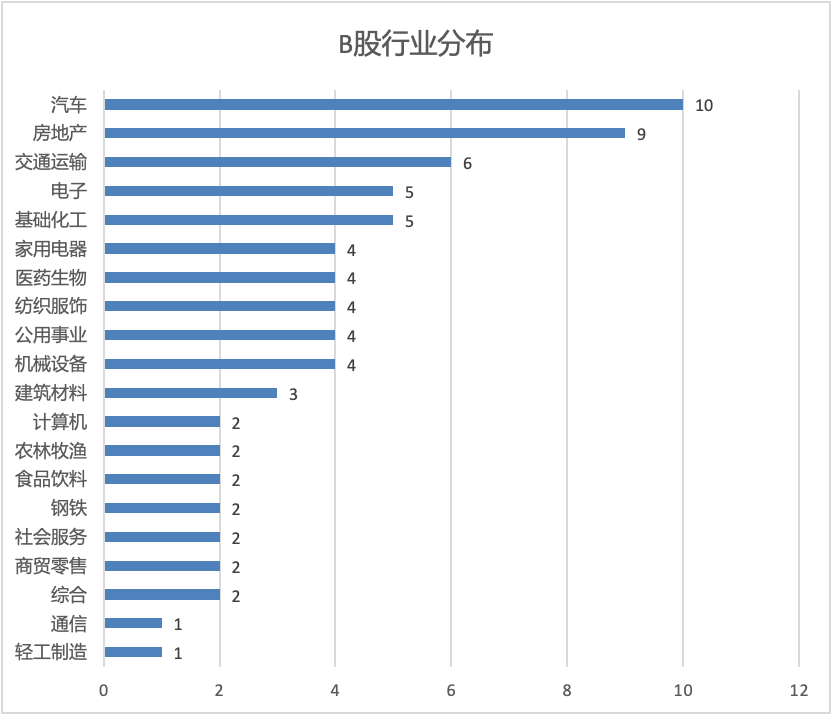
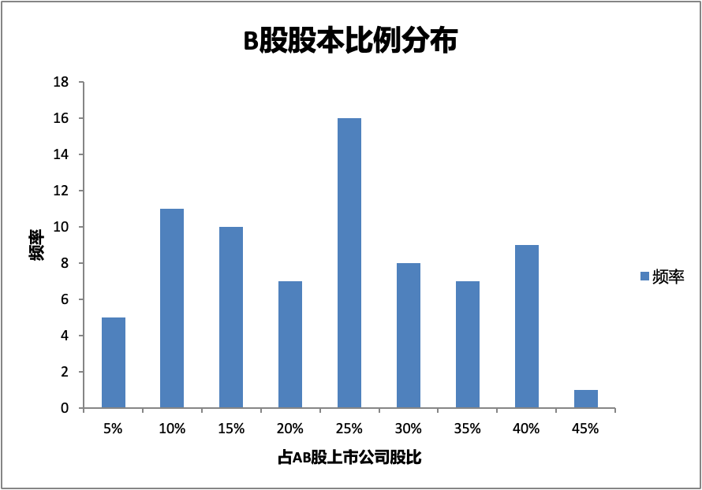
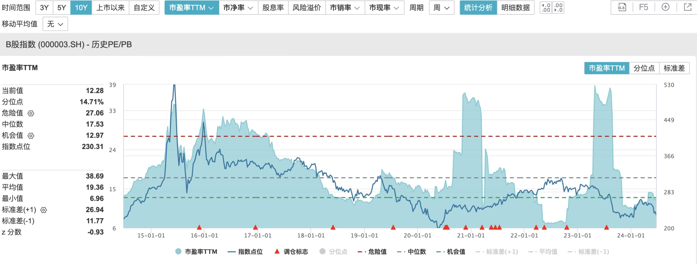
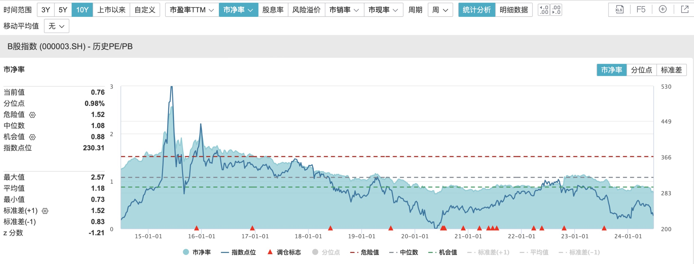
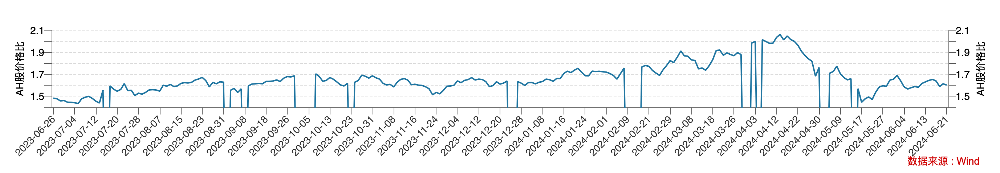

中国的股票市场可能是世界上最为割裂的。我们不仅有大量的A+H股上市公司，还有不少A+B股上市公司。

同一公司，同股同权，在不同交易市场上的价格却差异巨大。众所周知，H股相比A股存在明显的折价现象。AB上市公司也有这个问题，而且B股相对A股的折价率比H股相对A股的折价率还高。

## B股市场概览

很多人可能对B股不太了解，甚至未必听说过，但其实B股的历史与A股几乎一样悠久。第一只B股是真空B股，1992年2月上市。

B股是境内上市的外资股，以人民币标明面值，以外币认购和买卖，其中上证B股以美元计价交易，深证B股以港币计价交易。

目前沪深交易所有74家AB股同步上市公司，另外还有11家纯B股上市公司。以下是74家AB股同步上市公司的基本情况

### B股行业分布

B 股上市公司主要分布在汽车上下游、房地产（主要是商业地产）、电子电器、消费等行业。以下是按照申万二级行业划分的行业分布情况：

### B股实控人属性

B股的一个明显特征是国有企业高度集中，其中地方国企有43家，占比58%，国资委直接管辖的国企12家，占比16%。总体来看，74家B股中有55家是国有企业，占比74%。

### B股股本比例

B股股本占AB股上市公司总股本比例总体来看较为分散，最低只有1%，比如海控B股；最高是深南电B，B股占比44%。平均来看，B股占总股本比例在25%-30%之间。

### B股当前估值

以下用B股指数的相对估值指标作为估值参考。B股指数的样本是全部于上海交易所上市的44只B股。

从市盈率来看，过去12个月的市盈率均值为12x，处于过去10年15%分位点。当前市净率为0.76x，处于过去10年1%分位点。

### AB股价格对比

截至6月21日收市，AB股的平均价格比为2.3x。这意味着，与同步上市的A股相比，B股价格便宜了约56%。

作为对照，再来看下AH股的情况。截至6月21日收市，AH股的平均价格比为1.6x，即与同步上市的A股相比，H股价格便宜了38%。可见，B股的折价比H股还要高。

为什么B股比A股，以及存在明显折价的H股还要便宜呢？

## B股折价的原因

### 市场分割理论

证券市场分割理论认为，由于不同股票市场之间的流通障碍、交易规则以及信息传递差异等原因，导致同一上市公司在不同市场上的价格、收益率和风险等方面存在差异。

比如AH股，沪深交易所和香港交易所存在明显的市场分割，有着不同的上市规则、投资者类型和交易税费等。决定H股定价的是境外投资者，投资选择很多，对中国经济基本面的看法可能与国内投资者不同。另外，高额的股息税也是H股折价的重要原因。

反观A股的投资者类型，一个是散户多，短期投机严重；再一个受制于外汇管制，散户投资渠道有限，造成交易拥堵。

### B股投资者类型和外汇管制

AB股不像AH股那样存在物理场所上的硬分割，交易规则差别也不大。从股息税来看，AB股是一样的。AB股的市场分割主要体现在投资者类型和外汇管制上。

B股创立之初是为了吸引外资，专供境外投资者。2001 年 2 月 19 日之后， B股市场向境内个人投资者开放。目前来看，B股投资者主要是境内个人投资者，并没有太多境外投资者。

B股一直没有对境内的投资机构开放，可能主要是外汇管制的考虑。对于普通个人投资者来说，交易B股受限于每年5万美元的外汇额度管制。对于机构来说，5万美元额度就太小了，意义不大，额度放开了可能又难以控制。

相比之下，虽然H股是港币交易，但是由于港股通的闭环管理机制，通过港股通购买港股并没有外汇限额的问题。

通过上述分析可以看到，外汇管制导致B股相比A股甚至H股更加缺乏流动性。

流动性的匮乏是一个不断强化的正反馈。因为缺乏流动性，B股对投资者尤其是境外机构投资者难以有吸引力，进而导致更加缺乏流动性，更少被人关注。

### B股国有企业集中度高

与A股和H股相比，B股股票中国有企业占比更高，可能也只有国有企业能长期忍受B股这样的低估值而无动于衷。

国有企业肩负着为国家和股东服务的双重使命，利润增长并不是排在第一位的，这往往导致经营效率低下，官僚作风严重，甚至是内部人控制和腐败。这是国有企业估值一直不高的原因，也是A股市场的主流宽基指数，比如上证50和沪深300（国企占比分别为约62%和51%），难以长期创造价值的一个主要原因。

## B股的投资价值

虽然存在种种问题，但从折价率来看，B股是真的便宜。

对于长期投资者来说，B股流动性不是问题，流动性导致的低估值反而是一个可以利用的机会。

对于喜欢高股息的投资者来说，由于B股的折价，股息率比A股更有吸引力。一些优质的高股息股受到追捧，比如老凤祥、古井贡、黄山旅游等。

由于B股的企业属性，可能没什么wonderful company，但是有不少fair company at wonderful price。因此，B股是一个适合捡烟蒂的市场。

## B股的未来

随着H股、红筹模式等境内企业赴境外上市渠道的拓展和放开，B股丧失了融资功能，最后一只上市的 B股是2001 年4月26日上市的鄂绒B股。

对于境内个人投资者来说，可以通过港股通、QDII等渠道投资海外上市公司。QFII制度的出台也打通了境外投资者直接投资A股市场的渠道。这导致B股对境内和境外投资者的吸引力都明显下降，流动性越来越差。

可以说，B股已经成了一个被遗忘的角落，成为一些追求长期投资和高股息的散户投资者的乐园。

### 转股与回购

为了解决B股的流动性和市值低估问题，从过去的市场案例来看，有B转H，B转A，以及B股回购的案例。

“B转H”方案不存在法律合规性障碍，但前提是B股上市公司需要符合香港联交所的上市要求，目前仅有少数成功实践的案例。

对于“B转A”模式，主要方案是B股上市公司的控股股东或同一控制下的关联方吸收合并B股上市公司并在A股上市，涉及的实施程序较为复杂。由于吸收方股东和被吸收方股东需要实施换股，换股前后股票价值存在差异，换股方案需要兼顾平衡各方主体的利益。

除通过换股吸收合并方式实现“B转A”的实践模式外，理论上B股上市公司还可通过直接发行A股股票与B股股东进行换股并注销B股股票的方式，实现B股股票转换为A股股票，但目前尚未有成功先例，法律合规性方面也需要有更明确的结论。

此外，部分B股上市公司通过回购部分B股股份的方式，增强投资者对公司的信心，提升公司市场价值，但这个涉及到大量购汇，而且只适用于现金流较为充裕的B股上市公司。

### 其他思路

B股问题的本质是外汇管制和投资者限制。可以借鉴港股通，打造一个B股交易的闭环机制，对境内机构投资者开放，卖出B股后外汇不出境，这将有助于改善市场流动性。

B股以地方性国企为主。当前经济环境下，深化国企改革对盘活存量资产，提高经济的投入产出率意义重大。如果国企改革能取得更重大突破，将有助于提振B股的估值。