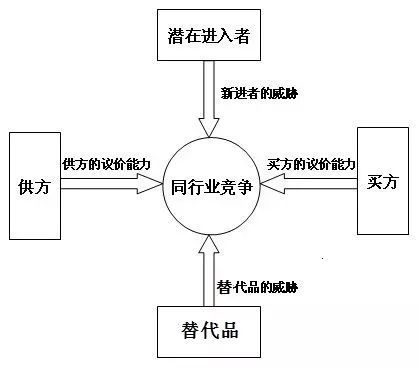

之前文章说到，通过杜邦分析，资本回报率（ROIC）可以分解为经营利润率和资本周转率两个驱动变量。也就是如下公式：

*ROIC = NOPAT/营业收入 x 营业收入/投入资本*

为了更好理解公司ROIC的驱动因素，以下对ROIC背后的竞争环境和公司的竞争优势选择做进一步探讨：

## 竞争环境

公司ROIC的高低首先要看所在的行业及其竞争环境。对于行业里绝大多数公司来说，ROIC是均值回归的。如何理解行业的结构特征和竞争力量呢，迈克尔·波特（Michael Porter）的五力模型提供了很好的分析框架。该模型于20世纪80年代初首次被提出，至今仍然是战略管理领域中被广泛采用的工具之一。

五力模型主要关注产业结构和竞争力的五个主要力量：

- **供方的议价能力（Supplier Power）：**如果供应商有较高的议价能力，他们可以要求更高的价格，从而对企业造成不利影响。
- **买方的议价能力（Buyer Power）：**如果买家有强大的议价能力，他们可以要求更低的价格、更高的质量，从而挤压产品的利润空间。
- **替代品的威胁（Threat of Substitutes）：**如果存在替代品，买家可能更容易转向其他产品或服务，对企业形成威胁。
- **新进入者威胁（Threat of New Entrants）：**如果进入市场的门槛不高，可能会加剧竞争，对现有企业的市场份额和利润构成威胁。
- **同行业竞争程度（Intensity of Competitive Rivalry）：**如果行业竞争激烈，企业可能会面临更大的价格战和其他竞争性挑战。

## 竞争优势

在一个行业里，为实现超越平庸的ROIC，公司就需要具备一定的竞争优势。波特的竞争战略告诉我们，公司的竞争优势主要是两个，差异化和成本领先。差异化往往体现为较高的经营利润率；成本领先往往体现为较高的资产周转率。典型例子如零售行业，奢侈品是低周转高毛利的行当，而商超赚取的是薄利多销的钱。

### 差异化

如何通过产品或服务的差异化获取价格溢价呢？如果我们仔细观察生活，会发现通常有这么几种经营模式：

- **创新性**。消费者显然更愿意为设计独特、功能创新的产品付出更高的价格。比如新产品上市价格往往是比较高的。再比如消费领域的升级趋势，市场越来越长尾，一些小众、网红产品，如手机配件，饮料新品等，销量可能并不大，但是能生存的原因就是消费者愿意付出更高的溢价。
- **高质量**。优胜劣汰是市场法则。高质量可以赢得消费者的信任，从而实现更高的产品溢价。比如国内的新能源汽车行业，群雄逐鹿，价格战打得激烈，但是决定最终谁能胜出的，还是要看产品本身，低价是难以有长期竞争力的。
- **品牌**。品牌本身就是溢价，品牌可以吸引天然的流量，不管是商品品牌，还是这个时代流行的个人IP。与工业品市场相比，直接面向消费者的行业往往是以品牌取胜的行业，这也就是为什么消费行业具有更高的ROIC回报。
- **客户忠诚度**。当客户对产品有忠诚度之后，一方面会形成产品的口碑效应，从而吸引更多的客户；另一方面，忠诚度意味着高转换门槛，有助于客户长期留存。早年的小米手机，如今的蔚来手机，都通过粉丝文化培养了一批忠诚的用户。零售行业搞的会员积分计划本质上也是为了提升客户忠诚度。

以上几个因素往往不是孤立的，而是相互影响的。品牌背后可能代表着高质量或者创新性的产品和服务，而高质量或者创新性的产品和服务可以提升客户的忠诚度。典型例子如苹果手机，集齐了上述所有因素。巴菲特说过一句话，可以说是他重仓苹果股票的简单而又直击本质的原因：

> “如果你是一个苹果手机用户，有人给你 1万美金，让你以后再也不用苹果，你应该不会答应。同样情况，如果换作福特汽车，你一定会收下那 1万美金，然后跑去买雪佛兰。”
> 

### 成本领先

在一个行业里，要持续地实现成本领先往往是不容易的。因为市场竞争的原因，总有更低的价格，而价格战的结果是行业利润整体下降。比如上面说到的新能源汽车行业，特斯拉开启的降价引发了行业的降价潮。再比如现在的线上零售，拼多多通过低价实现了逆袭，京东和淘宝不得不通过低价吸引流量，提高用户的购买频次。

长期来看，成本领先往往是行业之间的差异特征。比如前面说到的零售行业，天然就是薄利多销的行当。

如果说成本领先往往是靠高资本周转率实现的，又可以分两种类型来考察，这与投入资本（IC）的类型有关。投入资本可以分为短期的营运资本投入和长期的固定资产投入。零售行业体现的就是短期营运资本的高周转，也就是存货和应收账款。

如何理解长期资本的高周转呢？长期资本较重的行业通常我们称之为重资产行业，重资产行业重就重在往往难以实现高周转。事实上，重资产行业的资本回报率往往是较低的。那么，在一个重资产行业里，如何考察公司的成本领先能力呢？规模效应。

规模效应跟公司的经营杠杆是相关的。经营杠杆反映的是，企业由于存在固定成本，其息税前利润（EBIT）变动大于销售收入变动的规律。这本质上是一种放大效应，就如同财务杠杆通过加负债放大净资产回报一样。

重资产行业的特性决定了它的经营杠杆放大效应是比较大的，通过生产规模的提升，可以带来产品单位成本的快速下降，实现利润率的快速改善。因此，这个行业里的公司（比如新能源汽车）通过牺牲毛利换取收入增长是合适的做法。

规模效应并不意味着规模越大越好。事实上，很多时候，规模效应只局限于某个区域。比如大量的本地生活商户，它的服务半径极其有限，对外拓展成本较高。

实现规模效应的前提是产品本身是可量产的。比如特斯拉新推出的Cybertruck，造型奇特，极其创新，导致量产进度非常缓慢，目前看要到2025年才能实现年产25万量的目标。像汽车这样的产品，由于资本投入较高，如果难以量产，就无法实现盈利。

要看到，规模效应本身就是一种竞争力。如果一个行业需要极高的资本投入，那么能进入其中的玩家就很少，无形中保护了行业。比如汽车、芯片行业，注定是少数资本的游戏。

## 特殊的竞争优势：网络效应

网络效应是一种特殊的竞争优势，在于边际成本几乎为零，可以实现快速扩张。随着用户规模的快速增长，单个用户商业变现成本快速下降，产品对每个用户的价值不断提升，投入产出率（ROI）显著改善。比如这些年风起云涌的互联网行业，随着规模的快速扩张，可以实现极高的资本回报率。像抖音这样的公司，短短的5-6年内就崛起成为一家市值万亿级的公司，其背后就是巨大的网络效应。