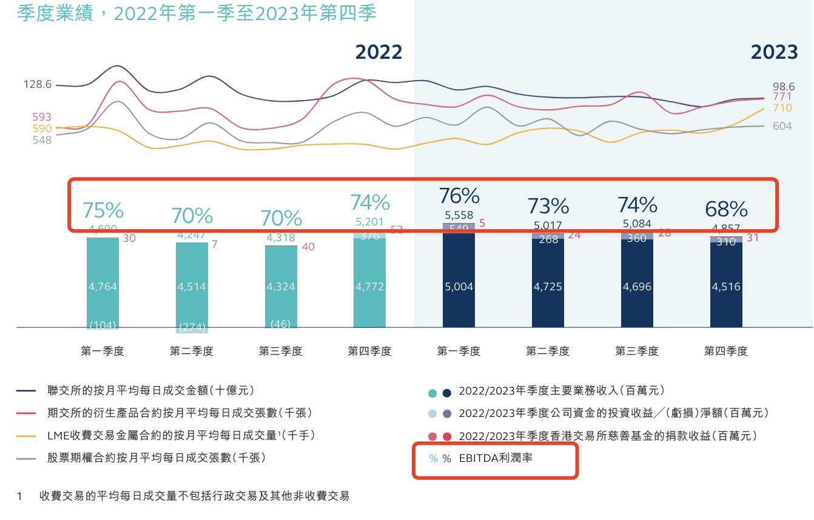
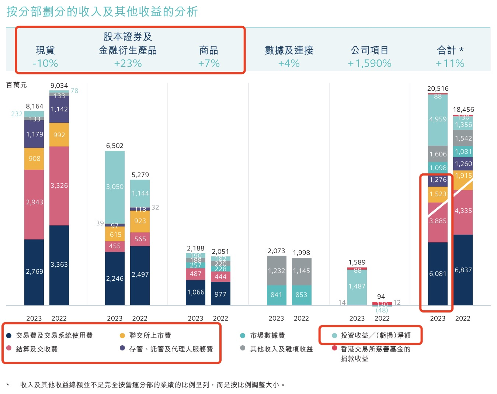
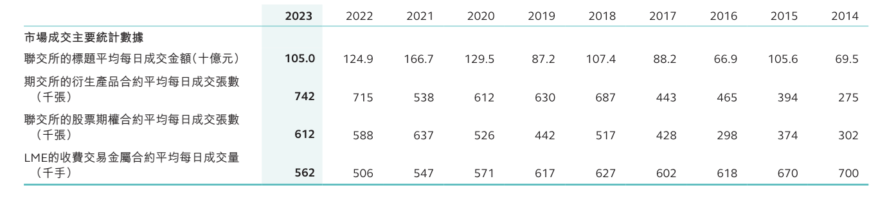
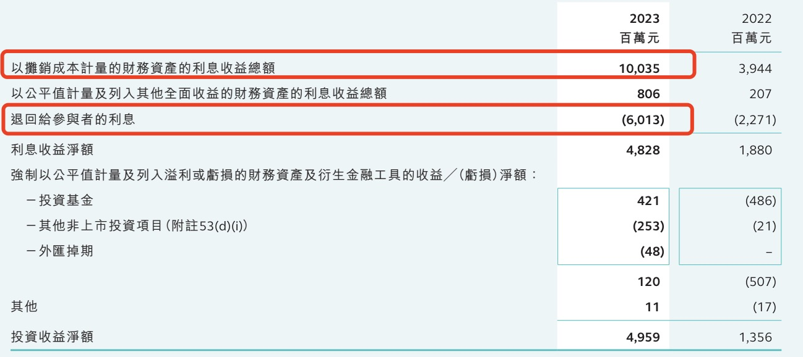
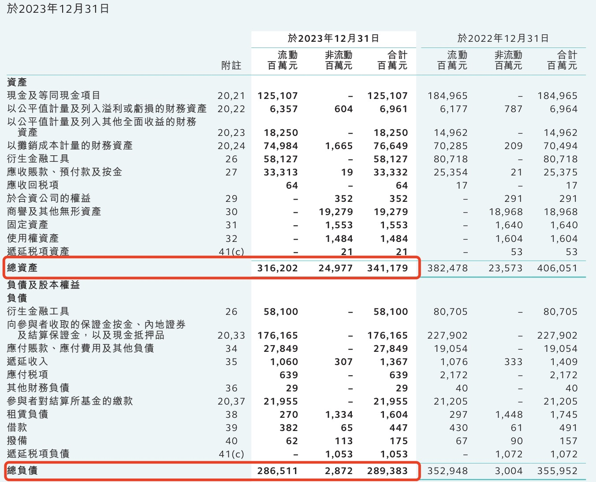
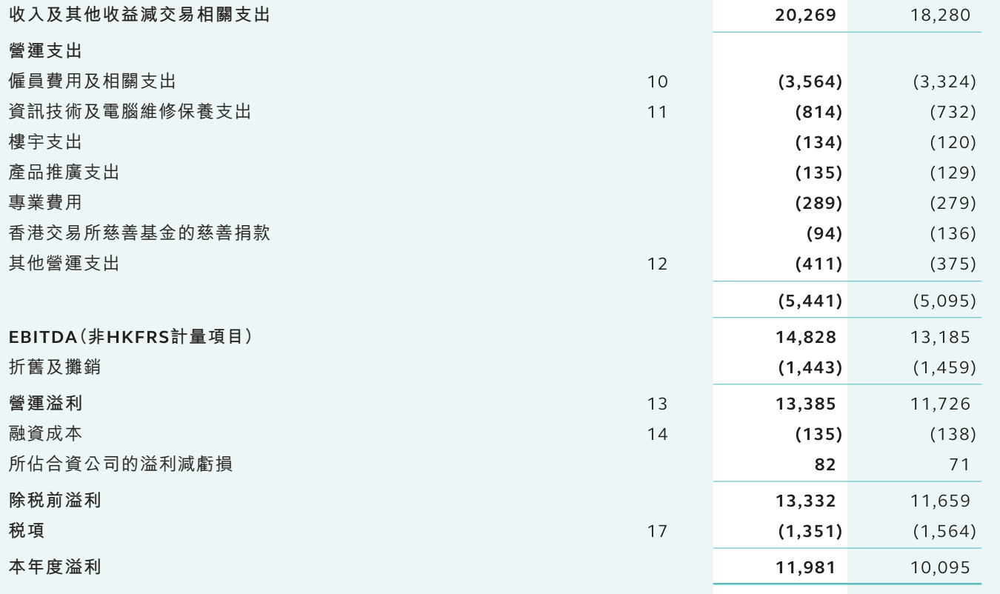
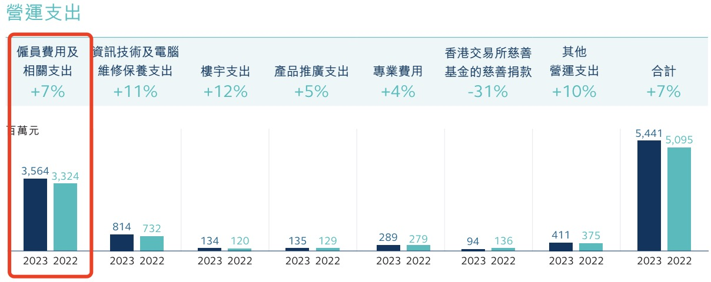

香港交易所不仅是个交易所，还是个上市公司，而且是很赚钱的上市公司。港交所不仅很赚钱，分红也很大方。

## 港交所有多赚钱

首先看下有多赚钱呢？下图是过去两年各季度的业绩情况，包括EBITDA利润率表现。可见，EBITDA利润率基本都在70%以上，2023年四季度有所下滑，主要是市场成交量下降导致。

以下是按时间倒序排列的（第一年为2023年）港交所过去10年的财务比率。除税前毛利率常年在60%以上，净资产回报率常年在20%以上且非常稳定。

再看下分红情况。港交所的分红率常年稳定在90%。这样的分红比例也只有上市REITs可媲美了。

## 港交所靠什么赚钱

港交所主要靠什么赚钱呢？下图是2023年按业务分部划分的收入：

可见，最主要的收入来自于现货、股本证券及金融衍生品业务，以及大宗商品。现货就是股票，股本证券及金融衍生品主要是认股权证、指数期货及期权等。这三大业务的收入性质主要是交易费和结算交收费，以及上市费、托管费等。这也好理解，作为交易所，雁过拔毛，属于天然的业务收入来源。而且，作为香港金融中心的唯一交易所，它的业务具有垄断性。

从收入合计可以看到，交易费、结算交收费、上市费，以及托管费等合计超过120亿，占总收入的60%。

值得注意的是，2023年，股票现货的收入是下降的，股本证券及金融衍生品的收入如果不考虑投资收益的话也是明显下降的，这主要是受股票交易量下降的影响。过去三年，受港股持续低迷影响，联交所每日的股票和衍生品成交金额呈现逐年下降趋势。如下图可见，2023年的平均日交易额下降至约1050亿。

2023年总收入相比2022年增长11%，主要靠的是投资收益。投资收益也是交易所的主要收入来源，尤其是2023年。这个投资收益是什么性质呢？其实主要是利息收入。实际上，利息收入远比这个高，这个利息收入是扣除给市场参与者之后的净收益。让我们再看下利息收入的总体情况：

可以看到，2023年利息收入约为100个亿，退还给参与者的利息是60亿。加上其他利息收入，联交所赚取的利息收入总共约为50亿。2023年利息收入比2022年之所以高很多，主要是港币及美元加息的影响。

利息收入实际上也是交易所的天然收入来源。交易所收取市场客户大量的保证金，作为账面资金的一部分，资金拿去买买债券，收收利息是稳赚的。当然，客户的资金也不是无息占用的，这就是列表中需要退回给参与者的利息含义。

可见，港交所的收入主要来自于股票、权证和金融衍生品上市、交易，以及结算环节收取的费用，以及占用参与者保证金赚取的净利息收入。其他还有一些收入来源，但影响都不大。

## 港交所有多少钱

以下是港交所的资产负债表。2023年的总资产高达3400亿，同时负债也高达约2900亿，看起来港交所的资产负债率不低，高达85%。

虽然表面看港交所似乎总资产很高，但这其中主要是客户的保证金，这也是负债率高的原因。港交所在年报里也详细披露了公司的财务资产类别，如下表，其中真正属于港交所的资金是348亿，其他基本都是收取的保证金等。

## 为什么EBITDA利润率这么高

从资产负债表来看，如果剔除交易所保证金相关资产和负债，港交所剩余的资产和负债都在几百亿的规模。其中资产端除了自有资金348亿外，剩下主要是商誉，以及固定资产和无形资产（主要是信息系统软硬件等）。可见，港交所经营的是非常轻资产的业务。其实，港交所最主要的资产应该是人了，这在资产负债表里无法记录，但是看利润表就一目了然：

从上面利润表可见，港交所除了雇员费用和相关支出之外，其他几乎没什么大项费用。雇员相关支出占到总营运支出的66%，见下图：

## 港交所的规模效应

雇员成本属于半固定成本，不会随着收入的增长而同步增长。港交所主要的成本是雇员，而收入端主要受到股票和衍生品交易量影响。这意味着，它的业务具有一定的规模效应。也就是说，收入的波动将会放大EBITDA利润率的变动。

从文章开头的季度业绩图表可以见，在过去两年的8个季度里，港交所的EBITDA利润率波动范围在68%-76%。

## 港交所的DCF估值

今年1季度来看，港交所的交易额与去年同期相比下降22%，但与去年4季度环比增长了9%。最近大家也能感觉到，港股热度明显提升，恒生指数反弹到了19000点以上。这其中有很多利好的因素，包括之前所分析的人民币柜台前景，这里不详细展开。

如果港股市场流动性持续改善，沪深港通业务受利好政策影响进一步活跃，港交所2024年收入将会有增长，其规模效应将会导致EBITDA利润率显著提升。港交所4月19日以来股价的持续上涨也证明了市场信心在逐步恢复。

以下是DCF估值所使用的主要假设，预测的基年为2023年：

- **收入及增长率**：假设不含投资收益的主营收入2024年增长20%，2025至2028年增长8%，之后逐步过渡到永续增长阶段。2024年增长率假设较高是考虑到当前港股的交易量持续增长，假设每日成交金额恢复到上图2022年水平。之后4年8%的增长率假设是基于过去10年港股的收入复合增长率，约为8%。
- **投资收益及增长率**：投资收益受港币及美元利率影响较大，过去5年的投资收益金额约为15亿-50亿。考虑美元未来的降息趋势，假设投资收益于2024至2025年逐步减少，之后稳定在20亿。
- **营运支出**：假设营运支出每年增长5%。
- **再投资**：港交所过去5年的资本开支均值约为1236亿，2023年的折旧金额约为1400亿。这意味着资本开支基本用于维护折旧。假设未来维持这个状况，也就是扣除折旧之后的再投资为零。

基于上述假设，按照DCF估值计算的港交所每股内在价值约为250港币。

最后想说，港交所的年报非常值得一读，尤其是管理层讨论与分析（MD&A）部分，结构清晰，层层递进，披露详细。推荐给从事经营或财务分析的朋友们，非常值得参考借鉴。