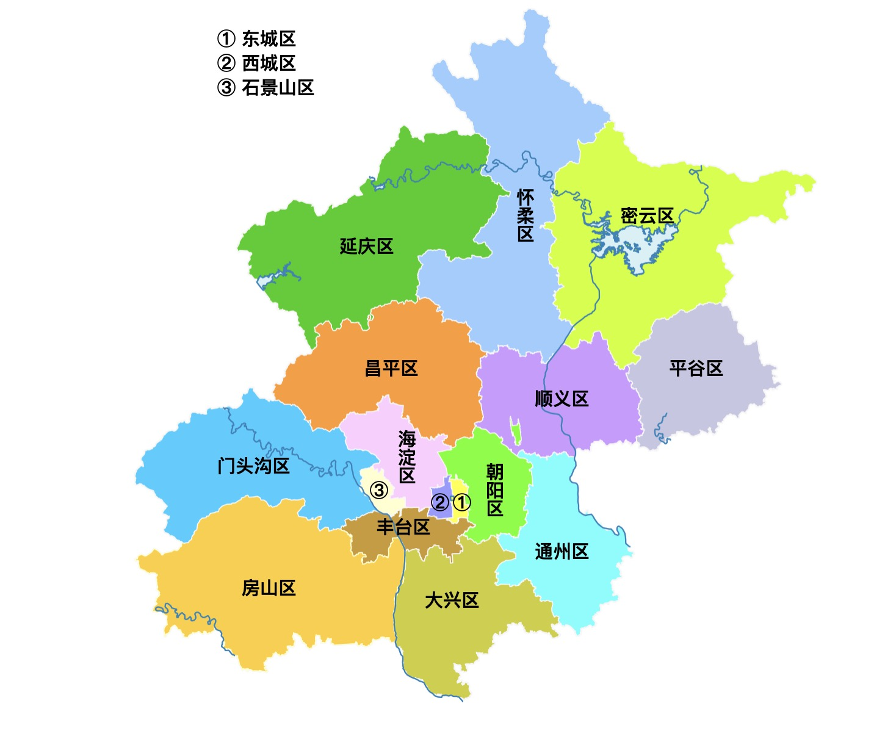
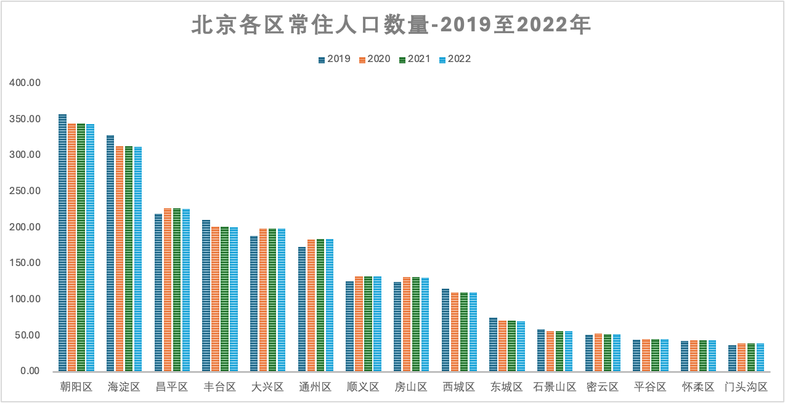
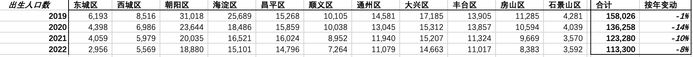
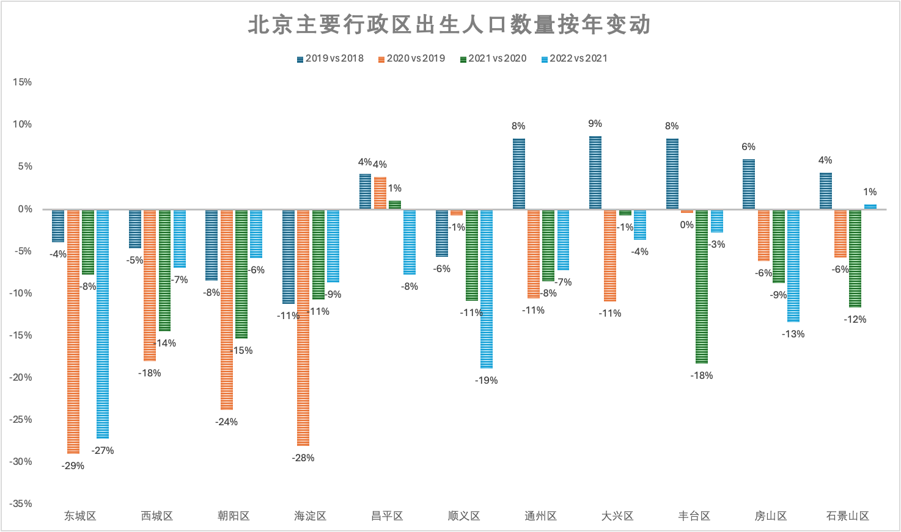

最近北京各区开始了幼儿园入园登记报名。都说现在孩子少了，连公立幼儿园都要招不满了。情况是不是这样呢？今年入园人数大概会比往年少多少？

作为孩子家长，带着这个疑问，我查阅了北京统计局发布的的出生人口数据，并尝试合理推测今年各区入园人数的大概降幅。

如果你是北京的家长，或者是幼儿园从业人员，以下的统计数据分析可能对你是一个参考。

## 北京行政区划及人口分布

北京有16个区县。截至2022年（最近统计年份数据），北京常住人口数量约2,185万人，相比疫情前2019年的2,190万人，基本稳定。

人口最多的区是朝阳和海淀，常住人口数量都超过了300万人。远郊区县中，延庆、怀柔、密云、平谷和门头沟的常住人口数量基本都在50万以下。

从2019至2022年，近郊区中，比如昌平、顺义、通州、大兴和房山，人口有所增长。核心城区，比如东西城，朝阳和海淀，人口有所减少。这符合政府主动将人口从城六区向其他郊区疏散的导向。

## 主要区2019至2022年出生人口数量

以下我们排除了人口低于50万的5个远郊区县（延庆、怀柔、密云、平谷和门头沟），选取剩余的11个区，汇总了2019至2022年总体出生人口数量：

2019年是疫情前一年。与2018年相比，2019年总体出生人口下降了约1%。

2020至2022年是疫情的三年。除了近些年人口出生率下降的大趋势，疫情风险显然会推迟大家的结婚和生育意愿。反映到数据上看，疫情这三年的出生人口数量呈明显下降趋势，其中2020和2021年总体降幅都在10%以上。

## 主要区2019至2022年出生人口数量按年变动

基于上表列示的数据，再来看下各区的出生人口变动情况：

通过上面图表，我们可以发现，各区的出生人口变动差异还是挺大的。2019至2022年总体呈现的趋势是：

- 东西城、朝阳和海淀2019年开始出生人口连续下降，疫情三年降幅更为明显，尤其是疫情第一年2020年降幅最大；
- 近郊区（除顺义）和远郊区2019年出生人口仍在增长，2020年开始普遍有所下降，主要的降幅出现在2021年，比核心城区晚了一年；
- 与近郊区相比，东西城、朝阳和海淀的出生人口降幅更明显。除了疫情影响，主要还受到了人口从城六区向其他郊区疏散的影响。
- 总体看，2020年和2021年是出生人口降幅最为明显的两年，其中2020年降幅主要集中在东西城、朝阳和海淀。2021年，东西城、朝阳和海淀出生人口降幅有所收窄，与此同时，远近郊区的降幅开始加大。

## 2020.9-2021.8月出生人数同比变动

幼儿园入园年龄要求是年满3周岁，对应今年入园的出生日期范围为***2020年9月1日-2021年8月31日出生。***因此，我们重点推断一下这一时段出生的人数相比之前同期的变化情况，对应**以下图表中红色折线趋势**。

总体结论是：

- 东西城、朝阳和海淀的出生人数下降明显，预计降幅普遍在25-30%左右；
- 北边近郊区，昌平和顺义的出生人数可能基本稳定，甚至有所增加；
- 其他几个区的出生人数降幅在15-20%左右，其中通州和丰台可能下降更为明显

需要说明的是，考虑到出生人口可能的流动，以及入园的户籍和房产政策等因素，上述数据无法准确预测各区的入园人数变动，仅作为大概参考。

## 上述推断的假设

由于统计局的人口数据是按自然年划分的，因此需要对2020和2021年出生人口降幅数据做时间划分，并基于疫情影响修正降幅，以计算出2020年9月至2021年8月出生人口的降幅。

由于疫情是从2020年年初开始的，反映到出生人口数量上，疫情对推迟生育的影响，要在2020年9月以后才能显现。9月以前，出生人口的趋势应该更接近2018年的趋势，受出生率总体下降趋势的影响。

我们假设2020年前三个季度的出生人口降幅为延续2019年变动的基础上加2%降幅，然后推断出2020年9-12月的降幅。可以看到，2020年4季度的降幅要高于全年总体变动。

针对2021年1-8月，简单化处理，假设降幅与全年总体降幅一致。

最后，根据入园对应的出生日期范围分别赋予2020年和2021年权重，对上述假设的2020年9-12月和2021年1-8月出生人口降幅做加权计算，得出今年入园人数的降幅。