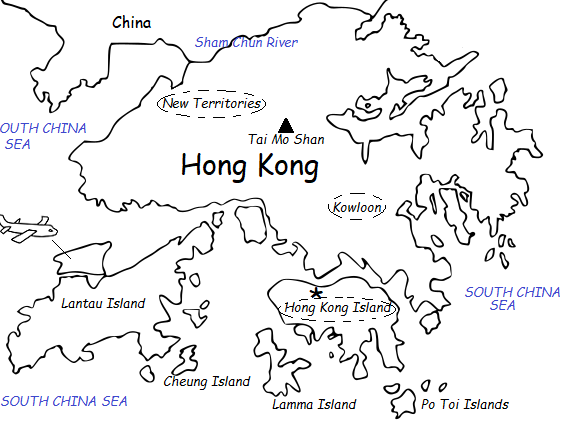

## **香港里有香港**

打开香港地图，你会发现，香港里边还有一个叫香港的地方，这里是香港真正意义上的金融中心，通常称作香港岛（Hong Kong Island）。这个小岛东西约18公里长，南北约3至8公里宽。说香港被英国殖民统治了150多年，这个起始时间就是从1842年根据《南京条约》香港岛被清政府永久割让给英国开始的。

但香港还包括另外两个区域：九龙半岛（Kowloon）和新界（New Territories）。九龙半岛是在1860年根据《北京条约》割让的；而新界是在1898年租借给英国九十九年。所以，香港的边界其实是陆续形成的。

香港岛与九龙半岛隔维多利亚港湾相望。这个海港水深港阔，四周有高耸的花岗岩山丘作屏障，是世界三大天然良港之一。

香港岛早期被称为不毛之地（Barren Rock），新界的水源、土地空间和农业对香港的蓬勃发展至关重要。但是，与港岛和九龙半岛的永久割让不同，新界是长期租借的。九十九年的租期无意中就形成了一个约定，那就是1997年的回归故事了。

这片新租之地面积约945平方公里，相当于香港岛和九龙加起来的十倍左右，其中包括二百三十个离岛，最大的离岛就是现在的香港国际机场所在地：大屿山（Lantau Island），其面积比香港岛还要大许多。

租借新界有它的时代背景。1895年甲午战争战败，触发列强在1897年至1899年争相瓜分中国。英国急欲在这瓜分中国的竞赛中分一杯羹，要求清政府租借山东半岛北部的威海卫。后来法国提出租借广州湾九十九年的要求，该地邻近海南岛，距离香港只有300多公里，英国人闻讯后即向九龙半岛以北的腹地新界出手。

## **香港的经济变迁**

香港100多年的殖民地历史伴随着中国100多年的历史动荡，香港的移民和经济发展史始终是连接中西的，并与内地紧密相连。

### **早期鸦片贸易**

鸦片贸易和早期香港历史密不可分。这个殖民地之所以建立，就是因为鸦片；它能撑过早期的艰难岁月，也全仗鸦片。在1845至1941年，鸦片是一本万利的生意，以致殖民政府的财政收入很大部分是来自鸦片贸易。

英国以鸦片贸易的收入购买中国的茶、丝，并资助占领印度所需经费；中国商人用售卖茶和丝所得利润，向英国商人购买鸦片；印度制造商则以向中国销售鸦片所得收入，向美国购买棉花。

香港靠着鸦片贸易中转港口的地位，成为五个互相交叠的贸易网络的枢纽，这五个贸易网络是中国、东南亚、印度、英国（由此延伸至欧洲）和南北美洲。

### **难民社会和产业变迁**

自英国殖民时代早期起，香港就是内地逃难百姓的庇护所，尤其是在1911年辛亥革命后和动荡的1920年代、1937年中国抗日战争爆发后、1946至1949年国共内战，以及1960和1970年代大跃进和文革时期。

1911年辛亥革命后，香港成为前清遗老避难之地，每天都有大量难民涌入香港。到了1914年，香港人口达到50万。

1930年代之前，虽然香港开始有了一定的本地工业基础，但英国政府担心从殖民地进口的货品会与英国本土货竞争，阻挠殖民地的政府发展工业。在香港行政、立法两局及英国国会拥有极大影响力的大型英资公司，对工业没有太大兴趣。

1937年抗日战争爆发后，来自内地的难民大批涌入，到1941年初，这个殖民地的人口已超过150万。华人企业家不仅带来资金，还把整座工厂迁来，有些工厂是生产军用装备供中国抗战所需。这帮助香港建设工业基础，有利于战后香港经济的复苏。在日本人封锁上海和其他中国港口后，中国的对外贸易有一半改经香港进行。中国银行和交通银行等银行把总部迁到香港，把此地变成全中国的汇兑银行中心。

1941年底，香港沦陷。日本人在1942年1月初宣布，在香港没有居住地址或职业的人都要离开，一年内香港人口从超过150万减至100万。到1945年8月日占时期结束时，香港人口降至不足60万。

1946至1949年国共内战期间，南来避祸的内地企业为香港工业带来新活力。殖民地政府后来估计，来自上海的资金和营商经验的注入，令这个殖民地享有领先东亚其他地方十至十五年的优势。

由1946年到1950年代中期，约有100万人从内地来到香港。到1955年香港人口已约有250万。

香港利用二战前后内地迁港的工业基础在经济上成功实现了由转口贸易为主向加工出口贸易转变再到经济多元化的变迁。到1970年代初，香港开始崛起成为亚洲的金融中心。香港既是英国殖民地又是亚洲转口中心的地位，奠定了它崛起成国际金融中心的根基，而东亚其他地方的政治动荡，更加强了香港的经济竞争力。

自1960年以来，香港人口由约400万跃升至近500万。这些新增人口大部分是内地在大跃进（1958年至1961年）和其后的三年饥荒时期来港的。

在1960和1970年代之前移居香港的中国人，大多数是把香港作为“借来的时间、借来的地方”。随着之后香港经济的腾飞和本地华人的崛起，更多本地出生的华人开始视香港为家。

1980年代改革开放之后，香港投资者到临近的广东省大量投入资金，设立工厂，尤其是在1982年设立的深圳特区。中国的改革开放使香港从原来生产电子产品等轻工业制品的制造业基地，摇身一变成为领先的全球金融和服务业中心。在1970年代末，服务业占香港本地生产总值不足65%，到了1990年代中期，已占差不多85%。及至1990年代中期，约九成的香港工厂已迁往中国，制造业占香港本地生产总值不足10%。

***********************************************************************************************

以上内容是基于《香港简史》的读书笔记。这本书由香港大学历史系教授高马可（John M. Carroll）所著，是了解香港历史的很好入门书。上述笔记只涉及其中某些侧面。

截至2023年，香港常住人口约为720万人。尽管一些本地人在离开香港，但与此同时，香港推出的人才计划吸引了大量的内地人寻求在香港的发展机会。

要理解香港当下面临的困境，把握香港未来的发展前景，首先要了解香港的过去，从历史中寻找香港发展的脉络。

回顾历史，香港最大的优势是连接中西，沟通中国与海外。这个优势背后的核心竞争力是香港的普通法体系、与美元挂钩的联系汇率并可自由兑换的货币，以及当前正在发展的离岸人民币中心地位。

香港的优势也是当下困境的原因。作为连接中西的交汇，香港受地缘政治冲击较大。但是，只要优势背后的核心竞争力还在，长期看，香港仍将是外商投资中国，以及境内企业海外融资和走出去的门户。